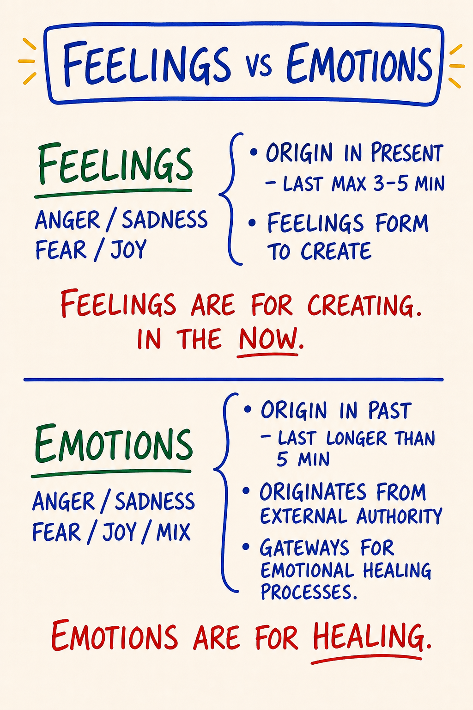
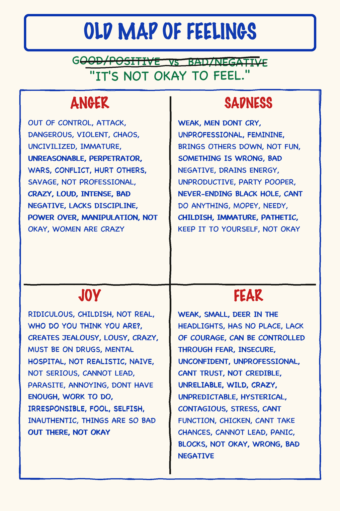
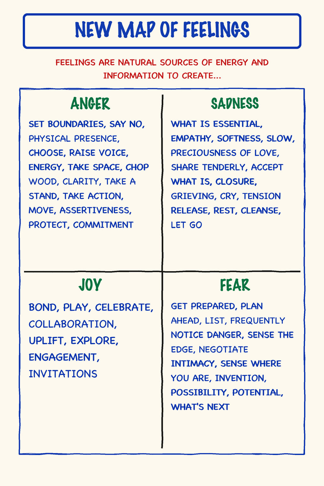
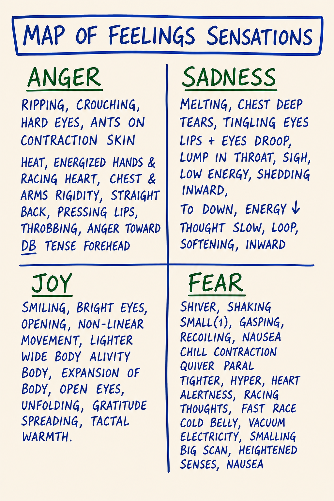
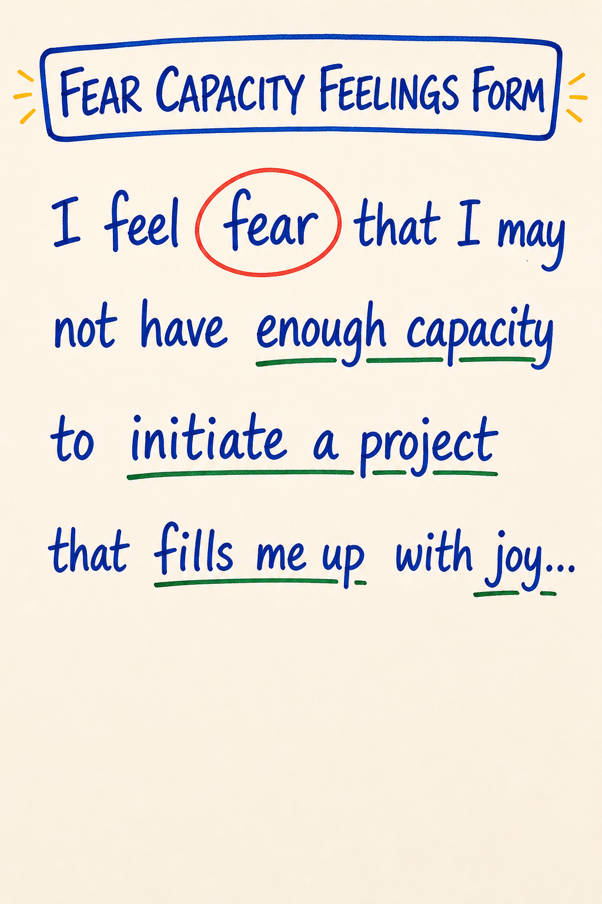

# Module 05 · Feelings vs Emotions, Old Map of Feelings, Numbness Bar

| | |
|---|---|
| **Intensity** | **HIGH.** Partner check-in required before starting; no override. See the unlock checklist in `04 - Container and Gatekeeping Protocol.md` Section D. |
| **Sittings** | 3 (break points marked in the text) |
| **Tools for this module** | Study the map: [M33 · Feelings vs Emotions](../Map%20Atlas/M33%20-%20Feelings%20vs%20Emotions.html) · [M08 · Old Map of Feelings](../Map%20Atlas/M08%20-%20Old%20Map%20of%20Feelings.html) · [M09 · Numbness Bar](../Map%20Atlas/M09%20-%20Numbness%20Bar.html) · [M10 · New Map of Feelings](../Map%20Atlas/M10%20-%20New%20Map%20of%20Feelings.html) · [M35 · Map of Feelings Sensations](../Map%20Atlas/M35%20-%20Map%20of%20Feelings%20Sensations.html) · [M37 · Fear Capacity Feelings Form](../Map%20Atlas/M37%20-%20Fear%20Capacity%20Feelings%20Form.html) · Run the practice: [Feeling Locator](../Interactive%20Tools/Day%2005/feeling-locator.html) |
| **Videos** | The written module is complete on its own. Videos are optional enrichment: see [Video Manifest](../Facilitator%20Resources/Video%20Manifest.md). |

**Daily spine:** Phase B — morning sit: Beep! Book + Feelings Form bar reading (8-10 min). See [Daily Practice Spine](../Practice/Daily%20Practice%20Spine.md).

Phase B starts with this module. The bar reading named in that line does not exist for you yet; the module installs it below, and from tomorrow morning it is part of your sit.

> **Grounding.** Script 1 (the 60-second universal script) is in [Solo Centering and Grounding Scripts](../Facilitator%20Resources/Solo%20Centering%20and%20Grounding%20Scripts.md). The gated practice tool for this module carries a **GROUND NOW** button, and the script stands alone at [ground.html](../Interactive%20Tools/ground.html). Know both routes before you start. You will likely use one of them inside this module.

---

## Consent check (read before continuing)

> This module engages **the emotional body directly**. Material that has been managed by avoidance (anger you were not allowed to feel, sadness you cut off, fear you learned to call something else, joy you suppressed) may surface.
>
> Before continuing, confirm to yourself:
> - My partner is reachable today and tomorrow.
> - I have at least 90 uninterrupted minutes ahead of me for Sitting 1.
> - I am not in acute crisis or under the influence right now.
> - I know how to ground, and I know where the GROUND NOW button and [ground.html](../Interactive%20Tools/ground.html) are.
> - I know how to reach the CM if I need to.
> - **The mid-course re-screen:** nothing has changed since my intake that would change my screening answers (no new loss, rupture, substance pattern, or safety risk). If something has changed, I have messaged the CM instead of ticking this line. (Doc 04 Section D, the Module 5 unlock.)
>
> If any of the above is not true, pause and come back when it is. There is no skip and no override on this check. If all are true and you choose to continue, take a slow breath and begin.
>
> **Reading this without a cohort or partner?** The teaching, the bar reading, and the Low/Medium-grade practices in this module are fine to run solo. Do not run the Emotional Healing Process (Module 6) or any Demon work (Module 9) without a live witness you have recruited on the Module 0 seven-line agreement. If anything surfaces that you cannot ground on your own, [findahelpline.com](https://findahelpline.com) lists crisis lines for every country.

> **Readiness check (10 seconds).** Can you find your center, drop a grounding cord, and set a bubble on demand (Module 3)? This module asks you to stay present *while feelings move*, and that takes the equipment. If you can't yet, that is not failure: re-read [M07](../Map%20Notes/M07%20-%20Center%2C%20Grounding%20Cord%2C%20Bubble%2C%20Golden%20Cube.md) and do its practice first. (Full self-check: [Learning Self-Assessment](../Facilitator%20Resources/Learning%20Self-Assessment.md), Part 2.)

> **If your partner has gone quiet.** This module is partner-gated for a reason: you should not do it alone. But a silent partner must never strand you. If your partner has not responded and you want to proceed, **message your CM**. There is a real fallback (a witness partner, or a CM-held exchange) so you are accompanied. Do not run the High-intensity practice with no one on the other end, and do not let a non-responsive pairing stall you indefinitely. The fallback is yours to ask for.

---

## Before you start — recall (5 minutes)

Free recall on Module 4. No notes, no peeking.

1. Take a blank page in your Beep! Book. Redraw the Rapid Learning loop (M26) from memory: the three stations, the arrows, the trap-door off Beep! into the swamp.
2. Say the core distinction out loud, in your own words. The shape to hit: a Beep! is design data, not a verdict, and feedback, criticism, and advice are the same sentence sourced from three different places.
3. Check your drawing against [the map](../Maps/M26.png). Mark what you missed, without verdict. A missed corner is information about where the next rep goes.

This warm-up is generation, never answer-checking. Nobody scores it, including you.

## Step 0 — center (5 minutes)

Run Script 2 (5 min centering) from [Solo Centering and Grounding Scripts](../Facilitator%20Resources/Solo%20Centering%20and%20Grounding%20Scripts.md). Then open the module.

**Sitting 1 of 3 starts here.**

---

## Purpose

To install the three distinctions the rest of the emotional-body work depends on: **feeling vs. emotion**, the **Old Map** you arrived with, and the **Numbness Bar** you have been operating above. And to install one instrument: the **Feelings Form**, the daily bar reading that turns this module's distinction into thirty days of evidence.

Module 5 is not the module where you heal anything; Module 6 is. Module 5 is where you build the map you will be healing with. Without these distinctions, Module 6 looks like generic catharsis. With them, it looks like surgery: you know which tissue is feeling, which is emotion, which is story, and what each one is for.

This module relies on the five-bodies work from Module 3. You will need to find your emotional body as distinct from your intellectual body. If that distinction is not yet living for you, pause and re-read [M06](../Map%20Notes/M06%20-%20Five%20Bodies.md) and [M07](../Map%20Notes/M07%20-%20Center%2C%20Grounding%20Cord%2C%20Bubble%2C%20Golden%20Cube.md) before continuing.

---

## Core PM concepts

- **Feeling.** A present-time archetypal energy in the emotional body. One of **four**: anger, sadness, fear, joy. Clean, time-limited (3–5 minutes), informational, takes responsible action.
- **Emotion.** A past-time, mixed, story-laden state. A feeling that did not move when it arose, got stored, and is now running on autopilot. Lasts longer than 5 minutes. Repeats rather than acts.
- **The purpose split.** Feelings are for **creating**, in the now. Emotions are for **healing**, gateways to the Emotional Healing Process (Module 6). Both real, both useful, different rooms.
- **The Old Map of Feelings.** Patriarchal-paradigm thoughtware: feelings sorted into "good" and "bad," three of four forbidden, maintained through numbness.
- **Numbness Bar.** Threshold below which feelings do not register. Installed in childhood as protection. Lowers with practice.
- **The four feelings as archetypal energies.** Anger, sadness, fear, joy as forces, not problems. Each has a body location, a purpose, an asked-for action, and a shadow form when stored.
- **The Feelings Form.** The Per-Feeling Bar Reading kept as a standing daily record: one row per day, inside the morning sit, from this module to the end of the course and beyond. Spec: [Feelings Form](../Practice/Feelings%20Form.md).

---

## Learning outcomes

By the end of this module you will:

1. State, in your own words, the difference between **feeling** and **emotion**, and apply the **5-minute test** to your own experience.
2. Name each of the **four feelings** by its archetypal purpose, body location, asked-for action, and common shadow form, and recognize each one by its **sensations** (M35).
3. Have located, in your own history, three specific items on **your Old Map of Feelings**.
4. Have run your first **Per-Feeling Bar Reading** and installed the **Feelings Form** as your standing morning instrument (spine Phase B).
5. Have registered a feeling at low intensity (≤20%) that you would normally not have noticed: your Numbness Bar moving one notch.
6. Have completed a partner exchange in which you spoke a feeling rather than a story about a feeling.

---

## Module flow

| Step | Time | What you do |
|---|---|---|
| 0 | 5 min | Run Script 2 (5 min centering). Then open the module. |
| 1 | 10 min | Recall warm-up; read the consent check; confirm partner reachable |
| 2 | 45 min | Teaching, part one: feeling vs emotion · the purpose of feelings · the Old Map |
| 3 | 45 min | Teaching, part two: Numbness Bar · the Feelings Form install · New Map · sensations · fear-capacity annex |
| 4 | 25 min | **Low-Intensity Feelings practice** (solo, embodied) |
| 5 | 10 min | Close the practice day: Script 5; Script 9 that evening |
| 6 | 2 min | **Next-morning three-question check**, then your first full Phase B sit |
| 7 | 20 min | **Partner voice exchange** (record + send) |
| 8 | — | Receive partner reply within 24 hours; record your reply |
| 9 | 2 days | Run the **between-module experiment** |
| 10 | 20 min | Journal the **reflection prompts** |
| 11 | 5 min | Close the loop |
| 12 | 1 min | Post one line to the cohort feed |

Spread the module across 3–4 days. The emotional body needs time to digest material between sessions.

---

## Concept teaching notes

### Feeling vs emotion

*▶ [Study M33 in the Map Atlas →](../Map%20Atlas/M33%20-%20Feelings%20vs%20Emotions.html)*

Study the map before reading on. Two panels, top and bottom, same four names in each: anger, sadness, fear, joy. The top panel says feelings originate in the present and last three to five minutes at most. The bottom panel says emotions originate in the past, last longer than five minutes, and arrive mixed. And each panel ends in a sentence that names what that class of experience is *for*: **feelings are for creating, in the now; emotions are for healing.** The whole module hangs on that split.

Most of the popular world uses *feeling* and *emotion* interchangeably. PM does not.

A **feeling** is a present-time experience in the emotional body. It arises because of something happening *right now*. It is one of four: anger, sadness, fear, joy. It is short: three to five minutes at full intensity, then it passes. It is **informational**: it tells you what you care about and what to do next. It is **clean**: no story, no interpretation, no "because you always…"

An **emotion** is a past-time experience. A feeling that arose at some earlier point (a year ago, twenty years ago, in childhood) and was not allowed to move. It got stored. It is now running on autopilot, often set off by something in the present that resembles the past. Emotions last longer than five minutes. They mix together. They come with a story. They do not take responsible action; they repeat. The map adds one more marker worth holding: an emotion often carries the voice of an **external authority**, the person or rule that blocked the feeling the first time.

> The clearest field test: **how long has this been going on?** If five minutes later you are still in it, you are in an emotion. The feeling, if there ever was one underneath, has been replaced by the emotional loop on top.

Confusing the two is a common error with a large blast radius. The learner feels an emotion of anger toward their partner, mistakes it for a present-time feeling, "expresses" it as if it were information about the partner, and creates damage. The anger had nothing to do with the partner. It was about the third-grade teacher. The partner was the trigger, not the source.

**Common misunderstandings about feelings vs emotions.**

- *"Feeling and emotion are two words for the same thing."* They differ on every axis the map draws: time of origin (now vs then), duration (minutes vs longer than five minutes, often years), composition (clean vs mixed), and purpose (creating vs healing). Collapsing the words collapses the work.
- *"Emotions are the bad ones and feelings are the good ones."* Neither class is bad. An emotion is unfinished business, a gateway to the healing work of Module 6. The error is not having emotions; it is treating an emotion as if it were information about the present person in front of you.
- *"If it's intense, it must be an emotion."* Intensity is not the test; time is. A clean 90% fear that passes in four minutes is a feeling. A mild irritation that has run for three weeks is an emotion.
- *"I can think my way to which one it is."* Run the 5-minute test on the clock and check for a story attached. The two tests are observable; your opinion of yourself is not.

### What feelings are for

The map's top panel closes with *feelings are for creating*, and that sentence deserves its own minute. (The Purpose of Feelings has its own PM map; its image is in the course's redraw queue, and the teaching is complete here as text.)

Each of the four feelings delivers a specific kind of fuel and asks for a specific kind of action. Anger says make a boundary. Sadness says let this go. Fear says prepare. Joy says more of this. That is not poetry; it is an operations manual. Anger is the energy to start things, stop things, say no, make the cut, hold a line. Sadness is the energy to release, grieve, open, receive care. Fear is the energy to sharpen: to plan, check, sense danger, get precise. Joy is the energy to connect, celebrate, and invite. A person with all four online has a full toolkit for creating what they care about. A person running the Old Map has one diluted tool and three locked drawers.

This is why the course will not let you treat feelings work as remedial therapy for broken people. The work is not only to stop hurting; it is to get the fuel back.

### The Old Map of Feelings

*▶ [Study M08 in the Map Atlas →](../Map%20Atlas/M08%20-%20Old%20Map%20of%20Feelings.html)*

Stop here and take the map in. Shape first, labels second. Two columns, a good one and a bad one, with three of the four feelings dropped into "bad" and the fourth held under suspicion. That sort, not the contents, is the whole error.

You arrived at this course with a map of feelings. You did not choose it. It was installed in childhood by the culture, the family, the schoolyard, the workplace. It is patriarchal-paradigm thoughtware: built for control, maintained through numbness.

The Old Map sorts feelings into **good** and **bad**:

| Feeling | Old Map verdict | Old Map rule |
|---|---|---|
| **Anger** | BAD: dangerous, "out of control." Especially forbidden for women and "nice" people. | Swallow it. Or redirect to a safer target. Never at the actual source. |
| **Sadness** | BAD: weakness, self-pity, "bringing everyone down." | Get over it. Don't cry in public. Don't cry at work. |
| **Fear** | BAD: cowardice, "you're being dramatic." | Hide it. Pretend confidence. Push through. |
| **Joy** | SUSPECT: self-indulgent, "what's wrong, you're too happy." | Tone it down. Don't make others jealous. |

The Old Map has **no good feelings**, only a thin permitted band of muted positive states ("fine," "good," "not too bad"). Three of the four are forbidden outright; the fourth is conditionally allowed and routinely diluted.

The sort is **gendered and cultural**. Which feeling sits in which column shifts with where you were raised and who you were raised to be. Across most patriarchal cultures, anger is suppressed hardest in women and in people trained to be "nice"; sadness and fear are suppressed hardest in men. The specifics vary by culture. The structure does not.

What happens to a feeling the Old Map forbids? It does not disappear. It gets **stored** (becomes an emotion) and shows up later, in distorted form, at the wrong place, the wrong intensity, toward the wrong person. The costs are predictable: stored emotion, mixed-emotion soup, recurring "for no reason" outbursts, drama (because feelings that cannot flow directly find indirect routes), and chronic low-grade depression dressed up as "stress."

The Old Map keeps people functional inside patriarchal cultures. It also makes them numb, and the numbness is the load-bearing mechanism rather than a side effect: the map only works if the person stops noticing what they actually feel. (That mechanism has a name and a shape, the **Numbness Bar**, and it is the next thing this module installs.) Put differently: the Old Map is appropriate technology for the wrong destination. It is functional in patriarchal culture and cannot run an archiarchal one, a culture organized around bright principles, distributed authority, and conscious relating. This is not a moral verdict on the map. It is a statement about what it was built to do.

You are not here to fight your Old Map. You are here to **see** it, to identify the specific rules you carry, so it stops running you in the background. Naming the rule is most of the work.

**Common misunderstandings about the Old Map.**

- *"The Old Map is bad and I need to get rid of it."* No. It is functional thoughtware for a particular culture. Fighting it just installs another version of it: the same good/bad sort, now with "fighting my map" in the good column. Instead, see it and name its rules, then stop running them silently.
- *"My family was healthy — we didn't have Old Map rules."* Every learner arrived with an Old Map. If you cannot find your rules, your Numbness Bar is set high enough that they are running below your registration. Look smaller. Ask which feeling you literally cannot find when you go looking for it.
- *"The Old Map is a Western / modern / capitalist thing."* Versions of it run in nearly every patriarchal culture on the planet. The contents differ; the structure is the same.
- *"Once I see my Old Map, I'm done with it."* Seeing the map is the start, not the finish. The emotions it already stored are still in your emotional body. Those get released later, through the Emotional Healing Process (Module 6), not by insight today.

---

**SITTING BREAK** — stop here if you need to. When you return: one breath, re-read your last Beep! Book line, continue with Sitting 2 of 3.

---

### The Numbness Bar

*▶ [Study M09 in the Map Atlas →](../Map%20Atlas/M09%20-%20Numbness%20Bar.html)*

Give the map a full minute before the words. A single horizontal line drawn across the emotional body. Everything above it, you feel. Everything below it is still happening; you just don't perceive it. Hold that image while you read.

That line is your **Numbness Bar**. It was installed early, often before age six. It was protective: as a child you encountered feelings that were too big, that no one helped you process, that put you in danger if you expressed them. The Numbness Bar cut them off so you could keep functioning. This was intelligent. It was survival.

It is also obsolete. You are no longer six. The bar that protected you then is now the reason you cannot register the warning anger when a colleague crosses a line, cannot feel the sadness that would let you grieve a finished relationship, cannot detect the fear that would tell you not to take the meeting, cannot access the joy that would tell you you have found your work.

Most adults live with the bar at **70–90% numb**: they experience 10–30% of their emotional body's signal and call that their full range. When the course says "lower the numbness bar," learners often hear "feel everything at maximum intensity" and brace. The opposite happens: learners discover that full intensity is far less than they feared, because they have been operating on so little signal they assumed "full" must be overwhelming.

One thing the map flattens that matters in practice: **the bar is local, not global.** You do not have one Numbness Bar. You have four, one per feeling. You can feel anger fully and be numb to joy. You can be wide open in fear and shut down in sadness. So "am I numb?" is the wrong question. The right question is *which feeling can I find right now, and which one can't I?* Read each feeling separately.

And the bar is not a fixed setting you adjust once. It **moves with conditions**: stress, exhaustion, and the Box feeling threatened all raise it temporarily. The work is not "lower it once and you're done." It is "keep noticing where the line sits today."

The bar drops over time. Not in one practice. Not in one module. Through repeated, **low-intensity** work: feeling 5%, then 10%, then 20% of a feeling on purpose, with consent, in a held container. Each rep lowers the bar a notch. (Two tools for two layers: solo low-intensity practice, like this module's, lowers the bar for everyday real-time signal; the Emotional Healing Process in Module 6 goes after the *stored* material the bar has been holding down. Different layers, different tools.)

> **Micro-practice — the Per-Feeling Bar Reading (3 minutes).** Do this now, before reading on. Center, ground, drop a bubble. For each of the four feelings — anger, sadness, fear, joy — ask out loud: *"Right now, in my emotional body, how much of this feeling am I registering, 0 to 10?"* Say the number. Don't justify it; the first reading is the reading. Then, for whichever feeling read lowest, ask once: *"If the bar were one notch lower, what would I be feeling?"* — and stay 20 seconds. The answer is usually a sensation, not a sentence: a flicker of heat, a small tightness, an almost-imperceptible buzz. *Almost* nothing is data. Finish with one line: *"Today my anger bar is low, my fear bar is medium, my sadness and joy bars are high."* Your own pattern, today. Tomorrow's will be different. You are not fixing anything; you are learning where the line sits.

**What to expect:** the first reading usually takes longer than three minutes and produces at least one "I have no idea." Write the no-idea down as a number anyway. An unfindable feeling reads 0, and that 0 will tell you more, over thirty days, than any other number on the page. The reading gets faster within a week.

**Common misunderstandings about the Numbness Bar.**

- *"If I don't feel anything, the feeling isn't there."* Below the bar the feeling is present and unregistered: still operating in your system, still using your energy, still surfacing later as a mixed emotion. The bar is a perceptual cutoff, not a vacuum.
- *"I should feel everything at full intensity to lower the bar fast."* High-intensity flooding usually triggers the Box to reinstall the bar harder. The lever is the 2%, not the 100%.
- *"I'm just not an emotional person."* "Not emotional" is almost always a high Numbness Bar. You have the same emotional body anyone has; you have been operating above the bar so long it feels like baseline. The bar lowers; the baseline shifts.
- *"Lowering the bar means I'll be a wreck and unable to function."* The opposite. More signal reaching you in real time means better choices. Functionality usually improves once stored emotions stop running you from underneath.

### The Feelings Form — the reading becomes an instrument

The Per-Feeling Bar Reading you just ran is not a one-off exercise. From tomorrow morning it is a standing daily instrument with a name: the **Feelings Form**. One row per day (four numbers, two checks, one line), filled inside the same morning sit as your Beep! Book capture, before the capture. This is Phase B of the [Daily Practice Spine](../Practice/Daily%20Practice%20Spine.md): the sit grows from 3–5 minutes to 8–10 and never becomes a second practice. The full instrument spec, including the printable form and the Mixed and Numb columns, is in [Feelings Form](../Practice/Feelings%20Form.md). Read it before tomorrow's sit; it takes five minutes.

Log the row in the Beep! Book (one flat line: `12 May · A2 S5 F4 J6 · mixed: — · numb: joy`), or keep the printed Form clipped inside the book's back cover. One home for the record.

Why a form and not just a habit: **thirty rows are evidence.** One morning's row tells you where your four bars sit today. Thirty rows tell you whether the lines are moving. By Module 10 you will be able to read your own rows and see whether the Numbness Bar dropped: which feeling opened, which stayed shut, what raises the bars (you will find your own weather: deadlines, visits home, alcohol). The course will explicitly send you back to your rows at Modules 6, 7, and 10. No insight, no enthusiasm, and no amount of agreeing with this module can substitute for that trend line. The Form is not a mood tracker and produces no score. It is an instrument log, the same register as the Beep! Book.

### The new map — the four feelings as they actually are

*▶ [Study M10 in the Map Atlas →](../Map%20Atlas/M10%20-%20New%20Map%20of%20Feelings.html)*

The map first. The text below assumes you have seen it. Four feelings, each with a body location, a purpose, an asked-for action, and a shadow form it takes when stored. No good column. No bad column. Just four tools and what each one is for. The table below is the same map in words; read the image and the table together.

PM treats the four feelings as **archetypal energies**: forces with characteristic shape, body location, purpose, and a recognizable shadow form when stored rather than moved.

| Feeling | Body location | Purpose / energy is for | Asked-for action | Shadow form (stored as emotion) |
|---|---|---|---|---|
| **Anger** | Bones · big muscles of legs, arms, jaw · hands | Make boundaries · change what is not life · clarify what matters · start and stop things, *without blame* | Say no. Stand. Push back. Make the cut. Decide. | Rage · resentment · bitterness · passive aggression · collapsed compliance · violence |
| **Sadness** | Heart · throat · soft tissue of the face · eyes | Release · honor what is gone · open the heart · receive care | Cry. Slow down. Let go. Be held. | Depression · self-pity · chronic grief · emotional shutdown · martyr stance |
| **Fear** | Nervous system · skin · the small nerves · belly | Bring presence · prepare · avoid actual danger · catalyze precision | Slow down. Sense. Check the ground. *Move away only if the signal says move.* | Anxiety · paranoia · panic · avoidance · hyper-vigilance · freeze |
| **Joy** | Energetic body · whole organism · the eyes | Connect · appreciate · celebrate · expand · invite others in | Speak it. Move toward it. Share it. | Mania · forced positivity · spiritual bypass · addictive pleasure · numb pleasantness |

Three notes on the new map:

- **There are four. Not five. Not eight.** "Love" is not a feeling; it is an archetypal force of nature, much larger than the emotional body. "Frustration," "overwhelm," "stress," "burnout" are not feelings; they are stories about mixed emotions. The discipline of the four is what makes the work clean. Resist the pull to add to the list.
- **None of the four is good or bad.** Each is a tool. The shadow form is what happens when the tool was not allowed to do its job in real time, so it stuck. Even the shadow forms are not "bad"; they are signals that Emotional Healing Process work is waiting.
- **The feeling tells you what you care about.** If you feel anger, something you value is being violated. If sadness, something you valued is gone. If fear, something you value is at risk. If joy, something you value is alive and present. The feeling is information about you, not about the trigger.

**Common misunderstandings about the new map.**

- *"The body locations are metaphorical."* They are literal. Anger lives in bones and big muscles. Sadness in heart and throat. Fear in the nervous system and belly. When you go looking for a feeling, look for the sensation in *those specific places*. The location is anatomy, not poetry.
- *"Frustration is a feeling."* Frustration is a story about a mixed emotion, usually some anger plus a story about helplessness. Restate it as its components: *"I have some anger and some sadness."* Same for "overwhelm," "stress," "burnout."
- *"If I feel two things at once, one of them must be wrong."* Multiple feelings often arrive together. That is normal. When they tangle, store, and attach to a memory and a story, that is a *mixed emotion*, and it gets processed in Module 6, not untangled by force today.
- *"Shadow forms are pathologies I need to fix."* A shadow form is a signal that the feeling underneath got stored. You do not fix the shadow form. You release the stored feeling, through the Emotional Healing Process (Module 6), and its energy returns.

### Sensation, not story

*▶ [Study M35 in the Map Atlas →](../Map%20Atlas/M35%20-%20Map%20of%20Feelings%20Sensations.html)*

Before the prose: the image. Notice what is drawn, and what is not. Four quadrants, one per feeling, and not a single abstraction in any of them. No "I felt disrespected." No "it triggered me." Heat. Racing heart. Lump in the throat. Cold belly. Tingling eyes. Shiver. Bright eyes. Pressing lips.

This map is the answer to the question every learner asks in the first feelings practice: *"How do I know which feeling this is?"* You know by **sensation**. The sensation is the feeling; the thought about it is the story. Anger announces itself as heat, rigidity in the arms and back, a tense forehead, energy pressing outward. Sadness as melting: chest-deep heaviness, thickening throat, slow inward-turning energy. Fear as electricity: shiver, contraction, racing thoughts, heightened senses, a cold or fluttering belly. Joy as opening: smiling that starts in the eyes, lightness, expansion, warmth spreading.

Use this map as a lookup table in both directions. Direction one: you have named a feeling ("some anger, maybe 2") and you verify it against the body (is there heat? rigidity? where?). Direction two, more often: you have an unnamed sensation (tight throat, cold belly) and the map tells you which quadrant you are standing in. In the bar reading every morning, and in the practice below, this is the map you are actually using.

**Common misunderstandings about sensations.**

- *"I don't feel any of these, so I have no feelings."* Re-read the Numbness Bar section. The sensations are running below your registration, not absent. Look for the 2% version: not heat but a flicker of warmth, not a lump in the throat but a faint thickening.
- *"My sensation isn't on the map, so it doesn't count."* The map lists common signatures, not an exhaustive catalog. Your anger may have its own dialect. The discipline is to track *some* concrete body sensation rather than a verdict or a story.
- *"Thinking about my feelings counts as feeling them."* A description produced by the intellectual body is a story. The feeling is in the emotional and physical bodies. The course will keep asking you to drop from the second to the first.

### Low-intensity feelings

Learners assume feelings only count when they are big. *Real* anger is rage. *Real* sadness is sobbing. This is the Old Map talking.

In the new map, **low-intensity feelings are the most useful kind**, because they arrive in real time, give you information, and let you respond before the situation has compounded into emotion. A 5% anger noticed in the moment a colleague crosses a line lets you say *"that one I want to come back to."* A 70% anger noticed three weeks later, in your kitchen, at your partner who was not there, is an Emotional Healing Process waiting to happen.

The course works the low end on purpose. Here, the rep is: notice the 5%. Lower the bar.

### Annex — fear and capacity

*▶ [Study M37 in the Map Atlas →](../Map%20Atlas/M37%20-%20Fear%20Capacity%20Feelings%20Form.html)*

One sentence, drawn large: *"I feel fear that I may not have enough capacity to initiate a project that fills me up with joy…"* That is a Feelings Form sentence, written out in full, and it shows the instrument doing its most precise job.

Read the anatomy of the sentence. It names the feeling plainly (*I feel fear*), no euphemism, no "I'm a bit stressed about." It names what the fear is *about*: not the project, but **capacity**, the speaker's own current size relative to what they want to create. And it keeps the joy in the same sentence, because the fear only exists since something worth creating is in view. Fear read this way is not an alarm to silence. It is a surveyor's report: *here is the gap between what I want to build and what I can currently hold.* The asked-for action of fear is prepare, and "prepare," at this resolution, means build the capacity the sentence just measured.

Use the form when a fear reading in your morning row is attached to something you want: write the full sentence, *I feel fear that I may not have enough ___ to ___*. Most learners discover the named version is smaller than the unnamed dread it replaces. You do not need this annex every day. You need it the weeks you are deciding something.

**Common misunderstandings about fear and capacity.**

- *"Fear means stop."* Fear means prepare. It only means move away when the signal says actual danger. Fear about a project you want is usually a capacity reading, not a verdict on the project.
- *"If I were ready, I wouldn't feel fear."* The fear is how you find out what ready would take. A person who feels nothing at the edge of something new is reading a numb bar, not courage.

---

**SITTING BREAK** — stop here if you need to. When you return: one breath, re-read your last Beep! Book line, continue with Sitting 3 of 3.

---

## Embodied practice (solo) — Low-Intensity Feelings

A single concrete practice. ~25 minutes. Done alone, in a room you will not be interrupted in. You will need: a chair, water, your Beep! Book, and a small object from your surroundings (a mug, a book, a photo, a piece of clothing — anything within arm's reach). The [Feeling Locator](../Interactive%20Tools/Day%2005/feeling-locator.html) walks the same practice on screen, with the consent gate and the GROUND NOW button; paper and this script work exactly as well.

Read the script through once before you do it.

> **Script.**
>
> Sit. Both feet on the floor. Center, ground, drop a bubble (Module 3 practice — if it has fallen out of your body, re-read [M07](../Map%20Notes/M07%20-%20Center%2C%20Grounding%20Cord%2C%20Bubble%2C%20Golden%20Cube.md) first).
>
> Pick up the object. Hold it. Look at it.
>
> Ask yourself, out loud: *"Right now, in my emotional body, with this object — am I feeling some anger, some sadness, some fear, some joy?"*
>
> Do not look for big feelings. Look for low-intensity ones. 2%. 5%. The almost-imperceptible kind. They are there. You have been not registering them.
>
> Name the first feeling out loud: *"I feel some [anger / sadness / fear / joy] looking at this [object]."*
>
> Locate the sensation in the body, using M35 as your lookup table. Where exactly? Bones? Heart? Nervous system? Eyes? Be specific. Touch the place with your hand if it helps.
>
> Stay with the sensation for 60 seconds. Do not analyze. Do not story. Do not figure out why. Just register. Breathe.
>
> Notice if a second feeling surfaces underneath the first. Often the first is on top and the next is deeper. Name it. Locate it. 60 seconds. If a third surfaces, repeat.
>
> When the feelings stop arriving, set the object down. Take three breaths.
>
> In the Beep! Book, write fast, no editing: *Object · feeling · location · what the feeling seemed to be about, if anything came clear.* Three or four lines. The point is not insight; the point is the rep.
>
> Pick a second object. Do it again. Do three objects total.

**What to expect.** Most learners report the first object yields almost nothing: "I don't feel anything." This is the Numbness Bar speaking. Stay another 30 seconds. Look smaller. The 2% is there. By the second or third object, the bar drops a notch and feelings register that were not available ten minutes earlier.

> **Variation B — the Four-Bodies Check-In (~12 min).** If the object practice keeps you in your head, or if you want to drill the body locations directly, run this instead of or after the object version. Sit, center, ground, drop a bubble. Take the four feelings *in order — anger, sadness, fear, joy* — and give each a 3-minute micro-cycle: (1) find the body region from the M10/M35 tables — anger → bones, jaw, big muscles; sadness → heart, throat, eyes; fear → nervous system, skin, belly; joy → whole organism, face, chest; (2) place a hand there and breathe into it for 30 seconds; (3) ask out loud, *"Right now, in this place, is there any [feeling] present, even at 2%?"*; (4) stay with the sensation 60 seconds — no analysis, no story, look smaller than you think you should; (5) write one Beep! Book line: *feeling · location · sensation · approximate intensity · what it might be about, if anything came clear.* After all four, read your four lines aloud. The region easiest to land in is where your Numbness Bar is lowest today; the one furthest away is where it is highest. Finish by naming, out loud, the asked-for action of whichever feeling registered most cleanly — *"my anger is asking me to make a boundary about X"* — with no commitment to act. Just name what the feeling was for.

If you find yourself in an emotion (a feeling about something years ago, with a story attached, lasting longer than five minutes): stop, ground, and note it in the Beep! Book. Do not try to process it. Module 6 is for the Emotional Healing Process. Today is for **registering**.

If you find yourself dissociating (floating, watching from outside, unable to feel anything anywhere): stop, ground (Script 1 or [ground.html](../Interactive%20Tools/ground.html)), end the practice. Voice-message your partner that you stopped. This is not failure. Your system told you it was at limit.

### Closing the practice day

This is a High day. Close it deliberately:

- **Now:** run **Script 5, the dissolution script (8 min)**, from [Solo Centering and Grounding Scripts](../Facilitator%20Resources/Solo%20Centering%20and%20Grounding%20Scripts.md).
- **This evening:** run **Script 9, pre-sleep grounding (4 min)**, before bed. Feelings material likes to keep moving after lights-out; Script 9 hands it to sleep cleanly.

> **Next morning — three questions (2 minutes, before the daily sit).**
> 1. How did I sleep, and how does my body read right now: heavy, normal, or wired?
> 2. Is anything from yesterday still moving (fine — let it move), or stuck and looping (run Script 1, then voice-message your partner)?
> 3. What is right for today: continue the module, take a low-demand day, or contact the CM? Say the choice out loud.
>
> Then run your first full Phase B sit: bar reading into the Feelings Form, then the Beep! Book capture. From today, this is the shape of every morning.

---

## Partner exchange (async)

Same structure as before: record, send, receive, reply. Voice messages only. Speak from your body, not from your script. (Solo path: run the same three prompts into your voice recorder, listen back the next day, and write one Beep! line on what you heard. A recorder is a thinner witness than a person; it is still a witness.)

**Before recording: do the partner check-in.** Verify your partner is reachable in this 48-hour window. If not, pause and contact the CM. (Structural requirement for all High modules. No override.)

**Prompt to record (5–10 minutes):**

Speak to your partner directly. Three things, in this order:

1. **One item from your Old Map of Feelings.** A specific rule you grew up with about one specific feeling. Not "my family didn't talk about feelings" — too general. *"In my family, anger meant my father had been drinking, so I learned: if you feel angry, leave the room."* That specific. Name the feeling, the rule, the source if you know it.
2. **What surfaced in the Low-Intensity Feelings practice.** Which feelings showed up with which objects. Where you located the sensations. Whether you hit the Numbness Bar and what that felt like. If you hit an emotion, name it but do not process it.
3. **One feeling alive in you right now**, as you record. Use the form: *"Right now I feel some [feeling], and the sensation is [location and quality], and what I think it is about is [one sentence, if you have it]."* Speak from the feeling, not about it.

If you stumble, leave the stumble in. Do not edit.

**When you receive your partner's message: listen all the way through once before replying.** Then record (3–7 minutes):

1. **What you heard them say.** Paraphrase the core. Not all of it. The part that reached you.
2. **What feeling surfaced in you while listening.** Name it from the four, locate it, note its intensity. *"While you were speaking I felt some sadness in my throat, low intensity, maybe 10%."*
3. **One question.** Open-ended. Aimed at their body, not their head. *"What would you do with that anger if you let it move?"* is the shape.

No advice. No fixing. No "I had a similar experience." Witnessing only. If your partner names an emotion bigger than the partner exchange can hold, gently say so and remind them the CM is reachable. Then continue witnessing.

---

## Between-module experiment

Pick **one**. Write it on a fresh Beep! Book page in the Module 4 format before you run it, and run it once in your actual life before you start Module 6.

> **Experiment — [your pick]**
> *What I will do:* (the specific test, in a real situation)
> *By when:* (a specific window — date and time, not "this week")
> *What I will notice:* (the data you will write down afterwards)

One at a time. Two parallel experiments compete for noticing bandwidth and you end up running neither cleanly. The options:

1. **The 5-minute test.** The next time you find yourself in a difficult internal state (irritation at a co-worker, anxiety about a meeting, sadness in your day), start a quiet stopwatch. Is this still happening after 5 minutes? After 15? After an hour? Do not try to change it. Do not act on it. Just clock it. If it is past 5 minutes, you are in an emotion. Note which one.
2. **The Old Map Roll Call.** In one sitting, write the rule you grew up with for each of the four feelings, in order. One sentence per feeling, specific not general: *"In my family, fear meant you'd be ridiculed, so I learned: never admit you're scared."* For each, name the source: parent, teacher, religion, peer group, profession, partner. The named source is half the work; it locates the rule in time and place so it stops feeling like just-how-things-are. Then read the four rules aloud, slowly, in your own voice, and notice which rule carries the biggest charge, and which one you almost did not write down because it felt too small to count. Keep the page where you can see it through Modules 5 and 6; you will reference it in the Emotional Healing Process.
3. **The low-intensity check.** Three times in the next 48 hours (set phone reminders), stop for 30 seconds and ask: *"In my emotional body, right now, what 2% feelings are present?"* Register. Do not act. Do not story.

**Capture within ten minutes**, in the Beep! Book, in the full grammar: Go! or Beep!, flat lines, a Shift! line under every Beep!. A failed experiment is a Beep!, and Beeps go in the book. That is the loop working, not the loop failing.

**Callback rep (Module 2's instrument):** once during the experiment window, when one of your Old Map rules fires in real life (you swallow an anger, talk yourself out of a fear), run the catch-and-name on it: *"That is my Box's rule, not mine. I have a Box. I am not my Box."* Ten seconds. The Old Map is Box material; the Module 2 instrument is how you hold it.

---

## Reflection prompts

Journal at your own pace. Longhand if you can.

1. Which of the four feelings was most forbidden in the world I grew up in? What was the specific rule? Who enforced it? What did I do with the feeling instead?
2. Which of the four feelings is hardest for me to register *right now* in my adult life? (Not which I most avoid — which I literally cannot find when I look.) What does that tell me about where my Numbness Bar is set?
3. The Low-Intensity Feelings practice: which object surprised me? Which feeling arrived that I did not expect? What does it seem to be telling me I care about?
4. Have I been mistaking an emotion for a feeling in some current relationship, running an old loop on a present person? Name the person and the emotion, without writing a story about either.
5. What would change in my week if I lowered the Numbness Bar one notch and registered 5% more of my emotional body than I currently do? What might I stop doing? What might become possible?

---

## Safety callouts for this module

Module 5 is **High intensity**. Specific things that come up in this module, and what to do:

- **Anger surfacing toward parents (living or dead).** Common. The Old Map work makes visible whose rules you have been carrying, and the anger that arrives is often decades old. **It is an emotion, not a feeling about the present.** Do not call your parents in the middle of the module. Do not write the letter today. Note it as an Emotional Healing Process candidate (Module 6) and voice-message your partner. Action, if any, comes after the processing.
- **Sadness stuck in a loop: you start crying and the crying does not feel like a clean wave, it feels like falling.** Cue to **ground, then stop the module for today**. Sadness that moves cleanly comes in waves with arrival, peak, and dissipation in under 5 minutes. Sadness that loops with no exit is an emotion. Trying to "complete it" inside this module is the wrong container. Pause. Voice-message your partner. Re-enter tomorrow. (If the crying will not stop: Script 6 in the [Solo Centering and Grounding Scripts](../Facilitator%20Resources/Solo%20Centering%20and%20Grounding%20Scripts.md) is built for exactly this.)
- **Fear of going crazy.** When the Numbness Bar drops a notch, some learners register so much new signal they conclude *something is wrong with me, this is too much*. The signal is not wrong. You are perceiving more of your emotional body than you have for years. Ground. Slow down. The flood feeling is the Box reacting to losing its numbness-based control, not evidence of damage.
- **Urge to call your old therapist while flooded.** If you have one, calling them is not a problem. Be precise: *"I am doing a feelings-vs-emotions module. I think I hit an emotion. I am grounded. Can I check in?"* That gives them what they need. Do not start unprocessed emotional material with a brand-new therapist mid-module. If you do not have one and feel you need one, contact the CM for the [Referral List](../Facilitator%20Resources/Referral%20List.md).
- **Wanting to drink, scroll, eat, work, or otherwise numb after the module.** Common. The Numbness Bar dropping is uncomfortable; the Box wants to re-install the bar by familiar means. Notice the urge. Voice-message your partner about it before acting. If you act anyway, name it as a numbing action in the Beep! Book — information for Module 6, not failure.

The universal grounding script applies at all times: Script 1, the GROUND NOW button in the day tool, or [ground.html](../Interactive%20Tools/ground.html). If you notice you are dissociating, floating, or shutting down: stop, ground, decide. Close the practice day with Script 5, and the evening with Script 9, as wired above.

This course is not therapy. The Emotional Healing Process (Module 6) is in scope. Trauma processing is not. If today's material brings up specific traumatic memory, use the [Referral List](../Facilitator%20Resources/Referral%20List.md) and bring a qualified clinician alongside.

---

## Cohort feed post (suggested)

One line each, no more (solo or witness path: same lines, into the Beep! Book):

- What I noticed about my Old Map: …
- Where my Numbness Bar showed up: …
- (Optional) one question for the group: …

---

## Glossary additions

- **Feeling**: present-time archetypal energy in the emotional body; one of four (anger, sadness, fear, joy); 3–5 minutes; informational; takes responsible action; *for creating*
- **Emotion**: past-time, mixed, story-laden state; a feeling that did not move and got stored; longer than 5 minutes; *for healing*; an open wound until processed
- **The four feelings**: anger, sadness, fear, joy; treated as archetypal energies, not problems
- **The four asked-for actions**: anger says make a boundary; sadness says let this go; fear says prepare; joy says more of this
- **Old Map of Feelings**: patriarchal-paradigm map most learners arrived with; three of four feelings forbidden, the fourth diluted
- **New Map of Feelings**: the PM map; four energies, each with body location, purpose, asked-for action, and shadow form
- **Numbness Bar**: threshold below which feelings do not register; installed in childhood; local (four bars, one per feeling); moves with conditions; lowers with practice
- **Per-Feeling Bar Reading**: the 0–10 reading of each of the four feelings, taken separately, out loud, each morning
- **Feelings Form**: the bar reading kept as a standing daily record; one row per day inside the morning sit; spine Phase B's instrument; 30 rows = the evidence the bar moved
- **Low-intensity feelings**: feelings registered at 2–20%; the kind that arrive in time to use; the rep that lowers the Numbness Bar
- **Shadow form**: what a feeling becomes when stored as emotion (anger → rage, resentment; sadness → depression, self-pity; fear → anxiety, panic; joy → mania, forced positivity)
- **Fear-capacity reading**: fear about something you want, read as a measurement of the capacity still to build (M37); fear's asked-for action, prepare, applied to creating
- **5-minute test**: the simplest field test for distinguishing feeling from emotion; still happening after 5 minutes? Emotion.

---

## Close the loop (5 minutes)

1. **Self-check, three-word scale** (not yet · starting · landed in my body; the scale from the [Learning Self-Assessment](../Facilitator%20Resources/Learning%20Self-Assessment.md)): *I can tell a feeling from an emotion in my own experience, and I can find a 2% feeling as a body sensation and say its name.* Say your rating out loud. No score, no log, just the honest word.
2. **My Map Book entry.** Add one page to [My Map Book](../Practice/My%20Map%20Book.md): one distinction from this module in your own words, plus one lived example from this week. Two sentences is enough.
3. **Re-entry line.** A High module is exactly where a pause can turn into a silence. If that happens, come back through [Coming Back](../Practice/Coming%20Back.md): a gap handled cleanly is a rep, not a debt. The morning sit, now with its bar reading, is the thread you pull to return.

Module 6 takes the distinctions you built today into the working room: mixed emotions, and the structured process that completes them.

---

🄯 **World Copyleft 2026** · *Expand the Box (Digital)* · licensed **[CC BY-SA 4.0](https://creativecommons.org/licenses/by-sa/4.0/)**, consistent with the spirit of World Copyleft · re-presents Possibility Management thoughtware originated by Clinton Callahan & the Possibility Management community · this course is an independent re-presentation, **not an official Possibility Management training** · please share, share-alike · Powered by Possibility Management ([possibilitymanagement.org](https://possibilitymanagement.org)) · full terms: `LICENSE.md` in the course root
