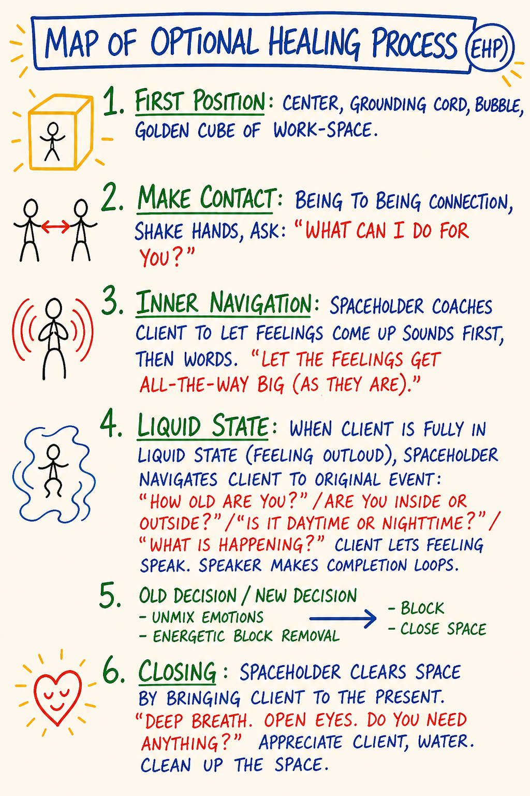
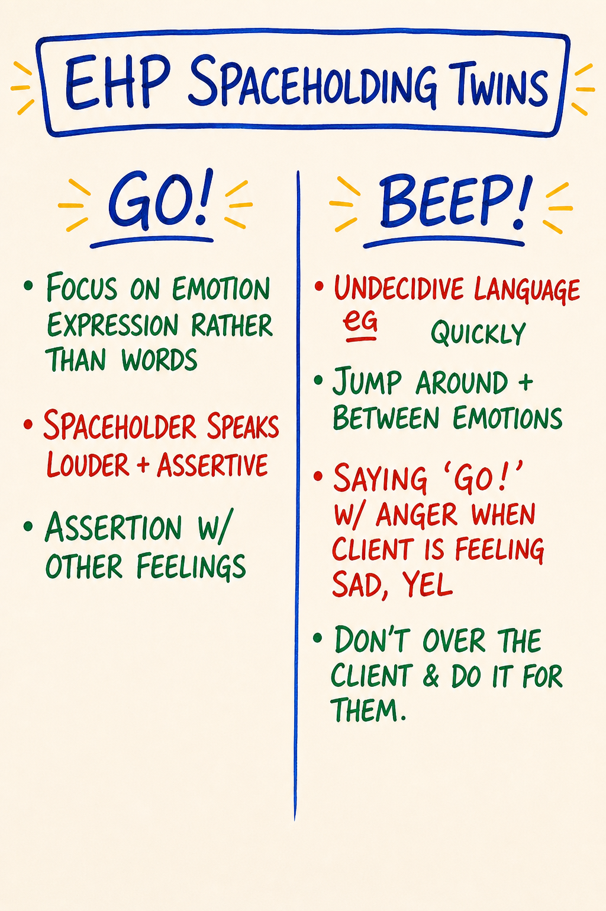

# Module 06 · Mixed Emotions and Emotional Healing Process

| | |
|---|---|
| **Intensity** | **HIGH.** Partner check-in required before starting; no override. **Partner debrief also required after.** See the unlock checklist in `04 - Container and Gatekeeping Protocol.md` Section D. |
| **Sittings** | 3 (break points marked in the text) |
| **Tools for this module** | Study the map: [M11 · Mixed Emotions](../Map%20Atlas/M11%20-%20Mixed%20Emotions.html) · [M12 · Emotional Healing Process](../Map%20Atlas/M12%20-%20Emotional%20Healing%20Process.html) · [M39 · Map of Optional Healing Process](../Map%20Atlas/M39%20-%20Map%20of%20Optional%20Healing%20Process.html) · [M40 · EHP Learnings](../Map%20Atlas/M40%20-%20EHP%20Learnings.html) · [M38 · EHP Spaceholding Twins](../Map%20Atlas/M38%20-%20EHP%20Spaceholding%20Twins.html) · Run the practice: [EHP Walker](../Interactive%20Tools/Day%2006/ehp-walker.html) (gated) |
| **Videos** | The written module is complete on its own. Videos are optional enrichment: see [Video Manifest](../Facilitator%20Resources/Video%20Manifest.md). |

**Daily spine:** Phase B — morning sit: Beep! Book + Feelings Form bar reading (8-10 min). See [Daily Practice Spine](../Practice/Daily%20Practice%20Spine.md).

> **Grounding.** Script 1 (the 60-second universal script) is in [Solo Centering and Grounding Scripts](../Facilitator%20Resources/Solo%20Centering%20and%20Grounding%20Scripts.md). The gated practice tool for this module carries a **GROUND NOW** button, and the script stands alone at [ground.html](../Interactive%20Tools/ground.html). Know both routes before you start. You will use one of them inside this module, most likely more than once.

---

## Consent check (read before continuing)

> This module teaches **the Emotional Healing Process (EHP)** and asks you to do a small one on yourself. The EHP is the structured PM practice for completing a stored emotion. Material that has been sitting in your emotional body, sometimes for decades, will surface. That is what the module is for.
>
> Before continuing, confirm to yourself:
> - My partner is reachable today and tomorrow, and we have already agreed on a "before" check-in and an "after" debrief.
> - I have at least 90 uninterrupted minutes ahead of me for Sitting 1.
> - I am not in acute crisis, not under the influence, not within 60 days of a major loss.
> - I am not planning to use this module as a substitute for trauma therapy. (If I have unprocessed trauma, I am doing this with my clinician alongside, or I am pausing this module.)
> - I know the solo practice's **hard stop**: I stop before Position 3 if intensity passes 40%, if I lose present-time orientation, or if the original event becomes vivid in body memory.
> - I know how to ground, and I know where the GROUND NOW button and [ground.html](../Interactive%20Tools/ground.html) are.
> - I know how to reach the CM if I need to.
>
> If any of the above is not true, pause and come back when it is. There is no skip and no override on this check. If all are true and you choose to continue, take a slow breath and begin.
>
> **Reading this without a cohort or partner?** The teaching in this module, the unmixing micro-practice, and the observation experiments are fine to run solo. **The solo EHP practice is strictly deferred until you have a live witness** recruited on the Module 0 seven-line agreement (the debrief is part of the practice, not decoration), and Demon work (Module 9) carries the same line. If anything surfaces that you cannot ground on your own, [findahelpline.com](https://findahelpline.com) lists crisis lines for every country.

> **Readiness check (10 seconds).** Can you tell a feeling from an emotion, and locate one of the four feelings as a body sensation (Module 5)? The EHP applied to material you cannot yet feel is theatre. If the feeling/emotion distinction is still abstract, re-read [M10](../Map%20Notes/M10%20-%20New%20Map%20of%20Feelings.md) and [M11](../Map%20Notes/M11%20-%20Mixed%20Emotions.md) first. (Full self-check: [Learning Self-Assessment](../Facilitator%20Resources/Learning%20Self-Assessment.md), Part 2.)

> **If your partner has gone quiet.** This module is partner-gated for a reason: you should not do it alone, and Module 6's EHP debrief is partnered by design. But a silent partner must never strand you. If your partner has not responded, **message your CM**. There is a real fallback (a witness partner, or a CM-held exchange) so you are accompanied through the "after." Do not run the EHP practice with no one to debrief with, and do not let a non-responsive pairing stall you indefinitely. The fallback is yours to ask for.

---

## Before you start — recall (5 minutes)

Free recall on Module 5. No notes, no peeking.

1. Take a blank page in your Beep! Book. Redraw the New Map of Feelings (M10) from memory: four feelings, body locations, asked-for actions, shadow forms. As much as comes.
2. Say the core distinction out loud, in your own words. The shape to hit: a feeling is present-time, clean, three to five minutes, and for creating; an emotion is past-time, mixed, longer than five minutes, and for healing.
3. Check against [the map](../Maps/M10.png). Mark what you missed, without verdict, and move on. This warm-up is generation, never answer-checking. Nobody scores it, including you.

## Step 0 — center (5 minutes)

Run Script 2 (5 min centering) from [Solo Centering and Grounding Scripts](../Facilitator%20Resources/Solo%20Centering%20and%20Grounding%20Scripts.md). Then open the module.

**Sitting 1 of 3 starts here.**

---

## Purpose

To install the two distinctions that turn yesterday's map into today's tool: **mixed emotions** (the messy state most adults actually live in) and the **Emotional Healing Process** (the structured PM practice for completing a stored emotion so its energy returns to you).

Module 5 named what feelings and emotions are. Module 6 is where you start working with them. Specifically: you learn the shape of a mixed emotion, you learn the **six positions of the EHP map (Position 0 through Position 5)**, and you do a **solo EHP-map practice on small stored emotion only**. Canonical EHP requires a live witness; this module is not that. What you do here is a rep: small material, the 40% hard stop before Position 3, and the partner debrief afterward. By the end of this module you will know, from your own experience, the difference between **expressing an emotion** (which leaks it onto people) and **processing an emotion** (which moves it through with structure).

This module relies on Module 5's distinctions being live: feeling vs. emotion, the four feelings, the Numbness Bar. If those are still abstractions for you, pause and re-read M08, M09, M10 before continuing. Your morning bar reading continues through all of this, and from today it earns its Mixed column: when a morning number arrives as two feelings tangled together, tick **Mixed** in the [Feelings Form](../Practice/Feelings%20Form.md) row and name the pair if you can. That one tick is this module's teaching running as a daily instrument. And before Sitting 1, read your rows since Module 5 once, two minutes: which bars moved, which stayed flat. This is the first of the three row re-reads the course schedules (here, Module 7, Module 10).

---

## Core PM concepts

- **Mixed emotion.** A stored state that is part feeling, part memory, part story: two or three feelings tangled together with the past event that froze them. The default adult condition is mixed-emotion soup, not clean feeling.
- **Unmixing.** Naming the component feelings of a mixed emotion, one at a time, so each one can move through. Anger as anger. Sadness as sadness. Fear as fear. Not all at once.
- **Stored emotion / open wound.** The PM image: an unprocessed feeling sits in the emotional body like an open wound waiting for the right conditions to close. It is not pathology. It is incomplete data.
- **Emotional Healing Process (EHP).** The structured practice for completing a stored emotion. Six positions, numbered 0 through 5. **Not trauma processing.** A moment-to-moment, non-linear discovery journey of healing — no script. And **optional**: nobody heals you, and nothing makes you heal; the process begins with a person choosing it and stays inside that consent.
- **The witness / spaceholder.** The partner, coach, or therapist who holds space during an EHP. Does not fix, advise, narrate, or "send love." The energy of being seen is the medicine.
- **Scope.** EHP is for ordinary stored emotional residue. Trauma (flashbacks, lost time, dissociation, abuse memory) needs a qualified clinician (EMDR, somatic experiencing, TF-CBT, IFS, equivalent). PM is precise about this carve-out.

---

## Learning outcomes

By the end of this module you will:

1. State, in your own words, what a **mixed emotion** is, name three common mixed states (sadness+fear, anger+sadness, fear+anger, joy+sadness), and identify one mixed emotion you have been carrying.
2. Name the **six positions of the EHP map** (Position 0 through Position 5) and what each is for.
3. Have completed one **solo EHP-map practice on small stored emotion**: registering, locating, unmixing, letting one component feeling move, returning to present. (Not canonical EHP — that requires a live witness. **Hard stop before Position 3** if intensity passes 40%, if you lose present-time orientation, or if the original event becomes vivid in body memory.)
4. Have been **witnessed** by your partner in a structured "after" exchange, and have practiced witnessing your partner in return.
5. Be able to distinguish **expressing** an emotion (acting it out, dumping it on a person) from **processing** an emotion (moving it through with a witness in a held container).
6. Know, concretely, with specific signals, when an EHP exceeds the scope of this module and requires a clinician.
7. Have given **teach-back #2**: explained one map each from Modules 4, 5 and 6 to your partner in your own words.

---

## Module flow

| Step | Time | What you do |
|---|---|---|
| 0 | 5 min | Run Script 2 (5 min centering). Then open the module. |
| 1 | 10 min | Recall warm-up; read the consent check; **send your partner the "before" check-in voice message** and wait for confirmation |
| 2 | 45 min | Teaching, part one: mixed emotions · the unmixing micro-practice · healing is optional (M39) |
| 3 | 40 min | Teaching, part two: the six EHP positions · expressing vs processing · the witness annex (M38) · what EHPs teach (M40) · scope |
| 4 | 40 min | **Small Solo EHP practice** (alone, grounding script open beside you) |
| 5 | 10 min | Close the practice day: Script 5; Script 9 that evening |
| 6 | 2 min | **Next-morning three-question check** before continuing |
| 7 | 25 min | **Partner "after" exchange** (within 24 hours): you are witnessed; you witness your partner; reply within 24 hours |
| 8 | 20 min | **Teach-back #2** (Modules 4–6, with your partner) |
| 9 | 48 hrs | Run the **between-module experiment** (small; observation only) |
| 10 | 25 min | Journal the **reflection prompts** |
| 11 | 15 min | The integration pause + **consolidation rep** before Module 7 |
| 12 | 5 min | Close the loop · post one line to the cohort feed |

Spread the module across 3–4 days. Do not stack the solo EHP and the partner "after" in the same hour as something stressful. The emotional body needs space around this work.

---

## Concept teaching notes

### Why "mixed" is the default

*▶ [Study M11 in the Map Atlas →](../Map%20Atlas/M11%20-%20Mixed%20Emotions.html)*

Study the map before reading on. It sits between the New Map of Feelings (M10) and the Emotional Healing Process (M12): M10 names what feelings are, this map names what they *become* when they cannot flow, and M12 is the practice that puts them back into motion. Notice it does not show four clean energies. It shows tangles: two or three feelings knotted together with the past event that froze them.

Module 5 introduced the four feelings as **clean, archetypal, time-limited** energies, each doing its job in 3–5 minutes and passing. That is what a feeling looks like when conditions allow it to move. For most adults, most of the time, conditions do not allow it. The Old Map forbade three of the four. The Numbness Bar was installed to keep feelings below registration. So a feeling arrives, is immediately blocked or swallowed or redirected or numbed, does not vanish, stops flowing, mixes with the memory of the event that set it off, picks up a story, and **stores**.

The next time something resembling that event happens, what arrives is no longer a clean feeling. It is a **mixed emotion**: part present-time stimulus, part 1997 dinner table, part story you have been telling yourself for twenty years, part anger that was never allowed, part sadness that was never received, part fear that was never spoken. The work of this module is to learn how to **unmix** them so the energy returns to you and the wound closes.

> A mixed emotion is a feeling that has stopped flowing. It is part feeling, part memory, part story. Naming the components is the first step to unmixing them.

### Common mixed states

You will recognize most or all of these from your own life:

| Mixed state | Component feelings | What it commonly looks like |
|---|---|---|
| **Collapse · hopelessness** | sadness + fear | "What's the point." Limp body, blank eyes, no anger available even when warranted. |
| **Resentment · bitterness** | anger + sadness | Long-running grudge. Anger that cannot land cleanly because the loss underneath has not been grieved. |
| **Anxiety · defensive rage** | fear + anger | The body braced and ready to attack what hasn't happened yet. Hyper-vigilance, sleeplessness, snapping at safe people. |
| **Nostalgia · bittersweet** | joy + sadness | Looking back at something you loved that is gone. The respectable mixed emotion, and easy to live inside forever. |
| **Depression** | sadness + (suppressed) anger + fear | The classic. Sadness on the surface, anger that was forbidden underneath, fear of one's own anger underneath that. |
| **"Stress"** | fear + anger + sadness, all numbed | The standard-issue adult mixed emotion in industrialized cultures: underneath, three feelings the person is not allowed to feel. |
| **"Overwhelm"** | varies; usually fear + sadness + one more | The signal that several stored emotions are arriving at once and the system has no order to take them in. |

None of these are pathological. They are all storage states. Each can be unmixed.

Note what is *not* on this list: "frustration," "irritation," "moodiness," "burnout," "trigger." Those are not feelings. They are stories about mixed emotions. The discipline of returning to the four (anger, sadness, fear, joy) and naming **which feelings are mixed in this** is what makes the work possible. Stay disciplined. And hold two sharper tests for telling a mixed emotion from a clean feeling. **Duration:** pure feelings are minutes long; mixed emotions last years. If it has been around longer than five minutes, it is not a present-time pure feeling. **Energy:** a pure feeling asks for specific work and then takes it (make a boundary, let go, prepare, share); a mixed emotion takes no responsible action. It just runs, and it drains.

**Common misunderstandings about mixed emotions.**

- *"If I just feel my mixed emotion fully, it will pass like a pure feeling."* It will not. Mixed emotions loop; they do not arrive in 3–5 minute waves. The work is to **unmix**: name the components and move each one separately. Trying to move "the whole thing at once" reinforces the tangle.
- *"If I'm in a mixed emotion, I'm broken."* The default adult condition is mixed-emotion soup. Not pathology: the predictable result of running the Old Map for decades. Naming the mix is the first move toward unmixing it.
- *"Depression / anxiety / chronic stress is just how I am."* Each is a recognizable mixed-emotion pattern with identifiable component feelings, not a fixed identity. Each can be unmixed via the EHP. (Clinical depression, anxiety disorder, and PTSD are separate categories needing clinical care alongside; see the scope carve-out below.)

> **Micro-practice — the Unmixing Restatement (10 minutes).** Do this now, before reading on. It is the skill the whole EHP rests on, practiced on safe material. Sit, center, ground, drop a bubble, Beep! Book nearby. Identify one mixed state you have been in within the last 48 hours — and **pick a small one**: a recurring low-grade irritation, a mild "stress," a small "overwhelm," a flicker of nostalgia, a familiar brief resentment. *Not* a major decades-old wound. First, write the state in the words you would normally use: *"I was stressed about the meeting." "I felt frustrated when she said that."* One sentence in your usual vocabulary. Now restate it in the form: *"I have some [feeling] and some [feeling] mixed together about [trigger],"* using only the four — anger, sadness, fear, joy. For each component you named, ask: *"Where in my body does this one live, and at what intensity (0–10) is it present right now?"* — write the location and number. Then for each component ask: *"What is this one asking for on the New Map of Feelings (M10)?"* — anger asks for a boundary, sadness for release, fear for precision, joy for sharing. Write the asked-for action for each. Read your unmixed version aloud and notice how differently it sits than the "stress / frustrated / overwhelmed" wording. Precision opens space. **Stop there.** Naming the components is the practice; *moving* them is the EHP below, and the larger pieces want a witness. Do not attempt to process this mixed emotion solo right now.

### Healing is optional — and that is the design

*▶ [Study M39 in the Map Atlas →](../Map%20Atlas/M39%20-%20Map%20of%20Optional%20Healing%20Process.html)*

Give the map a full minute before the words. Six stations down the page, drawn as a path: the golden cube of workspace at the top, two figures making contact, sounds before words, the liquid-state cloud, the old-decision/new-decision arrow, and a heart at the close. (The map numbers its stations 1 through 6; the module names the same stations Position 0 through Position 5. Same path, two numbering conventions; the course uses the 0–5 names throughout.)

The word to sit with is in the title: **optional**. Nobody heals you. Nothing makes you heal. A stored emotion can sit in an emotional body for sixty years and the person remains functional; plenty do exactly that. An EHP begins with a person choosing, out loud, to complete something (*"What can I do for you?"* is a question, and "nothing today" is a valid answer), and every later position stays inside that consent. This is not a soft disclaimer. It is what separates healing work from the things that get done *to* people, and it is why the course gates this module on your own confirmation rather than on a schedule. The choice is the first position before the first position.

**Common misunderstandings about the optional healing process.**

- *"If healing is optional, I can skip it forever with no cost."* You can. The cost is carried as the storage itself: the energy bound in the wound stays bound, and the mixed emotion keeps running its loop. Optional does not mean free.
- *"Someone who loves me can decide I need this and walk me into it."* No one can be processed against their will, and trying produces resistance or harm, not healing. The loving move available toward an unconsenting person is to keep being someone they could one day choose to be witnessed by.

---

**SITTING BREAK** — stop here if you need to. When you return: one breath, re-read your last Beep! Book line, continue with Sitting 2 of 3.

---

### The EHP map — six positions, Position 0 through Position 5

*▶ [Study M12 in the Map Atlas →](../Map%20Atlas/M12%20-%20Emotional%20Healing%20Process.html)*

Open this map side-by-side with the module and keep it there for the rest of this section. Take its shape in before reading: six positions in relationship, not a numbered staircase. You do not march through them in order. You find yourself in one, the witness helps you locate yourself, you move when the material moves you. The positions are the terrain; the path is yours.

> An EHP is a moment-to-moment, non-linear discovery journey of healing. **No script.**

**Position 0 — First position.** Center · grounding cord · bubble · golden cube · bright principles. The Module 3 equipment plus the integrity layer you carry. Without this foundation, you are doing catharsis with no container.

**Position 1 — Make contact.** Being-to-being connection with the witness. Shake hands. The witness asks: *"What can I do for you?"* The moment the EHP becomes a chosen practice between two consenting people.

**Position 2 — Navigate to liquid state.** The witness coaches the client to close eyes, let the emotion get bigger, make sounds of the emotion, *and only after, the words*. The body's signal precedes language. You become liquid by giving the emotion permission to take more space, not by analyzing it.

**Position 3 — In liquid state — work the original event.** The witness navigates with concrete questions: *Is it daytime or nighttime? Inside or outside? Alone or someone else there? What is happening?* Then three moves:
- **Block**: locate where the original feeling got blocked. Whose voice. Which rule. What stopped it moving the first time.
- **Old decision / new decision**: surface the decision the child made to survive the moment (*"I will never need anyone." "Anger means I get hit." "If I cry I am weak."*) and let an adult-stance decision replace it (*"I can need people now." "I can be angry safely now."*).
- **Unmix · emotions process**: name the component feelings of the mixed emotion. Let each move in turn. **Anger as anger. Sadness as sadness. Fear as fear.** Not all at once.

**Position 4 — Start closing.** Summarize the territory the client went through. Navigate back to present + room. Open eyes. Get water. Appreciation. An EHP without a clean closing leaves the client suspended.

**Position 5 — The end.** Vanish the golden cube and clean up. Energetic boundary closes. The container ends. The client is in ordinary life again, and *changed*, because the energy bound in the stored emotion is now available to them.

### Feeling vs. expressing vs. processing

This is the load-bearing distinction of the module:

- **Feeling**: registering a feeling, in the present, in your body. A 3–5 minute clean wave. (Module 5's work.)
- **Expressing**: acting a feeling out. Yelling at your partner. Crying at your friend. Posting it. Drinking it. *Expressing a feeling that is actually a stored emotion creates damage*, because the feeling has nothing to do with the person in front of you. They were the trigger, not the source.
- **Processing**: completing a stored emotion through the EHP, with a witness, in a held container. The feeling moves, the original event is met, the decision unmixes, a new decision is named, the wound closes. **Energy returns.**

Most of what the world calls "expressing your feelings" is actually expressing stored emotions onto present-day people. PM does not do this. PM separates the two. Feelings move in real time, with the person who is present, about what is actually happening. Emotions process in a held container, with a witness, about the original event. **Different practices. Different rooms.**

### The role of the witness

The witness (your partner today; a coach or therapist for larger EHPs later) has exactly one job: **be physically and energetically present while the feeling moves.**

What a witness does:
- Sit with attention on the person doing the EHP.
- Hold center, ground, bubble themselves. (Your own state is the container.)
- Notice when the person has drifted into story, head, or analysis; gently bring them back to the body, the sensation, the original event.
- Ask the navigation questions if relevant (*"How old are you in this? What is happening? Who is there?"*).
- Stay until the closing.

What a witness does **not** do:
- Advise. Fix. Suggest. Recommend.
- Narrate the person's experience back at them as your interpretation.
- "Send love," beam light, do reiki, or anything performative.
- Get pulled into the original event as if it were happening now.
- Talk about your own similar experience. (That is a different conversation, for a different time.)
- Use therapy language you do not own. (No "inner child." No "shadow work." No "trauma response." Those words come from other modalities with their own training; PM has its own vocabulary and uses it on purpose.)

The witness's energy of being present is the medicine. That sounds soft. It is not. It is what the EHP stands on. A feeling does not complete in isolation. It completes in the presence of a being who can be with it without flinching.

#### Witness annex — the spaceholding twins

*▶ [Study M38 in the Map Atlas →](../Map%20Atlas/M38%20-%20EHP%20Spaceholding%20Twins.html)*

Stop here and take the map in. Shape first, labels second. Two columns under two familiar names, **Go!** and **Beep!**: the Module 4 rapid-learning grammar, applied to the witness's own craft. Spaceholding is a learnable skill with reps and design data like any other, and this map is its field log. The Go! column is what works: keep the client's attention on the emotion's expression rather than on its vocabulary; speak up, because a witness who mumbles hands the client doubt; be assertive enough that the container is unmistakably held, and hold it steadily even while the client's other feelings surge. The Beep! column is the classic spaceholder errors, each one a design specification: indecisive language ("um, maybe you could…") that drops the container; jumping between emotions instead of letting one complete; shouting an encouraging *"Go!"* in an angry tone while the client is in sadness, which collides with the feeling instead of holding it; and the Rescuer's classic, doing the client's process *for* them. You will hold space for exactly one thing this module: your partner's debrief. These columns apply at that scale too. When you catch yourself advising mid-debrief, that is a Beep!, and it goes in your Beep! Book with a Shift! line under it like any other.

**Common misunderstandings about spaceholding.**

- *"Witnessing is passive — I just sit there."* The Go! column is all active verbs: focus, speak, assert, hold. The witness does nothing *to* the client and is more energetically engaged than anyone else in the room.
- *"Mistakes while spaceholding mean I'm not safe to witness."* The map is literally a Beep! list: spaceholders are expected to err and shift. What makes a witness unsafe is not the error; it is not noticing.

### What running EHPs teaches

*▶ [Study M40 in the Map Atlas →](../Map%20Atlas/M40%20-%20EHP%20Learnings.html)*

The map first. The text below assumes you have seen it. A second Go!/Beep! card, harvested from many EHPs, and it describes the client's discipline as much as the spaceholder's. The Go! column: the feeling is found *in the body*; the body leads and the words follow; the client gets space to experience rather than narrate; the voice stays even and strong; both people are on one team; the emotion is sensed where it actually sits, right at the surface. The Beep! column is a catalog of the ways the process gets stolen: performing instead of feeling; distractions; telling the client what they feel; firing too many questions too fast; the verdict *"you are doing this"*; coaching when the moment asked for witnessing; thinking over feeling; and managing the client toward a goal (the subtle one, because a goal-shaped EHP is no longer a discovery). If you keep one line from this map for today's solo practice, keep **thinking over feeling**. Every learner hits the moment where the mind offers a tidy explanation in exchange for not feeling the next wave. The explanation is the Beep!.

**Common misunderstandings about EHP learnings.**

- *"A good EHP reaches the goal I set for it."* A goal-shaped EHP is managed, not discovered. You choose the material and the container; what moves, and how far, is not schedulable. Today's process moves today's available material.
- *"Crying / shaking / shouting means it worked."* Sounds and movements are common and none of them are the goal. The marker of a working process is the feeling moving in the body and the return to present afterwards, not the volume of the middle.

### Solo EHP — what you can and cannot do alone

**Solo EHP is for small to medium stored emotions only.** The reason is structural: when an EHP is in liquid state and the original event is live, the part of you holding the container is not the same part doing the processing. You need a witness to hold the container so you can be the one moving.

| Solo EHP works for | Solo EHP is NOT for |
|---|---|
| Low-intensity stored emotions you have noticed (a recurring irritation, a small old sadness) | Anything trauma-coded (flashbacks, dissociation, body memory, abuse history) |
| Material you have already worked with a witness; tidying up the edges | Material never touched before and large |
| "The energy doesn't quite return" loose ends | Anger toward a parent that is decades old and unprocessed |
| | Grief you have been holding off |
| | Anything actively suppressed that is starting to surface for the first time |

If any of the right-hand items arrive when you sit down to do today's practice: **stop, ground, voice-message your partner, and bring it to a witness.** That is not failure. That is the protocol working.

### Scope — what an EHP is, and what it is not

The EHP is for the ordinary stored emotional residue of an ordinary life: the third-grade teacher who shamed you, the friend who broke ranks at sixteen, the parent who could not receive your anger, the dog who died when you were nine, the boss who took credit. Stored emotions from these events are exactly what the EHP is built for. The EHP completes the unfinished feeling and the energy returns.

The EHP is **not** trauma processing. Trauma, both single-incident (assault, accident, surgical, combat) and complex/developmental (sustained abuse, chronic neglect, attachment rupture), operates differently in the nervous system: dissociation, body memory, autonomic dysregulation, somatic re-experiencing. Treating trauma with EHP is not just ineffective; it can re-traumatize. Trauma requires a qualified clinician with a trauma-built protocol: EMDR, somatic experiencing, TF-CBT, IFS, sensorimotor, or equivalent. It is a different kind of injury and it needs a different kind of room. A learner who sits down for an EHP and finds they are in trauma material has not done anything wrong. They have hit the ceiling of what this container holds, and the right next move is to stop, ground, contact a clinician, and not try to push through.

**Common misunderstandings about the EHP.**

- *"The EHP is a quick technique I can apply to anything."* It is a structured practice that requires foundation, a witness (for anything beyond small material), and time. Not a technique you apply: a container you enter. The smallest version takes 30–45 minutes. Larger EHPs run longer, with a trained witness.
- *"If I have trauma, the EHP is the right tool for it."* No. This is the carve-out above, stated as a rule: trauma needs a qualified trauma clinician with a trauma-built protocol (EMDR, somatic experiencing, TF-CBT, IFS, sensorimotor, equivalent). Treating trauma with the EHP can re-traumatize. The boundary is structural, not a preference.
- *"I can do major EHPs alone if I'm careful."* Solo EHP is for **small to medium** stored emotions only. The part of you holding the container is not the same part doing the processing. Major material needs a witness. Not optional caution; it is how the practice is built.
- *"Once an EHP is done, the material is gone forever."* A completed EHP closes one wound and returns its energy. Other stored material will surface in its own time. The work compounds; it does not "finish" in one session.

---

**SITTING BREAK** — stop here if you need to. When you return: one breath, re-read your last Beep! Book line, continue with Sitting 3 of 3.

---

## Embodied practice (solo) — Small Solo EHP

A single concrete practice. **30–45 minutes.** Done alone, in a room you will not be interrupted in. You have: a chair, water, your Beep! Book, the grounding script open in front of you, and your phone within reach in case you need to voice-message your partner. The [EHP Walker](../Interactive%20Tools/Day%2006/ehp-walker.html) walks the same positions on screen, behind the same consent gate, with the GROUND NOW button; paper and this script work exactly as well. **You are picking a *small* stored emotion you have been carrying for a while.** Not a major one. Not anything trauma-coded. The smallest one that still has some charge: a recurring irritation, a small old sadness, a low-grade fear about a specific situation. Quality of the rep, not size of the material.

**The hard stop, before you begin:** you stop before Position 3 if intensity passes **40%**, if you lose present-time orientation, or if the original event becomes vivid in body memory. You will meet this rule again at its point of use inside the script. It is not a suggestion. Read the script through once before you do it.

> **Script.**
>
> **Position 0 — Set foundation (5 min).**
> Sit. Both feet on the floor. Center. Drop a grounding cord into the earth. Set a bubble at arm's-length. Imagine a golden cube around the bubble — the container of this practice. Three breaths, exhale longer than inhale.
>
> Name out loud one bright principle you are sourcing from. (Examples: clarity, presence, integrity, gentleness, truth.) One word.
>
> **Position 1 — Make contact with yourself (3 min).**
> One hand on chest, one on belly. Speak to yourself by name: *"[Name], what can I do for you?"* Wait. Listen. (If the answer is "stop the practice" — stop. That is a valid completion.)
>
> Name the small stored emotion you have chosen, plainly: *"I have a stored emotion about [X]."* One sentence. No story yet.
>
> **Position 2 — Navigate to liquid state (5–8 min).**
> Close your eyes. Locate the stored emotion in your body. Where exactly? Heart? Throat? Belly? Bones? Specific.
>
> Let the sensation get *bigger*. Not the story — the sensation. If a sound wants to come (a sigh, a hum, a soft groan, even a single word), let it. Sound moves emotion faster than language.
>
> Stay until you feel a softening — a "yes, I am with this" quality. That is liquid state. If you cannot find it in 5 minutes, ground and end here. The bar may still be high today. Try again another day.

> **⛔ HARD STOP — read this at the threshold, every time.** Before you go on to Position 3, check three gauges, out loud. *Intensity: is this past 40% of what I could imagine feeling?* *Orientation: do I still know I am an adult, in this room, today?* *Memory: is the original event arriving as vivid body memory rather than as a scene I am observing?* If any answer is yes: skip Position 3 entirely, go now to Position 4, close, drink water, and voice-message your partner. Solo, with no witness holding the container, 40% is the ceiling. This is the protocol working, not the practice failing.

> **Position 3 — Unmix (8–12 min).**
> Eyes closed: of the four feelings — anger, sadness, fear, joy — **which two or three are in this mixed emotion?** Name them out loud. *"In this I have some anger and some sadness."* Whatever is true.
>
> Pick *one* of them. The one that wants to move first. Let it take more space. Anger as anger — jaw setting, arms wanting to push, bones solid. Sadness as sadness — chest softening, throat thickening, tears if they come. Fear as fear — skin prickling, breath shallow, attention sharpening.
>
> 3 to 5 minutes. **One feeling at a time.** No story. If the mind tries to explain "this is because of…" — set the explanation down and return to the sensation.
>
> If a second feeling rises behind the first, let it move. Same way. 3 to 5 minutes.
>
> If a memory of the original event surfaces, register but do not narrate it. *"I see myself at seven, in the kitchen."* That is enough. Stay with the feeling, not the storyboard.
>
> **Position 4 — Closing (5–7 min).**
> When the body has softened and the breath deepened, begin to close. Open eyes. Name three things you can see. Drink water. One hand on the chair, one foot pressed to the floor. You are here, in this room, now.
>
> If a new decision arrived (an old *"I will never need anyone"* becoming *"I can let myself be witnessed now"*) — write it down, one sentence, present tense.
>
> Out loud: *"Thank you, [Name]. We will continue when ready."* The container is closing.
>
> **Position 5 — Cleanup (3 min).**
> The golden cube dissolves. The bubble softens. The grounding cord remains. Stand. Walk three steps. Drink water. Notice the temperature of the room. You are back.
>
> In your notebook, fast, no editing: *Mixed emotion · component feelings · what moved · what didn't · any new decision · how my body feels right now.*

**What to expect.** The notebook named in the script's last line is your Beep! Book; the capture goes there, within ten minutes, like every capture in this course. The first 5 minutes often feel like nothing. Stay; the sensation is underneath, and you may need to look smaller. One feeling will usually move further than the others, and that is normal: today's EHP processes today's available material. You may cry, growl, shake, sigh, or laugh (all normal, none of them "the goal"), you may feel tender for several hours after (drink water, walk, no content, no hard conversations, no alcohol), and you may feel nothing during the practice and then a wave six hours later. The body's timing is not your timing.

**If at any point you find yourself:**
- Floating, watching from outside, unable to feel anything anywhere → **stop, ground, voice-message your partner.** This is dissociation. The EHP is not the right container.
- Crying that does not arrive in waves but feels like falling → **stop, ground, voice-message your partner.** Stuck sadness needs a witness.
- A specific traumatic memory surfacing (flashback, body memory, sensory replay of an abuse or accident event) → **stop, ground, voice-message your partner, contact your clinician** (today, not next week). This is trauma material. Different container.
- A strong urge to call a specific person from your life and *do something* about them → **stop, ground, do not call them today.** Whatever arrived is information about you, not instruction about them. Action, if any, comes after processing and after a night of sleep.

### Closing the practice day

This is a High day. Close it deliberately:

- **Now:** run **Script 5, the dissolution script (8 min)**, from [Solo Centering and Grounding Scripts](../Facilitator%20Resources/Solo%20Centering%20and%20Grounding%20Scripts.md).
- **This evening:** run **Script 9, pre-sleep grounding (4 min)**, before bed. EHP material likes to keep working at 3 a.m.; Script 9 hands it to sleep cleanly.

> **Next morning — three questions (2 minutes, before the daily sit).**
> 1. How did I sleep, and how does my body read right now: heavy, normal, or wired?
> 2. Is anything from yesterday still moving (fine — let it move), or stuck and looping (run Script 1, then voice-message your partner)?
> 3. What is right for today: continue with the debrief and teach-back, take another low-demand day, or contact the CM? Say the choice out loud.

---

## Partner exchange (async)

**Before the module:** both partners confirm reachability for the next 48 hours. One voice message each, short: *"I'm starting Module 6 today. I'm available for your debrief in this window."* Do not skip this. It is the unlock requirement for the module. **After the solo EHP, within 24 hours:** record the "after" exchange. Voice messages only.

**Your message (5–10 minutes).** Speak to your partner directly. Three things, in this order:

1. **The mixed emotion you worked with.** Name it, name the component feelings, name where in your body it lived. Not the whole story. One paragraph. *"I worked with a low-grade fear-and-sadness I have been carrying about [topic]. It was in my throat and my belly. The original event seemed to be from [age / situation, briefly]."*
2. **What moved and what did not move.** Be specific. *"The sadness moved further than the fear. The fear softened but did not complete. There was anger underneath I did not get to."* No conclusions about what it means. Just the report.
3. **Where you are right now**, as you record: body, energy, emotional state. *"Right now I feel quieter in my chest. I am a little tired. I feel slightly tender."* One feeling, located, at intensity, in present tense.

**The witness's reply (5–10 minutes).** When you receive your partner's message, **listen all the way through once before responding.** Then record:

1. **What you heard them say.** One or two sentences paraphrasing the core. Not the whole message. The part that reached you.
2. **That you witness them.** Say it plainly. *"I am with you in what you just did. I see that you did the practice. I am here."* This is not performative. It is the witness role's one job in an EHP debrief.
3. **One feeling that arrived in you while listening.** Name it from the four, locate it, note intensity. *"While you were speaking I felt some sadness in my chest, low intensity."* This is so they know they are speaking to a being who is present, not to a checklist.
4. **No advice. No suggestions. No "have you tried." No "I had a similar experience." No "you should be proud of yourself."** None of those are witnessing. They are some other thing. (Check yourself against the M38 Beep! column afterwards; a caught Beep! is a good rep.)

If your partner names material that exceeds the module's scope (trauma surfacing, ideation, intent to act on the original event in their adult life) — gently say so. *"What you are describing is bigger than this exchange can hold. I am glad you told me. I am also asking you to message the CM today, and if there is a clinician you work with, them too. I am still with you. And I am being honest about the limits of what I can do here."* Then continue witnessing. The honesty is part of the witnessing.

---

## Teach-back #2 — Modules 4, 5 and 6 (partner, ~20 minutes)

The second of three scheduled teach-backs (the first ran at Module 3; the third comes at Module 9). Teaching a map out loud is generation: it shows you, faster than any re-read, which parts you own and which parts you have only recognized.

1. **Pick one map from each module:** Module 4 (Feedback and Coaching, M25, or Rapid Learning, M26) · Module 5 (Old Map of Feelings, M08, Numbness Bar, M09, or New Map of Feelings, M10) · Module 6 (Mixed Emotions, M11, or the EHP, M12).
2. **Explain each to your partner in your own words**, two to three minutes per map, no notes, as if your partner had never met it. Live call or voice message both work. Your partner holds meaning-listening: no correcting, no quizzing, no filling in.
3. **Then read the card.** For each map, open its Map Note (e.g., [M26](../Map%20Notes/M26%20-%20Rapid%20Learning.md), [M10](../Map%20Notes/M10%20-%20New%20Map%20of%20Feelings.md), [M11](../Map%20Notes/M11%20-%20Mixed%20Emotions.md)) and read its "How to explain it verbally" paragraph aloud. Both of you listen for what your version carried and what it dropped.
4. **Name one gap each, yourself.** *"I taught the EHP without the witness, the container. That is where my next rep goes."* Nobody grades this; the gap you name yourself is calibration, and it goes in the Beep! Book.
5. **Swap roles** per map if you are working live; async, your partner records their three teach-backs in reply. Solo path: teach the three maps to your voice recorder, listen back the next day, one Beep! line per map: *where the words ran out.*

---

## Between-module experiment

**Small. Observation only. Do NOT attempt a major EHP solo between modules.**

Pick **one**. Write it on a fresh Beep! Book page in the Module 4 format before you run it, and run it once in your actual life before you start Module 7.

> **Experiment — [your pick]**
> *What I will do:* (the specific observation, in real situations)
> *By when:* (a specific window — dates, not "soon")
> *What I will notice:* (the data you will write down afterwards)

1. **The mixed-emotion log.** Over 48 hours, three times a day, note one mixed emotion as it arises in you. Write three lines: *State · component feelings · approximate age this seems to be from.* Do not process. Just register. *"Resentment at the team meeting. Anger + sadness. Feels about 15."* Three a day × 2 days = 6 entries.
2. **The unmixing sentence.** Catch yourself once, in the next 48 hours, in a mixed state where you would normally say *"I'm frustrated"* or *"I'm overwhelmed"* or *"I'm stressed."* Silently, in your head, restate it in the form: *"I have some [feeling] and some [feeling] mixed together right now."* Just for yourself. No announcement. No action. Notice what shifts when the words land precisely.
3. **The witness-noticing.** Pay attention, over 48 hours, to the people around you who are in mixed emotions and trying to express them at people. Notice the pattern. *Do not* try to coach them. *Do not* try to witness them. Just see the shape of the pattern from outside. (This is also information about what *you* have been doing for years.)

**Capture within ten minutes** of each observation, in the Beep! Book, flat lines. A missed day is a Beep! with a Shift! line under it, not a verdict.

**Callback rep (Module 5's instrument):** each morning of the experiment window, when you fill the Feelings Form row, use the **Mixed** column deliberately: if any bar reading arrived as a tangle, tick it and name the pair. The Form is where this module's distinction lives from now on; the experiment feeds it.

---

## Reflection prompts

Journal at your own pace. Longhand if you can.

1. The mixed emotion I worked with today: what specifically did I learn about its components that I had not seen before? Which feeling in it had I been most reliably refusing to name?
2. The original event that surfaced during the solo EHP: what was the decision I made then? Write it in one sentence in the language a child would use. Then write the new decision in one sentence in the language an adult uses. Hold both. Notice which one your body believes today.
3. Where in my present life am I "expressing" stored emotions onto people who are not the source? Name the person. Name the emotion. Do not act on this insight today.
4. The role of the witness: what did it feel like to be witnessed in the "after" exchange? What did it feel like to witness my partner? Which was harder? What does that tell me?
5. What is the next stored emotion I am aware of carrying, that I am *not* going to attempt solo? Name it. (Naming it without processing it is itself a piece of work. It marks the territory you will return to with a witness.)

---

## Safety callouts for this module

Module 6 is **High intensity**: the most direct piece of inner work the course teaches. Specific things to expect:

- **Sadness that doesn't seem to stop.** "Grief gates" can open: old losses arriving in a wave that exceeds the small EHP container. *Cue:* the crying does not arrive in 3–5 minute waves with arrival/peak/release; it feels like falling without floor. **Ground first. Stop the practice today. Voice-message your partner.** (Script 6 in the [Solo Centering and Grounding Scripts](../Facilitator%20Resources/Solo%20Centering%20and%20Grounding%20Scripts.md) is built for exactly this.) If the gate stays open more than 12 hours and you are unable to function, contact the CM. A grief gate sometimes needs a grief-aware coach or therapist; PM does not pretend to be that container.
- **Anger surfacing toward parents (living or dead).** The classic Module 6 occurrence. The Old Map work made visible whose rules you have been carrying; the EHP today makes the anger underneath available. **It is anger for the EHP — not for the phone call.** Do not call your parents today. Do not write the letter today. Process the anger in the container; let the energy return; let a night of sleep pass. Any real-world action comes from your adult self in normal state, not from the EHP. Voice-message your partner.
- **Fear of being permanently changed.** *"What if I can't go back?"* The Box reacting to a real shift. The shift is real, and the change is not damage. Ground. Slow down. Notice you can still walk, eat, breathe. The fear is information about the Box's investment in the prior configuration, not evidence anything has gone wrong.
- **Re-traumatization risk for learners with unprocessed trauma.** If you have unprocessed trauma (developmental trauma, abuse history, single-incident trauma still producing flashbacks or dissociation), **the EHP is the wrong instrument**. Right next move: a qualified trauma clinician with a trauma-built protocol. Do not push through. The course will be here.
- **Wanting to drink, scroll, eat, work, or otherwise numb after the module.** The EHP opens a wound before it closes; the Box reaches for the familiar numbing tool. Notice the urge. **Voice-message your partner before acting.** If you act anyway, name it as a numbing action in the Beep! Book: information, not failure.
- **Urge to call a specific person and "have the conversation."** Whatever arrived is information about you. Wait 24 hours minimum before any significant action. If after sleep, grounded, back to ordinary state you still want the conversation, voice-message your partner first. Most "I have to do this now" urges post-EHP dissolve by morning.

### When to call your buddy
- The solo EHP did not complete cleanly and you are still tender 6+ hours later, or a feeling stayed open after Position 4 and you are not sure how to close.
- You stopped the practice partway (including at the 40% hard stop) and need a witness for what came up.
- An urge to act on someone is sitting in you and you want a witness before deciding, or you numbed immediately after and want to name it.

### When to call the CM
- A stuck feeling has not moved in 24+ hours and your buddy is not enough, or a state is interfering with sleep, work, or relationships for more than 24 hours.
- Material surfaced that you do not have a clinician for and you want a referral, or you want to pause the cohort to integrate.
- You are concerned about another learner based on what they posted to the feed.

### When to call a clinician — same day, today, not next week
- Flashback (in the original event sensorially, not just remembering it).
- Dissociation lasting more than a brief moment (lost time, watching from outside, body feels not yours).
- Suicidal ideation of any kind.
- Specific traumatic memory surfacing that you have not previously worked through.
- Hospitalization-grade nervous system event (panic that does not resolve, severe somatic dysregulation, mania).
- You are in concurrent care and the material exceeds what your weekly session can hold. Today.

The universal grounding script applies at all times: Script 1, the GROUND NOW button in the day tool, or [ground.html](../Interactive%20Tools/ground.html). Default action when uncertain: ground and pause. The course losing 10 minutes to caution is fine. Pushing through what needed a pause is not. EHP is in scope; trauma processing is not. The distinction is structural, not a slogan. Close the practice day with Script 5, and the evening with Script 9, as wired above.

---

## The integration pause — schedule it now, and put one rep inside it

Between this module and Module 7 the course schedules **at least one full integration day**: ground, sleep, journal, the morning sit, a partner check-in, and nothing else due. Module 7 reads your drama patterns, and it lands cleaner on a rested system that has digested the feelings work. Open the printable schedule from Module 0 and mark the pause with a date before you close this module.

One thing goes inside the pause, near its end: the **consolidation rep (15 minutes, recall-based)**. Blank page in the Beep! Book, files closed. (1) Redraw the New Map of Feelings from memory: four feelings, locations, asked-for actions, shadow forms (6 minutes). (2) Redraw the six EHP positions from memory, Position 0 through Position 5, one line each on what each is for (6 minutes). (3) Open [M10](../Maps/M10.png) and [M12](../Maps/M12.png), mark what you missed, no verdict (3 minutes). Generation, never answer-checking; the gaps you find are exactly the parts that would have silently faded before Module 7 builds on them.

---

## Cohort feed post (suggested)

One line each, no more (solo or witness path: same lines, into the Beep! Book):

- The mixed emotion I met today, in two-word form: …
- What surprised me about being witnessed (or witnessing): …
- (Optional) one question for the group: …

Do not post the content of your EHP. The cohort feed is not the container for that material; the partner exchange is.

---

## Glossary additions

- **Mixed emotion**: a stored state that is part feeling, part memory, part story; two or three of the four feelings tangled with the past event that froze them; an open wound waiting for the right conditions to close
- **Unmixing**: naming the component feelings of a mixed emotion, one at a time, so each can move through; the first move of EHP Position 3
- **Emotional Healing Process (EHP)**: the structured PM practice for completing a stored emotion; six positions, numbered 0 through 5; non-linear; no script; optional by design (the client holds the switch); requires a witness for anything beyond small material
- **Witness / spaceholder**: the partner, coach, or therapist who holds space during an EHP; present, grounded, no fixing, no advising; their craft has its own Go!/Beep! pair, the **spaceholding twins** (M38)
- **The 40% hard stop**: the solo ceiling; stop before Position 3 if intensity passes 40%, present-time orientation slips, or the original event arrives as vivid body memory
- **Expressing vs. processing**: expressing acts an emotion out at a person; processing completes the emotion in a held container with a witness; PM separates the two on purpose
- **Scope of EHP**: for ordinary stored emotional residue; NOT for trauma; trauma requires a qualified clinician with a trauma-built protocol

---

## Close the loop (5 minutes)

1. **Self-check, three-word scale** (not yet · starting · landed in my body; the scale from the [Learning Self-Assessment](../Facilitator%20Resources/Learning%20Self-Assessment.md)): *I can name the components of a mixed emotion I am carrying, and I know, with specific signals, what is in scope for an EHP and what needs a clinician.* Say your rating out loud. No score, no log, just the honest word.
2. **My Map Book entry.** Add one page to [My Map Book](../Practice/My%20Map%20Book.md): one distinction from this module in your own words, plus one lived example from this week. Two sentences is enough.
3. **Re-entry line.** A High module is exactly where a pause can turn into a silence. If that happens, come back through [Coming Back](../Practice/Coming%20Back.md): a gap handled cleanly is a rep, not a debt.

The integration pause comes next, with its consolidation rep inside it. Then Module 7: the drama your cleared emotional body can finally see.

---

🄯 **World Copyleft 2026** · *Expand the Box (Digital)* · licensed **[CC BY-SA 4.0](https://creativecommons.org/licenses/by-sa/4.0/)**, consistent with the spirit of World Copyleft · re-presents Possibility Management thoughtware originated by Clinton Callahan & the Possibility Management community · this course is an independent re-presentation, **not an official Possibility Management training** · please share, share-alike · Powered by Possibility Management ([possibilitymanagement.org](https://possibilitymanagement.org)) · full terms: `LICENSE.md` in the course root
