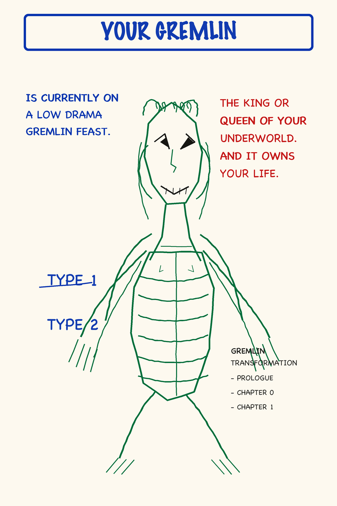
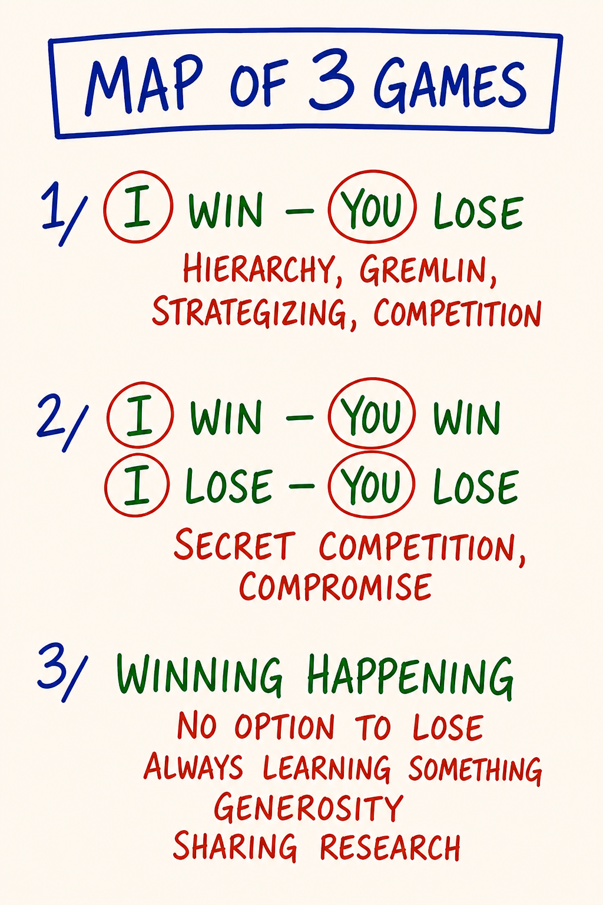
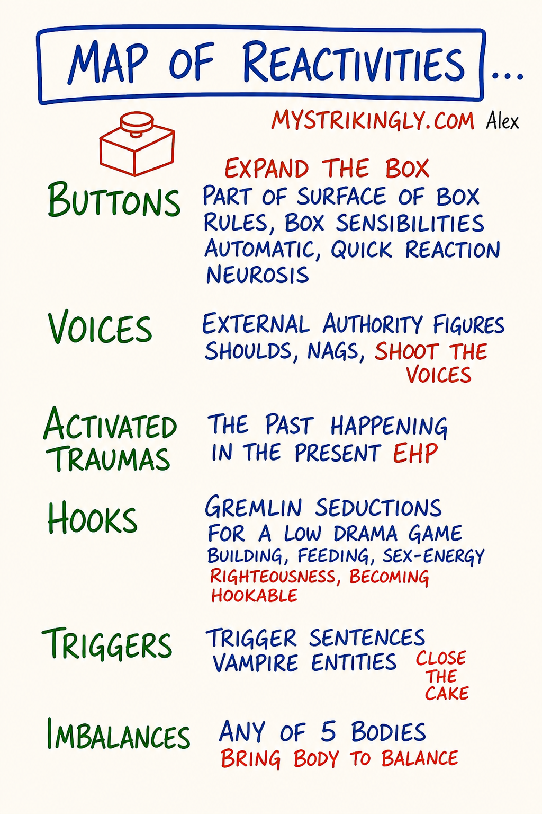

# Module 07 · Low Drama, Gremlin Food, Shifting to the Responsible Game

| | |
|---|---|
| **Intensity** | **HIGH.** Partner check-in required before starting; no override. See the unlock checklist in `04 - Container and Gatekeeping Protocol.md` Section D. |
| **Sittings** | 3 (break points marked in the text) |
| **Tools for this module** | Study the map: [M13 · Low Drama Triangle](../Map%20Atlas/M13%20-%20Low%20Drama%20Triangle.html) · [M27 · Your Gremlin](../Map%20Atlas/M27%20-%20Your%20Gremlin.html) · [M47 · Map of 3 Games](../Map%20Atlas/M47%20-%20Map%20of%203%20Games.html) · [M29 · Map of Reactivities](../Map%20Atlas/M29%20-%20Map%20of%20Reactivities.html) · Run the practice: [Drama Detector](../Interactive%20Tools/Day%2007/drama-detector.html) |
| **Videos** | The written module is complete on its own. Videos are optional enrichment: see [Video Manifest](../Facilitator%20Resources/Video%20Manifest.md). |
| **Also referenced** | [M20 · Map of Possibility](../Map%20Atlas/M20%20-%20Map%20of%20Possibility.html) (owned by Module 10: it is the course's own map of where low drama and high drama actually sit) |

**Daily spine:** Phase B — morning sit: Beep! Book + Feelings Form bar reading (8-10 min). See [Daily Practice Spine](../Practice/Daily%20Practice%20Spine.md).

> **Grounding.** Script 1 (the 60-second universal script) is in [Solo Centering and Grounding Scripts](../Facilitator%20Resources/Solo%20Centering%20and%20Grounding%20Scripts.md). The gated practice tool for this module carries a **GROUND NOW** button, and the script stands alone at [ground.html](../Interactive%20Tools/ground.html). Know both routes before you start.

---

## Consent check (read before continuing)

> This module engages **the drama patterns of your daily life directly**. The roles you have been playing (Persecutor, Victim, Rescuer) were learned early and have been running, in some form, every day since. Expect the gremlin to turn this material against you: self-disgust, special-awful, beyond-hope. That is food, not truth.
>
> Before continuing, confirm to yourself:
> - My partner is reachable today and tomorrow.
> - I took the integration pause after Module 6 (with its consolidation rep), or a real equivalent.
> - I have at least 90 uninterrupted minutes ahead of me for Sitting 1.
> - I am not in acute crisis or under the influence right now.
> - I know how to ground, and I know where the GROUND NOW button and [ground.html](../Interactive%20Tools/ground.html) are.
> - I know how to reach the CM if I need to.
> - **My primary relationship is not currently in active crisis.** If it is: pause, contact the CM, do not proceed without that conversation.
>
> If any of the above is not true, pause and come back when it is. There is no skip and no override on this check. If all are true and you choose to continue, take a slow breath and begin.
>
> **Reading this without a cohort or partner?** The teaching, the drama detector, and the seeing-only experiments in this module are fine to run solo; write the exchange prompts into your Beep! Book instead. Do not run the Emotional Healing Process (Module 6) or any Demon work (Module 9) without a live witness you have recruited on the Module 0 seven-line agreement. If anything surfaces that you cannot ground on your own, [findahelpline.com](https://findahelpline.com) lists crisis lines for every country.

> **Where you are on the climb.** Modules 5, 6 and 7 are three High modules close together, and this one closes that cluster. To be accurate about what remains: **Module 8 is Medium** (demanding partner work, not emotionally engineered) **with a scheduled rest day after it, and Module 9 is High** (ego states, the Demon locator). Pace accordingly; the pause architecture continues past this module, and the rest day before Module 9 is part of the route.

> **Readiness check (10 seconds).** Can you locate a 5% feeling in your body (Module 5)? Without it you will not catch your own Victim or Persecutor performance in the act, and the drama work flattens into personality typing. If not, re-read [M10](../Map%20Notes/M10%20-%20New%20Map%20of%20Feelings.md) first. (Full self-check: [Learning Self-Assessment](../Facilitator%20Resources/Learning%20Self-Assessment.md), Part 2.)

> **If your partner has gone quiet.** This module is partner-gated for a reason: you should not do it alone. But a silent partner must never strand you. If your partner has not responded and you want to proceed, **message your CM**. There is a real fallback (a witness partner, or a CM-held exchange) so you are accompanied. Do not run the High-intensity practice with no one on the other end, and do not let a non-responsive pairing stall you indefinitely. The fallback is yours to ask for.

---

## Before you start — recall (5 minutes)

Free recall on Module 6. No notes, no peeking.

1. Take a blank page in your Beep! Book. Redraw the EHP map (M12) from memory: the six positions, Position 0 through Position 5, one line each on what each is for.
2. Say the core distinction out loud, in your own words. The shape to hit: expressing acts a stored emotion out at a person and creates damage; processing completes it with a witness in a held container.
3. Check against [the map](../Maps/M12.png). Mark what you missed, without verdict, and move on.

This warm-up is generation, never answer-checking. Nobody scores it, including you.

## Step 0 — center (5 minutes)

Run Script 2 (5 min centering) from [Solo Centering and Grounding Scripts](../Facilitator%20Resources/Solo%20Centering%20and%20Grounding%20Scripts.md). Then open the module.

**Sitting 1 of 3 starts here.**

---

## Purpose

To make visible the daily-life drama you have been generating, to name what it has been for, and to name where the drama work is actually headed.

Module 7 is direct work. Drama is produced, not received: you generate it, on purpose, because something in you eats it. Modules 5 and 6 cleared the emotional body enough that you can finally see what the drama was substituting for. Module 7 asks the unflattering question: *what have I been feeding, and at whose expense?*

You install four distinctions. The **Low Drama Triangle** (Persecutor, Victim, Rescuer). The **gremlin** and what it eats. The way out: **shifting to the Responsible Game**. And the destination that shift points toward: **high drama**, radical responsibility taken at gameworld scale. None of this is moral. All of it is operational. By the end you will be able to detect a drama position in yourself in real time and name the food it is producing: the precondition for choosing differently.

This module relies on Modules 5 and 6. If your distinction between feeling and emotion is not yet living in you, the drama work reads as personality typing rather than as the energetic accounting it actually is. If you can't yet locate a 5% sadness in your chest, you will not catch your Victim performance in the act. Pause and re-read M10 if you need to. Your morning bar reading continues through all of this; drama days make distinctive rows. Before Sitting 1, take the second scheduled row re-read: scan your rows since Module 5 and mark the days a drama episode ran. The bars on those days are the energetic accounting in plain numbers.

---

## Core PM concepts

- **Low drama.** The daily-life, sub-threshold kind of drama: complaint, blame, "I had to," "you always," the sigh, the eye-roll, the rescue nobody asked for. Low not because the stakes are low but because it operates **below the threshold of noticing**. Runs on unconscious purpose. Produces gremlin food.
- **High drama.** Taking **radical responsibility at gameworld scale**: consciously sourcing bright principles to hold and shift what happens in a whole field of commitment (a team, a family, a culture, a gameworld). Sits under Conscious Purpose on the course's own map (M20). The *destination* of the drama work, not a variant of the disease.
- **The Low Drama Triangle.** Three positions a person rotates through: **Persecutor** (attacks, blames, controls), **Victim** (collapses, "this is happening to me," manipulates through helplessness), **Rescuer** (steps in unasked, takes over, builds dependency). All three are the same Box-pattern. One machine, not three personalities.
- **Gremlin.** The part of you that wants drama. Distinct from the Box (which keeps you safe). Hungrier and louder. Part of the system; naming it is not condemning it.
- **Gremlin food.** What low drama is actually for. Being right, being wronged, being special, being misunderstood, being a victim, being a savior, being above it all, being beneath it all. The drama produces the food; the gremlin eats. The Low Drama Triangle is gremlin food production at industrial scale.
- **The Responsible Game.** What is left when you decline drama. Simpler, less stimulating, feels less alive at first because the gremlin is starving. The shift: notice → name → step out → ask what is actually happening, what you actually want, what you can actually choose.
- **The 3 Games.** Three ways a game can be set up: I win–you lose · win-win (and its shadow, lose-lose compromise) · **winning happening**, where there is no option to lose because everyone is learning. The Responsible Game grows toward the third.
- **Fighting reality.** The first ingredient of low drama. *Whatever is happening should not be happening.* Set that posture, you are inside the triangle.
- **Reactivity.** Any time something external sets off an automatic internal reaction that is not a present-time conscious choice. The **Map of Reactivities** sorts reactivity into **six kinds** (Buttons, Voices, Activated Traumas, Hooks, Triggers, Imbalances), each routing to a *different* tool already in this course. From the inside they all feel the same; the first move is always to name which one fired.

---

## Learning outcomes

By the end of this module you will:

1. Name the three drama positions and recognize which one you flip into most habitually under stress.
2. State the difference between **low drama and high drama on the responsibility axis**, and say why only one of them feeds the gremlin.
3. Name at least three of your own gremlin foods, including the one you are most uncomfortable admitting.
4. Apply the **low-drama detector** to a specific drama within the last 7 days of your life: which position you were in, what the food was, what the Responsible Game move was.
5. Detect the energetic difference between speaking from a drama position and speaking from the Responsible Game.
6. Given a reactivity, name **which of the six kinds** it is (Button · Voice · Activated Trauma · Hook · Trigger · Imbalance) and the tool each one routes to, so you stop applying one favourite tool to every reaction.
7. Have completed a partner exchange in which you named a gremlin food out loud and were witnessed without being fixed.

---

## Module flow

| Step | Time | What you do |
|---|---|---|
| 0 | 5 min | Run Script 2 (5 min centering). Then open the module. |
| 1 | 10 min | Recall warm-up; read the consent check; confirm partner reachable |
| 2 | 45 min | Teaching, part one: low vs high drama · the Triangle · the gremlin and its foods |
| 3 | 40 min | Teaching, part two: fighting reality · the Responsible Game and the 3 Games · the responsible story · the Map of Reactivities |
| 4 | 30 min | **Low-drama detector practice** (solo, embodied, with the Beep! Book) |
| 5 | 10 min | Close the practice day: Script 5; Script 9 that evening |
| 6 | 2 min | **Next-morning three-question check** before continuing |
| 7 | 25 min | **Partner voice exchange** (record + send) |
| 8 | — | Receive partner reply within 24 hours; record your reply |
| 9 | 48 hr | Run the **between-module experiment** |
| 10 | 20 min | Journal the **reflection prompts** |
| 11 | 5 min | Close the loop |
| 12 | 1 min | Post one line to the cohort feed |

Spread the module across 3–4 days. The drama work has a way of going underground for a few hours and then surfacing in a conversation with someone you live with; give it that room.

---

## Concept teaching notes

### Low drama and high drama — the responsibility axis

The phrase *low drama* is easily misread. People hear *low* and assume mild, small, harmless. The opposite is true. Low drama is the kind so woven into ordinary life it is **invisible**. The sigh when your partner leaves a cup out. The story you tell yourself driving home about what your colleague *really* meant. The reassuring noise you make to the friend complaining about the same thing for the fourth month. The eye roll. The "I had to." The "you always."

It is low not because the stakes are low (over years the stakes are enormous; most relationships die from it rather than from anything dramatic) but because it operates **below the threshold of noticing.** And it is low on one more axis, the one that defines the pair: **responsibility.** Low drama is what a person does instead of taking responsibility. Every position on the triangle below is a way of declaring *the cause of this is not me*: the Persecutor blames, the Victim collapses, the Rescuer makes someone else's problem the alibi for ignoring their own. Unconscious purpose, kitchen scale, gremlin fed.

**High drama is the other end of that same axis, not a louder version of the disease.** High drama is taking **radical responsibility at gameworld scale**: consciously sourcing bright principles to hold and shift what happens in a whole field of commitment — a team, a family, a culture, a gameworld. The person playing high drama has stopped asking *who did this to me?* and started asking *what am I building, and what does it need from me next?* They are at cause for a space larger than their own comfort: the facilitator holding a charged room from presence rather than control, the founder declaring a context and then standing in it with their actions, the parent consciously authoring the emotional climate of a household for twenty years. Same energy budget the triangle was burning, now spent on creating instead of on producing food.

The course's own map already says this. Open [M20, the Map of Possibility](../Map%20Atlas/M20%20-%20Map%20of%20Possibility.html) (image: [M20](../Maps/M20.png)), which Module 10 teaches in full: LOW DRAMA sits under **Unconscious Purpose**, and HIGH DRAMA sits under **Conscious Purpose**, inside the Responsible Game. The two are not siblings on the wrong side of the map. They are the before and after of the whole drama work. Low drama feeds the gremlin; high drama feeds nothing to the gremlin, because there is no victim story in it anywhere. That is also why the gremlin finds it boring. This module goes after the low kind because it is the one you cannot see yet, and the one that runs your life. But hold the destination from the start: you are not learning to decline drama so you can live a smaller, quieter, drama-free life. You are reclaiming the energy so it can be spent at scale, by choice.

**Common misunderstandings about high drama.**

- *"High drama means theatrical, staged performance — a surgeon in an emergency, an actor holding a stage."* No. That misreading puts high drama next to low drama as another kind of show, and it is exactly what this course refuses. High drama is not performance and not staging; it is radical responsibility sourced from bright principles at gameworld scale. A surgeon's controlled intensity is professional skill; an actor's craft is art. Neither is what M20 means.
- *"Both kinds of drama are gremlin food."* False, and worth saying plainly because v1 of this course taught it. Only low drama produces gremlin food. High drama starves the gremlin: there is no being-right, no being-wronged, no rescue in it to eat.
- *"I should skip the low-drama work and go straight to high drama."* Nobody holds a gameworld from bright principles while their gremlin is still eating triangle food underneath. The detector work in this module is the training ground; high drama is what the reclaimed energy becomes (Module 10 gives it the full map).

### The Low Drama Triangle — three positions of one machine

*▶ [Study M13 in the Map Atlas →](../Map%20Atlas/M13%20-%20Low%20Drama%20Triangle.html)*

Study the map before reading on. It is a triangle: **Persecutor** at one upper corner, **Rescuer** at the other, **Victim** at the bottom, with arrows showing the rotation between them. Three positions. But read the arrows, not the corners. The corners look like three different people; the arrows are the truth: one machine, rotating.

The claim that carries the map sits underneath the drawing: low drama is **produced, not received.** You are not in the triangle because someone put you there. You are in it because something in you eats what the position generates. *Getting pulled in* is itself a Victim framing, and a clue about your preferred food.

Most learners arrive recognizing one or two of the positions and being certain the third is "not me." By the end of Module 7 most learners discover they rotate through all three, often within a single conversation.

**Persecutor.** *"It's your fault. Let me show you why."* Attacks, blames, controls, criticizes, makes wrong. Scans the room for what is not right and announces it. Energetically big: chest out, jaw set, voice over the top. The food is being **right**, being **superior**, being **the one who sees clearly**. Persecutor does not require yelling. The quietest Persecutors work in a precisely-worded email, a calm comparison to a sibling, a sociological critique of a partner.

**Victim.** *"I have no choice. This is happening to me. Help me."* Collapsed, helpless, often physically smaller. Words say *I cannot* and the body confirms it. The food is being **wronged**, being **innocent**, being **special in suffering**. Victim is more powerful than it looks. A skilled Victim runs entire households by making others do for them what they have declared themselves incapable of. The collapsed energy is itself a control: *if you do not rescue me, you are cruel.* The Victim does not feel powerful while doing this; the Victim feels miserable. The misery is part of the food.

A live moment from the source cohort, when a learner noticed she was blaming herself, the trainer named it: *a certain kind of telenovela with yourself. Only you can be the victim and only you can be the persecutor and only you can stop the show.* This is the internal version. You can run the triangle entirely between parts of yourself and never involve another person.

**Rescuer.** *"Let me fix it for you."* Steps in unasked. Takes over. Builds dependency. The food is being **good**, being **needed**, being **above the problem because solving it for someone beneath**. Rescuer is the most morally camouflaged position: rescuing looks like kindness and is often praised. The damage is structural: the Rescuer needs there to be a Victim, and so subtly cultivates one. The friend you cannot stop helping is the friend you have made dependent. The Rescuer's reward is the appreciation, until the appreciation runs out, at which point the Rescuer rotates.

**The rotation.** A person does not stay in one position. The Rescuer who is not appreciated becomes Persecutor: *after everything I did for you*. The Victim who finally gets angry weaponizes the helplessness: *look what you made me do*. The Persecutor who is challenged collapses into Victim: *no one understands me, I am being attacked*. The Rescuer who is overwhelmed recasts the rescue as suffering: *I do everything around here, no one helps me*.

One machine, three faces. The faces look different. The function is the same: **produce gremlin food**.

**Common misunderstandings about the Low Drama Triangle.**

- *"I am a Rescuer — that's my type."* You are not a type. You are a person who rotates through all three positions, with a preferred entry point. Naming one corner as your identity is the Box parking you somewhere comfortable so it never has to watch you flip into the other two.
- *"Drama is something other people do to me — I get pulled in."* Drama is produced, not received. *Getting pulled in* is already a Victim framing, and the very fact that it is your reflex explanation tells you something about your favourite food.
- *"If I shift to the Responsible Game I'll feel better."* At first you feel *less alive*, because the gremlin is starving. The real aliveness of the Responsible Game is quieter and takes time to recognize. Expecting to feel better immediately is how people abandon the shift thirty seconds in.
- *"Once I see my pattern I'll be free of it."* Seeing it is the first move, not the last. The gremlin is patient; the same discipline is required at year five as at week one.

---

**SITTING BREAK** — stop here if you need to. When you return: one breath, re-read your last Beep! Book line, continue with Sitting 2 of 3.

---

### The gremlin — what it is and what it eats

*▶ [Study M27 in the Map Atlas →](../Map%20Atlas/M27%20-%20Your%20Gremlin.html)*

Stop here and take the map in. A hand-drawn creature, impish, clawed, grinning. Not a diagram of parts: a *portrait of the thing itself*, drawn so you stop treating it as an abstraction and start treating it as a resident. The text on the map names it exactly: **the King or Queen of your Underworld — and it owns your life. Currently on a low-drama gremlin feast.** Hold that phrase. The gremlin is sovereign down below, running the show from beneath your awareness, and the map states the cost plainly: until you meet it on purpose, *it owns your life.*

The Box (Module 2) keeps you safe according to its rules. The gremlin is different. The gremlin **wants drama**. Hungrier than the Box, more cunning, louder. The part of you that, when something is going well, finds the thing that is not going well and dwells on it. The part of you that re-tells the painful conversation eight times in your head, not to understand it, but to keep the food coming.

This is the cut that makes the gremlin usable: **the Box wants safety; the gremlin wants food.** Different appetite, different location. You have both. You are neither. The gremlin speaks *sotto voce*, quiet, conspiratorial, intimate: *they never appreciate you; you're better than this; just give up; go on, have one.* The trap is that the voice passes for thought, for insight, for "what I really feel." It is none of those. The feeling of truth is part of the bait.

And the gremlin **eats in both directions.** It is just as well fed by *"I'm the worst"* as by *"I'm the best."* Grandiosity and self-disgust are the same meal served two ways. This is why the gremlin is **not the inner critic**: an inner critic only runs you down; the gremlin feeds on the glory just as happily as the shame.

The gremlin also comes in **types**; the map marks *Type 1 / Type 2*. Your gremlin has its own characteristic flavour, its own favourite food. Type-1 gremlins, in the transcripts, *like being caught — yes, I did that, I'm really good at this game.* When you spot it clearly, it often grins. The grin is information.

The gremlin is not a bad part of you. **The gremlin is part of the system.** Naming the gremlin is not condemnation. You have a gremlin. You are not your gremlin. The gremlin will be with you for life. You do not kill it, you cannot, and trying to eliminate it is usually the gremlin's own strategy. The work is to **meet it, know its diet, befriend it, and put it to conscious use.** A gremlin you know can be directed. A gremlin you refuse to look at runs your life.

> **Scope note — what is in this room and what is not.** Meeting your gremlin, naming it, and catching its low-drama feast in progress is **in scope** for this course. Deep gremlin process work, **Gremlin Transformation** (the map's *Preface, Chapter 0, Chapter 1*), is a separate, longer container held by a PM trainer (the GT training). **Do not attempt to "transform" your gremlin solo.** Naming it is the work here; processing it is a different room. (Same discipline as the Demon scope note in M17 and the EHP carve-out: naming is the entry, processing is held elsewhere.)

The classic gremlin foods; your list will overlap and have its own colors:

| Food | What it sounds like |
|---|---|
| Being right | "I told you so." "I knew it." "I am the only one who sees this." |
| Being wronged | "After everything I did." "Why does this always happen to me." |
| Being special | "Nobody understands what I go through." "I am not like the others." |
| Being misunderstood | "You don't get it. You'll never get it." (And the satisfaction of being right about that.) |
| Being a victim | "I had no choice." "It's not my fault." "What was I supposed to do." |
| Being a savior | "Without me this would fall apart." "They need me." |
| Being above it all | "I don't engage in that kind of thing." (The contempt is the food.) |
| Being beneath it all | "I'm just trying my best." "I'm so tired." "I can't keep up." |

Most people have a primary food, two or three secondary, and one they are deeply uncomfortable admitting they enjoy. The uncomfortable one is usually the most operational. **Knowing your foods is the first step. Catching the gremlin in the act of being fed is the second.**

A learner in the transcripts names being *"the one people underestimate, so I overperform."* The trainer's response: *your gremlin likes all of this. Type-one gremlins really like being caught — yes, I did that, I'm really good at this game.*

**Common misunderstandings about your gremlin.**

- *"My gremlin is evil — it's something to get rid of."* The gremlin is not the enemy and cannot be killed. The war on the gremlin is itself gremlin food: being right, being on the side of good. The work is to know it and put it to conscious use. You have a gremlin; you are not your gremlin.
- *"The gremlin is just my negative self-talk — my inner critic."* No. The inner critic is closer to the Critical Parent (Module 9). The gremlin wants *food* (drama, suffering, righteousness), and it feeds whether the talk is negative *or* grandiose.
- *"The gremlin and the Box are the same thing."* Distinct locations. **Box** = survival and safety. **Gremlin** = appetite for drama-food. Confuse them and you will try to feed the gremlin with safety, or soothe the Box with drama. Neither works.

### Fighting reality — the first move of every low drama

There is a single move that initiates every low drama. **Fighting reality.** The internal sentence: *whatever is happening should not be happening.*

Your partner is late. The traffic is bad. The colleague did the thing again. The weather. The diagnosis. The bill. Reality presents you with what is, and you object to its being what is. From that objection, that quiet *no* to what is already true, you enter the triangle. You become Victim of the late partner, Persecutor of the colleague, Rescuer of the situation.

The transcript names it cleanly: *one of the basic first steps of any kind of low drama is fighting reality. You are saying whatever is happening should not be. And — Victim, boom, you're in low drama.*

The Responsible Game does not require you to like what is happening. It requires you to stop arguing with the fact of it. From *this is happening, what do I want to do with it*, a different range of moves opens. From *this should not be happening*, you go into the triangle every time.

### Shifting to the Responsible Game

The Responsible Game is what is left when you decline drama. Not heroic. Not virtuous. Not impressive. The simpler, less-stimulating thing that becomes available when you stop producing food.

The move has a shape:

1. **Notice** you are in a drama position. Most of the work is here; the position is invisible until you have practiced enough to see it. The body usually knows first: tight jaw is often Persecutor; collapsed chest is often Victim; pulled-forward posture toward someone else's problem is often Rescuer.
2. **Name it**, out loud or silently. *I am in Persecutor right now.* The naming is itself a small act of stepping out. You cannot be fully in a position you are accurately naming.
3. **Step out.** Change posture, take a breath, drop the body. Ground, center, drop a bubble (Module 3 equipment). The position needs the energetic posture; loosen the posture and the position weakens.
4. **Ask three questions.** *What is actually happening, in fact, without my story about it? What do I actually want? What can I actually choose, right now, from here?* Not rhetorical. Sit with each.

A learner in the cohort, mid-conversation with a partner: *I told her where my attention was — my attention is on analyzing and being right. And then I just put this question. I asked, I wonder what else is possible for me with you right now? And then I was just quiet.* The shift is that compact. Naming the position, asking a different question, becoming quiet.

**A warning.** The Responsible Game **feels less alive at first.** Structural, not a sign you are doing it wrong. The drama was producing food, the food was producing a charge, you mistook the charge for aliveness. Without the food, the gremlin is starving and your body reads the starvation as *something is missing*. This passes, usually within hours, sometimes within days. It returns every time you decline a drama. **Stay with it.**

**A second warning.** The shift gets easier with practice but is **never automatic.** The gremlin is patient. When one food source dries up, the gremlin finds another. Catching it requires the same discipline at year five as at week one. People who claim they have transcended drama have usually just found a more sophisticated kind that flatters them.

#### What game are you in? — the Map of 3 Games

*▶ [Study M47 in the Map Atlas →](../Map%20Atlas/M47%20-%20Map%20of%203%20Games.html)*

Give the map a full minute before the words. Three numbered setups, three ways a game between people can be built, and the Responsible Game you just learned gets its ground from the third.

**Game 1: I win — you lose.** Hierarchy, strategizing, competition. The map writes *gremlin* right into this line, because the triangle lives here. Every low drama is a game-1 round: the Persecutor wins the exchange, the Victim wins the moral account, the Rescuer wins the gratitude ledger, and somebody has to lose for the food to be produced.

**Game 2: I win — you win… and its shadow, I lose — you lose.** The civilized improvement, and the map is dry-eyed about its underside: *secret competition* and *compromise*. Plenty of "win-win" is game 1 wearing a collaboration costume, both players quietly keeping score; and plenty of compromise is a lose-lose where each party's main consolation is that the other one also did not get what they wanted.

**Game 3: winning happening.** The map's own phrase, and the strangest of the three until you have tasted it: a game built so there is **no option to lose**. Always learning something. Generosity. Sharing research. A Beep! in game 3 is design data, not defeat, which you already know, because the Beep! Book has been training game 3 in you since Module 0. The Responsible Game at kitchen scale, and high drama at gameworld scale, are both game 3 setups: nobody has to lose for the thing to be worth playing, because what is being produced is learning and creation rather than food.

When you decline a drama this week, ask one extra question: *what game was I being invited into, and what game do I want to set up instead?* Changing your position inside game 1 is good work. Changing the game is the bigger move.

**Common misunderstandings about the 3 Games.**

- *"Game 2 is the goal — win-win is what mature adults do."* Game 2 is better than game 1 and still keeps score. The map names its failure modes on its own face: secret competition and compromise. Game 3 stops scoring losses entirely.
- *"Winning happening means everybody wins every time."* It means losing is not on the board: whatever happens, something is learned, shared, or created. Outcomes still vary. The accounting changes.
- *"Games are for games — this doesn't apply to my marriage / job."* Any field with more than one person in it is running one of these three setups right now, named or not. Naming which one is the first move toward changing it.

### The responsible story — retelling without the victim

One more instrument for the shift, taught here as text. (The Responsible Story has its own PM map; its image is in the course's redraw queue, and the teaching is complete without it.)

Every drama runs on a story, and the story has a grammar. The low-drama version casts you as the done-to: *he made me, I had no choice, this always happens to me.* The **responsible story** retells the same facts with the author back in the sentence: *I agreed to a deadline I knew was unreal. I stayed in the conversation after I felt the no in my body. I chose not to ask.* Nothing about the facts changes. What changes is where the cause lives, and therefore where the choices live. A story in which you are at cause is a story you can act in; a story in which the world does things to you is a story you can only suffer and re-tell, and the retelling is food.

The retelling discipline is the four-level sentence from Module 1, applied to narrative: take one drama story you told this week and tell it again from radical responsibility, out loud, one minute. Not as confession and not as self-blame; self-blame is the same victim story with the Persecutor hired internally (the telenovela again). As authorship: *given that I was at cause, what was I building, and what do I want to build instead?* You will use this in the detector practice's Step Three, and the partner exchange will show you how different the two versions sound in your own voice.

### The Map of Reactivities — name which one fired before you reach for a tool

*▶ [Study M29 in the Map Atlas →](../Map%20Atlas/M29%20-%20Map%20of%20Reactivities.html)*

The map first. The text below assumes you have seen it. A **reactivity** is when something external sets off an automatic internal reaction that is *not* a present-time conscious choice: something happens and you are already reacting before you decided to. The hook you just met is one kind of reactivity. So is the button that opens a drama. The map's claim is the one that spares you a great deal of wasted work: **not all reactivity is the same kind, and each kind has a different antidote.** From the inside they all feel identical (a jolt, a charge, a sudden *no*), so the untrained reflex is to grab one favourite tool every time (process it, push through it, analyse it). The map says: stop, and ask *which of the six is this?*

The six types, each with what it is and **where it routes**:

| Reactivity | What it is | Route (the tool it needs) |
|---|---|---|
| **Buttons** | Box rules and sensibilities firing automatically: quick, neurotic, repeatable. Someone leaves a cup out and *people should clean up after themselves* fires before you choose. The button is on the Box, not on you. | **Expand the Box** (Module 2 / M04). |
| **Voices** | Internalised external authority: the shoulds, the nags. A parent's, a teacher's, a culture's voice replaying as if it were yours. Cousin to the Critical Parent (Module 9). | **Shoot the voices**: recognise the voice is not yours and decline its authority. |
| **Activated Traumas** | The past happening in the present: a present-time trigger reaches old stored material and it floods forward as if the original event were happening now. | **The Emotional Healing Process** (Module 6 / M12) for the in-scope stored *emotion*, with the hard carve-out below. |
| **Hooks** | Gremlin seductions into a low-drama game (this module): the pull toward drama, righteousness, sex-energy, and *becoming hookable*, leaving the loop open so the gremlin gets fed. | **Catch the hook, decline the gremlin food**: the Responsible Game shift you just learned. |
| **Triggers** | Specific trigger sentences and draining "vampire" energies: the exact phrase, person, or energy that drains you the instant it arrives. | **Close the cake**: stop leaving yourself energetically open to the thing that feeds on you. |
| **Imbalances** | The reactivity that is really just one of the **5 bodies** (Module 3 / M06) out of balance: tired, hungry, energetically leaking. Not a psychological event at all. | **Bring the body to balance**: eat, sleep, ground, stop the leak. |

> **The hard line on Activated Traumas.** The EHP completes a stored *emotion*; it does not process **trauma**. Actual trauma (the early situations in which you first learned a drama position included) goes to a qualified clinician, not the EHP and not this module. (This is the same carve-out the safety callouts state below and that M12 holds. Naming which reactivity fired is in scope; trauma processing is a different room.)

**The diagnostic move.** When you catch yourself reacting, do not reach for a tool yet. Ask first: *which of the six is this?* Treating an Imbalance as if it were an Activated Trauma (sitting down to do deep inner work when you were actually just hungry) wastes the work and teaches your body the wrong lesson. Treating a Hook as a Button keeps you "expanding the Box" while the gremlin quietly eats. Naming the kind is what tells you the route. Often more than one is present at once. **Name the loudest first.** This is why Module 7 puts the hook beside the other five: the gremlin's hook is one reactivity among several, and the discipline that catches it is the discipline that sorts them all.

**Common misunderstandings about reactivity.**

- *"All reactivity is psychological and needs deep inner work."* The Imbalances type is the standing reminder that some "reactivity" is just a tired, hungry, or leaking body. Check the five bodies *first*. A snap at dinner is often low blood sugar, not a wound.
- *"I should just push through the reaction and suppress it."* Suppression banks it; that is the mechanism behind the Numbness Bar (Module 5) and Mixed Emotions (Module 6). Pushing through does not clear a reactivity; it stores it for later. Route it instead.
- *"Once I find my one tool, I can apply it to everything."* One tool per kind. Box work clears a Button and does nothing for an Imbalance; food clears an Imbalance and does nothing for a Voice. Using the wrong route is exactly why "I tried to work on it and nothing happened."

### A note on Karpman

Some learners have encountered Karpman's drama triangle from transactional analysis (1968). The shape is similar: Persecutor, Victim, Rescuer, rotation between them. PM differs in one important way. Karpman names the roles as **dysfunctional patterns**. PM names them as **gremlin food production**. Same positions, different account of what they are for. In Karpman, you stop because the roles are unhealthy. In PM, you stop because you can finally see what the drama was feeding, and you have built (over Modules 1–6) the equipment to feed yourself differently. If Karpman is already in your vocabulary, hold the two frames side by side; do not collapse them. (Karpman's frame also has no second pole: nothing in it corresponds to high drama, because it maps a pathology rather than a responsibility axis.)

---

**SITTING BREAK** — stop here if you need to. When you return: one breath, re-read your last Beep! Book line, continue with Sitting 3 of 3.

---

## Embodied practice (solo) — the low-drama detector

~25–30 minutes. Done alone, with your Beep! Book. You will need a specific drama from your actual life within the last 7 days; pick it before you start. Not the biggest drama of your life. A small one. Recent. The kind you would not normally have noticed as drama. The [Drama Detector](../Interactive%20Tools/Day%2007/drama-detector.html) walks the same steps on screen, with the consent gate and the GROUND NOW button; paper and this script work exactly as well.

Examples of the right size:
- The argument with your partner about dishes / weekend plans / the mother-in-law.
- The work conversation where you walked away with a story about what your colleague meant.
- The complaint you made to a friend that you have made before, about the same thing.
- The internal loop you ran for forty-five minutes about an email someone sent you.

Read the script through once before you do it.

> **Script.**
>
> Sit. Both feet on the floor. Beep! Book open. Center, ground, drop a bubble (Module 3 equipment; re-read [M07](../Map%20Notes/M07%20-%20Center%2C%20Grounding%20Cord%2C%20Bubble%2C%20Golden%20Cube.md) if it has fallen out of your body).
>
> **Bring the drama to mind.** The specific one. Who was there, what happened, what was said, how it ended. Spend ~3 minutes letting it become present. Notice your body. Notice the charge that arrives with the memory. The charge is data.
>
> **Step One — Which position was I in?** Out loud: *In this drama, I was in [Persecutor / Victim / Rescuer].* Try the first one that comes. Then check the other two: were you also in one of them, even briefly? Most dramas have you in at least two positions across the event.
>
> Write: the position(s) and one specific moment where you can locate each. *"When I said X, I was in Persecutor. When she replied Y, I rotated into Victim."* Be specific. Generalities will let you off the hook.
>
> **Step Two — What was the gremlin eating?** Out loud: *The food I was producing here was [name the food].* Try the list. Try your own words. Notice which naming makes your body do something: a flinch, a flush, a tightening, a quiet *oh*. That somatic response is the gremlin being spotted.
>
> Write: the food. Be precise. Not "I wanted to be right" but *"I wanted to prove that I have been carrying this relationship and she does not appreciate it."* That specific. If more than one food was produced, name each.
>
> **Step Three — What would the Responsible Game move have been?** Out loud: *The Responsible Game move would have been to [specific action].*
>
> Walk it through. *What was actually happening, in fact?* Strip the story off the event and describe it as a camera would. *What did I actually want?* Not the gremlin's want (to be right, to be appreciated, to be rescued) but the underlying want (to be understood, to share a workload, to feel close, to be left alone). *What could I have chosen, from there?* Then retell the event once, one minute, as a **responsible story**: same facts, you at cause, no self-blame.
>
> Write: the actual move. The sentence you could have said. The thing you could have done. The position you could have declined.
>
> **Step Four — Notice your gremlin's response.** Now that you have named the food and named the Responsible Game move, your gremlin will do one of two things. Either protest (*that's not what was happening, you're being too hard on yourself, the other person was actually wrong*), or go quiet and pivot to a new food: *now I am going to feel terrible about being a gremlin, which is a new gremlin food called "being beneath it all."*
>
> Watch this happen. Name what your gremlin tries. Write it down. Spotting it twice in one practice is excellent work.
>
> **Close.** Put the Beep! Book down. Stand up. Three breaths. Notice you are not actually inside the drama right now. You are in your room, in your body, in a different moment than the one you just walked through. The drama is over. The work is to have seen it.

**What to expect.** Most learners report the practice is uncomfortable but not destabilizing; the discomfort is the gremlin being spotted. A strong urge to dismiss the whole exercise as *I was actually right and they were actually wrong* is itself gremlin food (being right). Notice it; do the practice anyway.

If you discover the drama is much bigger than you thought (sitting on top of a decades-old pattern with this person), note it as a candidate for Emotional Healing Process work (Module 6, with a witness) and **do not try to process the larger pattern in this practice.** Today is for registering.

If you find yourself in shame rather than seeing (*I am a terrible person, I have been doing this my whole life, my relationships are ruined*): ground, stop the practice for today, voice-message your partner. Shame is not learning. The gremlin is using the practice itself to produce a new food. See the safety callouts.

> **Variation B — the three-corner stand (~10 min).** If the detector keeps you in your head, walk the triangle with your body instead. Mark three spots on the floor about three steps apart (coins, post-its) labelled **Persecutor**, **Victim**, **Rescuer**. Bring the same small recent drama to mind. Stand on **Persecutor**: take the posture (chest out, jaw set, weight forward) and say out loud what your inner Persecutor says about the situation; feel the charge; name the food (*being right, being the one who sees clearly*). Step to **Victim**: chest collapsed, shoulders down, weight back; say what your Victim says (*I had no choice, look what is happening to me*); name the food (*being wronged, being innocent, being special in suffering*). Step to **Rescuer**: leaning forward, hands ready, eyes on the other's problem; say what your Rescuer says (*let me handle it, don't worry*); name the food (*being needed, being good, being above the problem*). Then step *off* the triangle into the middle, equidistant from all three. Drop the postures. Ground: feet down, weight low, eyes soft. Ask the three Responsible Game questions out loud: *What is actually happening, in fact, without my story? What do I actually want? What can I actually choose, right now?* Notice the off-triangle spot is quieter, less charged. The gremlin will protest (*this is boring, nothing is happening*); that protest is the gremlin spotting the starvation. Stay in the middle anyway. Write two sentences in the Beep! Book about what you noticed when you stepped off.

> **Add-on — meet your gremlin's favourite food (≤15 min).** A *locator*, not a transformation (see the gremlin scope note above; do not try to transform your gremlin solo). Sit, centre, ground, drop a bubble. **Give the gremlin the pen (5 min):** on paper, let your gremlin say what it says when it wants its favourite food: petty, righteous, superior, collapsed, smug, whatever it actually is. Prompt it: *what does it want right now? To be right? Wronged? Special? The victim? Above it all?* Write the real sentences in its voice, *sotto voce*: *they never appreciate what I do; I'm the only one who sees clearly; nobody understands what I go through; I had no choice.* Notice the small charge of pleasure that comes with some of them; that charge is the food being eaten. **Name the favourite food, out loud (2 min):** read it back, find the one that shows up most or gives the biggest charge, and say it plainly once: *"That's my gremlin, and its favourite food is ___."* Be specific: not *"being right"* in the abstract but *"being the one who was carrying everything while no one noticed."* **Do not argue with it, do not fix it.** The moment you debate the gremlin (*that's not fair, the other person was actually wrong*) you have fed it a fresh meal. Just name the food and stop; naming starves it slightly. Close: pen down, three audible exhales, out loud: *"I have a gremlin. I know one of its foods now. I am not it. I am the one who can know it."* Write three lines: *favourite food · where in the body the charge sat · where in my week it is most likely eating.* If the gremlin turns this into self-disgust (*I've been like this my whole life, I'm beyond hope*), that is a new food (being especially awful), not the truth: ground, stop for today, voice-message your partner.

> **Add-on — name which one fired (~10 min).** Drill the Map of Reactivities directly. Sit, centre, ground, drop a bubble, Beep! Book open. **Bring one recent moment to mind:** a time in the last few days you snapped, withdrew, got hooked, got defensive, went cold. A small, ordinary one. Let it become present ~2 minutes; notice the charge (information, not a verdict). **Now walk the six, out loud, one at a time**, feeling for the body's answer each time. *Was it a Button?* (A Box rule firing, *this should not be like this*, the same reaction you always have to that exact thing.) *Was it a Voice?* (A should, a nag, an authority figure. And is that voice actually yours, or swallowed?) *Was it an Activated Trauma?* (Something old and much larger than the moment flooding forward.) *Was it a Hook?* (Gremlin food: righteousness, drama, being right. Did you get hooked because something wanted the food?) *Was it a Trigger?* (A specific sentence, person, or energy that drained you the instant it arrived.) *Was it an Imbalance?* (Be honest: were you just tired, hungry, ungrounded? Had you eaten? Slept?) **Name which one fired:** *That was a [Button / Voice / Activated Trauma / Hook / Trigger / Imbalance].* Name the loudest first, then any others; notice which naming makes your body do something. **Name its route:** *The route for this one is [Expand the Box / shoot the voices / EHP / decline the gremlin food / close the cake / bring my body to balance].* You are not running the route now; you are practising the diagnosis, the single move the whole map is built around. Close: Beep! Book down, stand, three breaths. Notice that naming the kind already changed the charge, even though you did nothing about it yet. That shift is the map working.

### Closing the practice day

This is a High day. Close it deliberately:

- **Now:** run **Script 5, the dissolution script (8 min)**, from [Solo Centering and Grounding Scripts](../Facilitator%20Resources/Solo%20Centering%20and%20Grounding%20Scripts.md).
- **This evening:** run **Script 9, pre-sleep grounding (4 min)**, before bed. Drama material likes to re-run the conversation at 3 a.m.; Script 9 hands it to sleep cleanly.

> **Next morning — three questions (2 minutes, before the daily sit).**
> 1. How did I sleep, and how does my body read right now: heavy, normal, or wired?
> 2. Is anything from yesterday still moving (fine — let it move), or stuck and looping (run Script 1, then voice-message your partner)?
> 3. What is right for today: continue with the exchange, take a low-demand day, or contact the CM? Say the choice out loud.

---

## Partner exchange (async)

Same structure as Modules 5 and 6: record, send, receive, reply. Voice messages only. Speak from your body, not from your script. (Solo path: speak the same three prompts into your voice recorder, listen back the next day, one Beep! line on what you heard.)

**Before recording: do the partner check-in.** Confirm your partner is reachable in this 48-hour window. If not, pause and contact the CM. (Structural requirement for all High modules. No override.)

**Prompt to record (5–10 minutes):**

Speak to your partner directly. Three things, in this order:

1. **One of your gremlin foods, the one you are most uncomfortable admitting.** Not the safe one. The one that, when you write it down, your body tightens. *"My gremlin eats being the smartest person in the room and looking down on everyone who isn't."* That specific. Name it. Do not justify it. Do not soften it with self-deprecation (itself a gremlin food). Just name it. **Naming the food starves it slightly.**
2. **The drama you used in the detector practice.** Which position you were in, what the food was, what the Responsible Game move would have been. Brief: the work was solo; the share is the headline, not the whole story.
3. **One thing alive in you right now**, as you record. Use the Module 5 form: *"Right now I feel some [feeling], the sensation is [location and quality], and what I think it is about is [one sentence]."* The Module 7 material often surfaces fresh feeling underneath the drama; speak it. If you stumble, leave the stumble in. Do not edit.

**When you receive your partner's message: listen all the way through once before replying.** Then record (3–7 minutes):

1. **What you heard them name as their food.** Repeat it back to them, in their words. The repetition is the witnessing. *"You said your gremlin eats being the one who never asks for help. I heard that."*
2. **What feeling surfaced in you while listening.** Name it from the four, locate it, note its intensity. *"While you spoke I felt some sadness in my chest, maybe 15%."*
3. **No question this time.** No advice. No "have you considered." No "I have a similar food." Naming a food and being witnessed without being fixed is the practice. Witnessing only. End with: *"Thank you for telling me that."*

If your partner names a food that hits home for you (one you have been a target of, or one you run too), notice it in your own body, do not bring it back to them in the reply, and journal about it separately. The drama-detection skills you are building are **for your own life first**.

**Critical: do not use the drama vocabulary on the person you live with this week.** Naming your partner's Persecutor / Victim / Rescuer position out loud to them is almost always wrong this week. You have one week of vocabulary and they have not done the module. See the safety callouts.

---

## Between-module experiment

One experiment. Write it on a fresh Beep! Book page in the Module 4 format, then run it for 48 hours, starting the day you finish this module.

> **Experiment — catch one drama position**
> *What I will do:* catch myself in one drama position, name it silently (position + food), and not fix it.
> *By when:* within 48 hours of closing this module; write the dates.
> *What I will notice:* the position, the food, what my body was doing, and what the gremlin did when it was spotted.

That is the whole experiment. Find one moment. It will not be hard; by Module 7 your detector is sharp enough that the dramas show up like neon signs you used to walk past. The moment can be tiny. *The eye-roll at the news. The sigh when the kid does the thing. The forty-five seconds of internal Persecutor rehearsal in the shower. The moment of Rescuer when your friend texted and you felt yourself getting drawn in.*

When you catch it:
- Silently, in your head: *That was Persecutor* (or Victim, or Rescuer).
- Notice the gremlin food. *I was eating being right about the political thing.*
- Do not act. Do not fix. Do not announce. Do not "shift to the Responsible Game" as a performance. Today is for **seeing**. Choosing comes later.

**Capture within ten minutes**, in the Beep! Book: 2–3 flat sentences. If you catch yourself two or three times in 48 hours, that is excellent. If you cannot catch yourself once, that is also information: either the dramas are still invisible (revisit the detector practice with a different recent event) or you are catching them and quietly judging yourself rather than naming them clean. Judgment is a gremlin food; the gremlin will run the experiment itself if you let it. A blank 48 hours goes in the book as a Beep! with a Shift! line under it.

**Callback rep (Module 6's instrument):** on one caught moment, run the unmixing restatement on the charge underneath the drama: *"Under that Persecutor was some [feeling] and some [feeling] mixed together about [trigger]."* Drama positions are mixed emotions wearing costumes; the Module 6 sentence is how you see through the fabric.

> **If naming things where you live could be unsafe** (a controlling partner, a household where being seen doing "self-work" has consequences, the intake Screen 4 situation), run this experiment entirely internally: silent naming, no notebook entry at home, capture later in a locked notes app or outside the house. The variant column in the [Experiment Bank](../Facilitator%20Resources/Experiment%20Bank.md) lists the lower-stakes version of every experiment in this course. Same rep, different room. Nobody needs to know which version you ran.

---

## Reflection prompts

Journal at your own pace. Longhand if you can.

1. Which position do I rotate to first under stress: Persecutor, Victim, or Rescuer? Which one did my body recognize before my intellect did? In whose company does this position show up most reliably?
2. Of the gremlin foods listed in the teaching notes, which one am I most uncomfortable admitting I enjoy? What is the specific shape of it in my life: what does it sound like, who is it usually about, what does it produce?
3. Name one chronic low drama in my life that I can now see was always there but had not noticed as drama. (A long-running complaint about a person, situation, or institution.) What gremlin food has it been producing? What would I lose if I stopped producing it?
4. The drama I worked in the detector practice: has it shifted in my body now that I have named it, even though I have not done anything about it? What does that tell me about the relationship between naming and changing?
5. High drama, as this module defines it: what is one field of commitment (a household, a team, a project, a community) that I would be willing to be at cause for at full scale? What does the energy currently going into my low dramas have to do with that field?
6. Where in my life am I in **internal** drama, running Persecutor and Victim and Rescuer entirely between parts of myself, with no other person involved? Who is each part to me, and what is being fed by the loop?
7. Think of a reaction I keep having that I have been treating as one thing. Walking the six kinds of reactivity (Button, Voice, Activated Trauma, Hook, Trigger, Imbalance), which one is it *actually*? How often, honestly, has it been an **Imbalance** (tired, hungry, ungrounded) wearing the costume of something deeper? What tool have I been mis-applying to it, and what is its real route?

---

## Safety callouts for this module

Module 7 is **High intensity**. The drama work has predictable shadows. Knowing them in advance is half of being able to handle them.

- **The gremlin will fight back. It will use Module 7 against you.** Some learners report intense self-criticism after this module: *"I am terrible at relationships," "I've been doing this my whole life," "I am a Persecutor pretending to be a Rescuer pretending to be a Victim, I am awful."* **That is the gremlin.** It is using the Module 7 material to produce a new, sophisticated food — being beneath it all, being beyond hope, being especially awful. Name it as the gremlin, not as truth. The work of Module 7 is to see your drama, not to be devastated by it. If you cannot tell which one you are doing, ground, voice-message your partner, and pause for the day.
- **Relationships may temporarily get worse before they get better.** Once you can see your own drama positions, you can also see other people's. **This is a trap.** Naming your partner's Persecutor position out loud to them is almost never the right move this week, no matter how clearly you see it. You have one week of vocabulary, they have not done the module, and the naming will land as Persecutor on your side (which it is, in that moment). **Run the experiments on yourself first.**
- **Numbing may increase.** Without the gremlin food, the body reads the starvation as *something is missing*. Some learners ramp up substances, screens, work, food, sex, or scrolling. Catch this. Voice-message the buddy when you notice the urge increasing, before you act on it. (Same mechanism as Module 5; same response.)
- **Couples already on the edge.** Module 7 can be destabilizing for relationships already in active crisis. The new vocabulary lets a person see patterns they had been managing by not seeing, and the seeing can collapse a structure that was holding by inertia. **If your primary relationship is currently in active crisis, name it to the CM before starting Module 7, not after.** The CM may recommend pausing, slowing the cadence, or proceeding with explicit additional support. This is not gatekeeping — it is what the safety framework was built for.
- **Wanting to call your old therapist or coach.** If you have one, calling them is not a problem. Be precise: *"I am working a module on drama patterns. I saw a lot. I am grounded. Can I check in?"* Do not begin unprocessed drama-position material with a brand-new therapist mid-module. If you do not have one and feel you need one, contact the CM for the [Referral List](../Facilitator%20Resources/Referral%20List.md).
- **The Persecutor-of-self loop.** Some learners discover that the drama they have been most reliably running is **on themselves**: internal Persecutor of an internal Victim, with both being you. The "telenovela with yourself" the transcript describes. If this loop is loud after Module 7, the right work is not to "stop being mean to yourself" (which is more Persecutor). The right work is to **see** the loop, name both parts as parts (not as you), and notice the gremlin food the loop has been producing. Module 9 (ego states) gives you more equipment. For now, see it, name it, do not try to resolve it.

The universal grounding script applies at all times: Script 1, the GROUND NOW button in the day tool, or [ground.html](../Interactive%20Tools/ground.html). If you notice you are dissociating, floating, or shutting down: stop, ground, decide. Close the practice day with Script 5, and the evening with Script 9, as wired above.

This course is not therapy. Drama-detection is in scope. Trauma processing, including the early situations in which you first learned a drama position, is not. If today's material brings up specific traumatic memory, use the [Referral List](../Facilitator%20Resources/Referral%20List.md) and bring a qualified clinician alongside.

---

## Cohort feed post (suggested)

One line each, no more (solo or witness path: same lines, into the Beep! Book):

- The drama position I caught myself in: …
- The gremlin food I named: …
- (Optional) one question for the group: …

---

## Glossary additions

- **Low drama**: the daily-life, sub-threshold kind of drama; low because it runs below the threshold of noticing and below the line of responsibility; unconscious purpose at kitchen scale; produces gremlin food
- **High drama**: radical responsibility taken at gameworld scale: consciously sourcing bright principles to hold and shift a whole field of commitment; sits under Conscious Purpose in the Responsible Game (map M20); NOT theatrical performance, NOT gremlin food; the destination of the drama work
- **Low Drama Triangle**: three positions of a single Box-pattern: Persecutor, Victim, Rescuer; person rotates between them; produces gremlin food
- **Persecutor**: drama position: attacks, blames, controls, makes wrong; food is being right, being superior
- **Victim**: drama position: collapses, "this is happening to me," controls through helplessness; food is being wronged, being innocent, being special in suffering
- **Rescuer**: drama position: steps in unasked, takes over, builds dependency; food is being good, being needed, being above-the-problem
- **Gremlin**: the King or Queen of your Underworld; the part of the learner that wants drama-food; distinct from the Box (which wants safety); eats in both directions (*"I'm the worst"* and *"I'm the best"* equally), so not the inner critic; comes in types; not the enemy and not the learner; met and named here, transformed only in the separate **Gremlin Transformation (GT)** container, a longer process held by a PM trainer
- **Gremlin food**: what low drama is for; emotional/energetic substances the gremlin eats (being right, being wronged, being special, being misunderstood, being a victim, being a savior, being above or beneath it all)
- **Fighting reality**: the first move of every low drama; the internal *whatever is happening should not be happening*
- **Shifting to the Responsible Game**: the move out of drama: notice → name → step out → ask what is actually happening, what you want, what you can choose
- **Responsible Game**: what is left when you decline drama; simpler, less stimulating, less alive at first because the gremlin is starving; sourced from Adult ego state (Module 9) and bright principles (Module 10)
- **The 3 Games**: I win–you lose (hierarchy, gremlin, competition) · win-win and its shadow lose-lose (secret competition, compromise) · **winning happening** (no option to lose: every outcome produces learning, sharing, or creation)
- **Responsible story**: the same facts retold with the author at cause; the narrative instrument of the shift out of low drama; not self-blame (which is the victim story with an internal Persecutor hired)
- **Reactivity**: any automatic internal reaction set off by something external that is not a present-time conscious choice; sorted by the Map of Reactivities into six kinds, each routing to a different tool
- **Map of Reactivities**: the six kinds of reactivity and their routes: **Buttons** → Expand the Box · **Voices** → shoot the voices · **Activated Traumas** → EHP (stored emotion only; trauma to a clinician) · **Hooks** → decline the gremlin food · **Triggers** → close the cake · **Imbalances** → bring the body to balance; the first move is always to name which one fired
- **Close the cake**: the route for a Trigger: stop leaving yourself energetically open to the specific sentence, person, or "vampire" energy that drains you

---

## Close the loop (5 minutes)

1. **Self-check, three-word scale** (not yet · starting · landed in my body; the scale from the [Learning Self-Assessment](../Facilitator%20Resources/Learning%20Self-Assessment.md)): *I can catch myself in a drama position in real time, name the food it is producing, and say what high drama would mean in my own life.* Say your rating out loud. No score, no log, just the honest word.
2. **My Map Book entry.** Add one page to [My Map Book](../Practice/My%20Map%20Book.md): one distinction from this module in your own words, plus one lived example from this week. Two sentences is enough.
3. **Re-entry line.** A High module is exactly where a pause can turn into a silence. If that happens, come back through [Coming Back](../Practice/Coming%20Back.md): a gap handled cleanly is a rep, not a debt.

Module 8 is Medium: listening, speaking, and the completion loops that stop drama before it starts. It has a rest day scheduled after it, and then Module 9 closes the High work.

---

🄯 **World Copyleft 2026** · *Expand the Box (Digital)* · licensed **[CC BY-SA 4.0](https://creativecommons.org/licenses/by-sa/4.0/)**, consistent with the spirit of World Copyleft · re-presents Possibility Management thoughtware originated by Clinton Callahan & the Possibility Management community · this course is an independent re-presentation, **not an official Possibility Management training** · please share, share-alike · Powered by Possibility Management ([possibilitymanagement.org](https://possibilitymanagement.org)) · full terms: `LICENSE.md` in the course root
