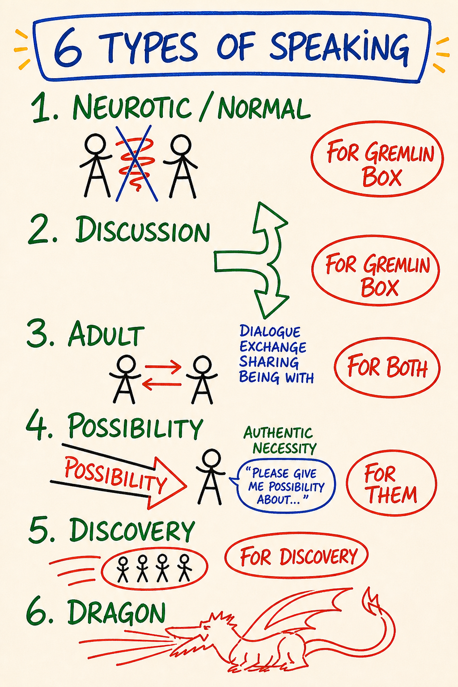
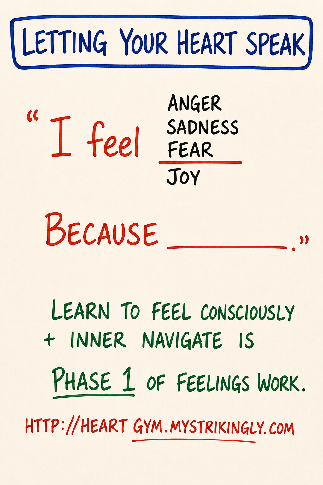

# Module 08 · Listening, Speaking, Communication, Completion Loops

| | |
|---|---|
| **Intensity** | **MEDIUM.** Partner check-in recommended before starting; debrief after. Partner reachability is required in the 48-hour exchange window, because this module *is* the partner exchange. Send the check-in message before Sitting 1: one line, "Starting Module 8 today. Reachable for the exchange this week?" |
| **Sittings** | 3 (break points marked in the text) |
| **Tools for this module** | Study the map: [M14 · 4 Listenings](../Map%20Atlas/M14%20-%204%20Listenings.html) · [M15 · 4 Speakings](../Map%20Atlas/M15%20-%204%20Speakings.html) · [M16 · Map of Communication](../Map%20Atlas/M16%20-%20Map%20of%20Communication.html) · [M43 · Letting Your Heart Speak](../Map%20Atlas/M43%20-%20Letting%20Your%20Heart%20Speak.html) · Run the practice: [Completion-Loop Builder](../Interactive%20Tools/Day%2008/completion-loop-builder.html) |
| **Videos** | The written module is complete on its own. Videos are optional enrichment: see [Video Manifest](../Facilitator%20Resources/Video%20Manifest.md). |

**Daily spine:** Phase B — morning sit: Beep! Book + Feelings Form bar reading (8-10 min). See [Daily Practice Spine](../Practice/Daily%20Practice%20Spine.md).

> **Grounding (60 seconds).** Script 1 in [Solo Centering and Grounding Scripts](../Facilitator%20Resources/Solo%20Centering%20and%20Grounding%20Scripts.md), also standing alone at [ground.html](../Interactive%20Tools/ground.html). Know where it is before you start.

---

## Before you start — recall (5 minutes)

Free recall on Module 7. No notes, no peeking.

1. Take a blank page in your Beep! Book. Redraw the Low Drama Triangle (M13) from memory: the three positions, the arrows, where the gremlin food flows.
2. Say the core distinction out loud, in your own words. The shape to hit: low drama runs below the threshold of noticing and produces gremlin food; the Responsible Game is what is left when you decline it.
3. Now check your drawing against [the map](../Maps/M13.png). Mark what you missed, without verdict. A missed corner is information about where the next rep goes, nothing more.

This warm-up is generation, never answer-checking. Nobody scores it, including you.

## Step 0 — center (5 minutes)

Run Script 2 (5 min centering) from [Solo Centering and Grounding Scripts](../Facilitator%20Resources/Solo%20Centering%20and%20Grounding%20Scripts.md). Then open the module.

**Sitting 1 of 3 starts here.**

---

## Purpose

To make visible how you use listening and speaking to shape, control, avoid, or open the space between you and another person.

Module 8 is where the inside of the work (Box, feelings, drama) meets the outside: another human being. Most maps so far you have used on yourself. From here on, you use them in the space between you and another person. That space has its own architecture, and you have been moving through it for a lifetime without seeing it.

You will catch the Box and the gremlin using your ears and your mouth, then practice Adult and Possibility moves that complete communications instead of leaving energetic debt.

Module 8 is tagged **Medium intensity** because doing this with your actual partner, on your actual material, comes closer to the bone than reading any map. Several learners report Module 8 as more demanding than the feelings modules. Nothing overflows; being met cleanly is simply unfamiliar. That is why the header asks for a partner check-in before you start and a debrief after, the standard Medium-day practice.

---

## Core PM concepts

- **The 4 Listenings.** Four distinct stances a listener can take: listening to confirm what you already think · listening for what the other person means · listening to what is being said · **Possibility Listening**.
- **The 4 Speakings.** Four parallel speech locations: speaking from the gremlin · speaking from the Box · speaking from Adult · **Possibility Speaking**.
- **Map of Communication.** The architecture of any exchange: intention → speaking → receiving → meaning-making → response. Gaps open at every join.
- **Completion loops.** The discipline of *finishing* a communication so it does not remain as energetic debt that surfaces in the next argument.
- **The 12 Roadblocks.** Thomas Gordon's named list of what people do *instead of* listening. **A roadblock is defined by function, not by intention.** If your action redirects the speaker, relieves your discomfort, positions you above them, closes uncertainty, or pushes toward a result, it is a roadblock. Good intention does not clear it.
- **Vacuum listening space.** The internal state of a Possibility Listener: empty of opinion, expectation, agenda, judgment, and even the need to understand. Still there. Just out of the way.
- **Meta-conversation.** Naming the conversation about the conversation. The single most useful move when a communication is stuck.

---

## Learning outcomes

By the end of this module you will:

1. Be able to name, in your own listening, which of the **4 Listenings** is operating at any moment.
2. Be able to name, in your own speech, which of the **4 Speakings** you are sourcing from.
3. Be able to walk the **Map of Communication** in both directions and locate at least two places where gaps tend to open in your own communications.
4. Have run at least one **completion loop** with your pairing partner during the exchange, and one in your actual life during the between-module experiment.
5. Have caught yourself, in real time, doing at least three of the **12 Roadblocks** instead of listening.
6. Have given and received one round of **practice-quality feedback** with your partner, using the Module 4 criteria, as calibration.

---

## Module flow

| Step | Time | What you do |
|---|---|---|
| 0 | 5 min | Run Script 2 (5 min centering). Then open the module. |
| 1 | 5 min | Recall warm-up on Module 7 (above) |
| 2 | 5 min | Read the header. Send the partner check-in; confirm reachability in the next 48 hours |
| 3 | 40 min | Teaching, part one: the 4 Listenings · the 4 Speakings · Letting Your Heart Speak |
| 4 | 35 min | Teaching, part two: Map of Communication · completion loops · the 12 Roadblocks |
| 5 | 15 min | **Listening posture practice** (solo, embodied) |
| 6 | 10–15 min | Variation C: completion-loop solo prep (sets up the experiment) |
| 7 | 55 min | **Partner exchange**, including the feedback calibration round |
| 8 | — | Receive partner's reply within 24 hours; record yours back |
| 9 | 2 days | Run the **between-module experiment**: one real completion loop |
| 10 | 20 min | Journal the **reflection prompts** |
| 11 | 5 min | Close the loop; schedule the rest day before Module 9 |
| 12 | 1 min | Post one line to the cohort feed |

Spread the module across three days. The partner exchange is not bolted onto the end; it *is* the module. Schedule it first.

---

## Concept teaching notes

### The 4 Listenings

*▶ [Study M14 in the Map Atlas →](../Map%20Atlas/M14%20-%204%20Listenings.html)*

Study the map before reading on. Four distinct places a listener can stand inside. The claim the map makes: the place you stand *from*, not the words the speaker says, determines what you actually hear. You are running one of these right now. The first three exist in many traditions; the fourth, Possibility Listening, is the PM-distinctive one the course is teaching toward.

**Listening to confirm what you already think.** The default for most adults, and invisible from the inside. The other person speaks; you run their words through your existing thoughtmap, keeping what fits and silently filtering the rest before it reaches awareness. You hear what confirms. You miss what disconfirms. You respond to a pre-shaped version of what was said. Most adults do this most of the time, and it is undetectable from inside because the filter is the thing through which you are detecting. Sourced from the Box.

**Listening for what the other person means.** A step better. You paraphrase, check accuracy, ask *do you mean X?* This is Adult Listening: the listening of most therapy, of Rogerian counseling, of NVC. Useful. Also limited. While you are paraphrasing, you have stopped listening; you are constructing a sentence. Asking the next question shapes where the speaker can go. You are still in your head; you have just made the head a more accurate one.

**Listening to what is being said.** Harder than it sounds. You let the actual words arrive. Not the meaning, not your interpretation: the words themselves, in their actual order, with their actual sounds. You notice the speaker said *I left him* and not *we broke up*, and you do not translate. Many learners discover, when they first try this, how rarely they have done it. Decades of hearing meanings and not words.

**Possibility Listening.** The PM-distinctive one. You stop listening *for* anything. You become a clean workbench on which the speaker can lay out thinking, sensing and feeling without it needing to be reasonable, logical or understandable. You do not nod. You do not smile. You do not say *yes*. (Nodding and smiling, in PM's analysis, are unconscious reinforcement: every nod trains the speaker to stay in the parts of their speech you are comfortable with.) A small neutral sound confirms you are present. Otherwise, zero resistance. *No reaction, no comment, no question.* The speaker enters a space they almost never enter: being heard without being shaped. Sourced from the bright principle of possibility (Module 10), not from analysis.

> Live-training phrasing: *"You are a yes for them. You are there for them."*

The fourth listening sounds passive. It takes more of you than running a paraphrase. The Box wants to comment; the gremlin wants to fix; the Adult wants to be helpful. Holding the space means noticing each impulse and letting it pass, listening to what wants to come into being through this speaker that neither of you has yet named.

Do not confuse this with empathic listening or NVC reflection. They overlap on the surface. Underneath, empathic listening accurately mirrors what the speaker said; Possibility Listening holds a *space* the speaker can speak into, with no commitment to mirror anything back. The first serves accuracy. The second serves emergence.

The whole map exists for one purpose: to make the listening a **choice**. You can switch mid-conversation. Until you can name which listening you are running, you cannot choose it.

**Common misunderstandings about the 4 Listenings.**

- *"I'm a good listener: I nod, I make eye contact, I say mm-hmm."* Those are reinforcement signals. They train the speaker to stay where you are comfortable. Possibility Listening explicitly drops them.
- *"If I'm quiet and not interrupting, I'm doing Possibility Listening."* Quiet on the outside, busy on the inside is still the confirming or meaning listening. The vacuum is *internal*: the absence of all internal construction, not just the absence of speech.
- *"Possibility Listening is the best one and I should always do it."* Each of the four is a real stance with a domain. Adult conversation at work usually needs the meaning or literal listening. The work is to know which one you are doing and be the one choosing.
- *"Possibility Listening is something you do to the speaker."* It is something you do with yourself: you clear the internal space so the speaker has somewhere to go. The speaker may or may not notice. The point is the space, not the performance of holding it.

### The 4 Speakings

*▶ [Study M15 in the Map Atlas →](../Map%20Atlas/M15%20-%204%20Speakings.html)*

Stop here and take the map in. Shape first, labels second. Speech, like listening, has locations. Symmetrically to the listening map, *where* you speak from, not *what* you say, determines what the speech does in the room. The same sentence said from the gremlin and from Adult are two different speech acts. You have been speaking from one of these for the last hour and may not have noticed which. (The course teaches four speakings; this PM map shows the fuller set of six (Neurotic/Normal, Discussion, Adult, Possibility, Discovery, Dragon), with what each is "for." The four named here map directly onto it.)

**Speaking from the gremlin.** Drama, righteousness, manipulation, provocation, juicy negativity. The gremlin loves to talk: other people's failings, your own grievances, what is wrong with the world. Gremlin speaking is recognizable by its *charge*. There is heat under it, and the heat is the point. The gremlin is eating while you speak. You can usually feel it in your chest if you check.

**Speaking from the Box.** Defended position, performance, opinion-as-identity. The Box speaks to maintain itself. It speaks for victory, not for truth. Box-speech often sounds reasonable; that is part of its design. The tell is that it cannot bend. Disagreement registers as attack.

**Speaking from Adult.** Clear, contractual, responsible. Adult speech does seven things well: passes cognitive information, shares feelings, makes distinctions, declares, asks for something, agrees or disagrees, sets borders. Most professional life runs on Adult speech, and most marriages and friendships benefit from more of it.

**Possibility Speaking.** Speech sourced from a bright principle (possibility, creation, truth-telling) that brings a new context into being that was not in the room a minute ago. Not brainstorming, not "thinking out loud." Speech that hands the listener a distinction they did not previously have, opens a door that was closed, makes available what was not available. It requires that the bright principle be active in the speaker, which is why this map points forward to Module 10. The teaching here is text-first; there is no separate course map for Possibility Speaking, and none is needed to run the practice.

> Live-training phrasing: *"You speak before you think, out of the bright principle of the unknown. You create distinctions, new perspectives, and possibilities."*

#### Letting your heart speak

*▶ [Study M43 in the Map Atlas →](../Map%20Atlas/M43%20-%20Letting%20Your%20Heart%20Speak.html)*

Give the map a full minute before the words. Between Adult speech and Possibility Speaking sits a gate most adults keep shut: speech that comes from the heart instead of from the mind's editor. The mind drafts, censors, polishes, and delivers something defensible. The heart, given the channel, says the unpolished true sentence: shorter, warmer, sometimes shaky. The map draws the two routes. Heart speech is not a performance of vulnerability and not emotional venting; it is what becomes available when you stop running every sentence through the editor first. Possibility Speaking is almost never reachable through the editor. If you want the fourth speaking, this gate opens first. In the voice-memo practice below, the fourth recording is where you try it.

**The four speakings are the structural parallel of the four listenings, and they pair.** Gremlin speech wants gremlin listening (someone to react). Box speech wants confirming listening (someone to agree). Adult speech wants meaning-listening. Possibility Speaking is met by Possibility Listening; both require the same internal infrastructure: liquid state, holding context, being sourced from being rather than from Box or gremlin. You cannot Possibility-Speak from a defended position, and you cannot Possibility-Speak with a gremlin running the speech. This is why a communication can fail even when the words are clear: you may be Possibility-Speaking to a confirming-listening, or Adult-Speaking to a gremlin-listening. Speech and listening have to match.

**The highest form of Possibility Speaking is a declaration.** *I declare.* Not a prediction, not a hope, not a wish, not a promise or a goal: a spoken act that brings something into being by being spoken, then followed by behavior consistent with what was declared. *I declare we will finish this by Friday* is only a real declaration if the speaker then stands in it with their actions. Without the bright principle active, "I declare" is grandiosity; with it, it is a real act. Module 10 teaches declaration in detail.

Each of the four is a real stance with its domain. The work is to *know which one you are doing*, in real time, and to be the one choosing.

**Common misunderstandings about the 4 Speakings.**

- *"I can tell which speaking I'm in by what I'm saying."* Content does not tell you the location. *I love you* can be gremlin-speech (manipulation), Box-speech (performance), Adult-speech (cleanly reporting an internal state), or Possibility Speaking (bringing a new context into the relationship).
- *"Possibility Speaking is just brainstorming."* Brainstorming generates ideas inside an existing context. Possibility Speaking changes the context the ideas were going to come out of. They look similar from outside; they are different acts.
- *"Adult is boring, Possibility is exciting, so I should speak from Possibility most of the time."* Adult is the workhorse; it runs most of life that functions. Possibility Speaking is rare, costly, and only real when the bright principle is active. Faked, it is just more Box.
- *"Speaking from the gremlin is bad and should be eliminated."* The gremlin will be with you for life. The work is knowing when you are speaking from it, and choosing whether to.

---

**SITTING BREAK** — stop here if you need to. When you return: one breath, re-read your last Beep! Book line, continue with Sitting 2 of 3.

---

### The Map of Communication

*▶ [Study M16 in the Map Atlas →](../Map%20Atlas/M16%20-%20Map%20of%20Communication.html)*

The map first. The text below assumes you have seen it. Any communication, no matter how simple, runs the following circuit:

> Speaker has an **intention** → speaker **encodes** it into speech → listener **receives** the sound → listener **decodes** sound into meaning → listener **responds** → and the response runs the same circuit back.

At every arrow, a gap can open. The gap is the structural fact, not the exception. Five named joins, five gaps:

- **Intention gap.** The speaker has not located *why* they want to say it. The speech is muddy at the source.
- **Encoding gap.** The speaker is clear about the intention but lacks words that carry it. They reach for a phrase that approximates and hope the listener fills in the rest.
- **Reception gap.** The listener was running the first listening (confirming) or constructing their reply.
- **Decoding gap.** The listener heard the words but mapped them onto their own thoughtmap. Same words. Different meanings.
- **Response gap.** The listener responds to a constructed version, which is then received through the speaker's filter, and the gap compounds.

After three turns of this, most "communications" are two parallel monologues touching only at the surface. Both participants feel unheard. Both file the incident as more evidence that *the other person doesn't get me*.

This account describes structure, not character. The circuit is the same one Shannon-Weaver named decades ago; what PM adds is the account of *what determines whether the gaps open*. A reception gap is the listener running the confirming listening, not a transmission failure. This is exactly why the Map of Communication sits downstream of the 4 Listenings and 4 Speakings: the gaps are the upstream maps showing up in the space between two people. Named failure points can be repaired by a named practice.

The repair tool for a stuck communication is the **meta-conversation**: stopping the content and having a brief conversation about the conversation. From the live training: *"I'm going to pause here because I'm going to have a meta conversation with everybody, which is a conversation about the conversation."* It pulls back from the content and makes the *structure* visible, so the participants can choose where to re-enter cleanly. The Sparks state it as a distinction of its own: *"Having a conversation about the conversation creates the possibility of possibility."* (SPARK 041.)

### Completion loops

Most arguments do not end. They pause until next time. The same fight, in a marriage, can run for a decade: the content varies, the structure is identical, because the underlying communication was never completed. Incomplete communications accumulate as **energetic debt**, and that debt is gremlin food. The gremlin loves the unsaid.

A completion loop is the discipline of finishing a single communication so cleanly that there is nothing left over. The steps:

1. **Speaker speaks.** Says the thing.
2. **Listener reflects.** Paraphrases back, in their own words, **what the speaker wanted received**, until the speaker confirms it arrived accurately. (Note the precision: not "the part that landed *for me*"; that is a listener-centered act dressed as listening. The target is what the speaker meant to convey.)
3. **Speaker confirms or corrects.** *Yes, that's it.* Or: *No, what I meant was X.* If correction, listener reflects again. Loop until clean.
4. **Listener acknowledges.** *I got it.* Not agreement. Receipt.
5. **Both name the conversation as complete.** Out loud. *Are we complete on this?* *Yes.*

It feels formal the first three times. Then it becomes a reflex. *"Got it. We good?" "Yeah, we're good."* is a completion loop in three sentences. The formality is the price of precision. Pay it.

**Step 5 is what makes the loop PM-distinctive.** NVC's reflective listening and the Carkhuff/Gordon Active Listening tradition both teach the paraphrase in step 2; that part is not new. What PM adds is explicitly naming the conversation as complete, out loud, with words. Without that sentence, even a beautifully paraphrased exchange can leave residue. With it, residue cannot accumulate. The explicit close is the work.

**Retroactive completion loops are real.** You can run one on a conversation from last week, last year, or last decade. The original conversation does not need to be replayed; the unfinished piece is what gets named, reflected, confirmed, acknowledged, and closed, now. The opener does the work: *"Small thing from last month I want to circle back on, two minutes, nothing dramatic."* The other person does not need to know the framework. The loop you can close, you close. Their part is theirs.

Completion loops are how PM works at the relational level. They are what makes feedback usable, conflict survivable, intimacy possible. Without them, every conversation leaves a residue, and the residue is what people are actually living inside when they say their relationship is *exhausting*. The exhaustion is the unfinished arc.

> **Daily spine note — one new line, no new practice.** From this module on, today's Feelings Form row gains one line item: *"One incomplete communication I am carrying: ___ (or: none)."* Ten seconds inside the same morning sit. It makes the energetic debt visible while it is still small. You are not obliged to act on the line; you are obliged to write it. Spec: [Daily Practice Spine](../Practice/Daily%20Practice%20Spine.md) · [Feelings Form](../Practice/Feelings%20Form.md).

**Common misunderstandings about completion loops and energetic debt.**

- *"Completion loops are formal and stilted — they'll ruin natural conversation."* They feel formal the first three times, then go invisible. Most of the time the loop is over in two sentences and no one but you knows it happened.
- *"I can't run a completion loop with someone who doesn't know the framework."* You can. They do not need to. You initiate, speak cleanly, ask them to reflect back. If they cannot, *"I don't know what you want from me"* is also information you can work with.
- *"Energetic debt is just a metaphor."* It is observable. Walk into a room where two people have been silently carrying a three-year-old unfinished conversation and you can feel it before either speaks. The debt has weight. The completion loop pays it.
- *"Once a conversation is past, it's past — retroactive completion is fake."* Retroactive completion recovers years of accumulated debt. The unfinished piece is what gets closed now; the old conversation does not get replayed.

### The 12 Roadblocks

Thomas Gordon catalogued twelve things people do *instead of* listening when listening would actually serve. PM adopted the list because it is comprehensive and because every learner does most of them daily.

1. **Ordering, directing.** *Stop crying. Calm down.*
2. **Threatening.** *If you keep talking like that, I'll leave.*
3. **Moralizing, preaching.** *You should… You ought to…*
4. **Advising, giving solutions.** *What I would do if I were you is…*
5. **Lecturing, giving facts.** *Statistically, what you're describing is…*
6. **Judging, criticizing, blaming.** *That was selfish of you.*
7. **Praising, agreeing to control.** *You're so strong, you've got this.* (When the function is to redirect the speaker, not to honor them.)
8. **Name-calling, ridiculing, shaming.** *That's ridiculous. Don't be a baby.*
9. **Interpreting, analyzing, diagnosing.** *I think what's really going on is that you have abandonment issues.*
10. **Reassuring, sympathizing, consoling.** *Don't worry, it'll all be fine.* (Often deployed to end the speaker's discomfort because the listener can't hold it.)
11. **Probing, questioning, interrogating.** *When did this start? Why did you do that? What were you thinking?*
12. **Distracting, diverting, withdrawing.** *Anyway, how was your day?* Changing the subject. Going on your phone.

**These are not "bad."** Most are normal, helpful-seeming, well-intentioned actions: what your friends do when you are upset. Most have a domain where they are appropriate. The point is to notice that **doing any of these is not listening**, and when listening was what served, the roadblock got in the way. Reassuring a friend in pain often serves the listener's discomfort more than the friend's process. Naming that you reassured does not make you a bad friend; it names that, in that moment, you reached for relief instead of presence.

**The 12 Roadblocks are also a free X-ray of your Box.** The roadblock you reach for first under pressure tells you which survival strategy your Box runs. Compulsive advice-givers have one kind of Box; compulsive interrogators another; compulsive reassurers a third. Watch which roadblock leaps to your mouth.

**A roadblock is defined by function, not by intention.** This is the test, and it is why good intentions do not clear an action off the list. Advising is appropriate when someone *asked* for advice; it is a roadblock when it redirects a speaker who needed to be heard. Reassuring is appropriate when reassurance is what serves; it is a roadblock when it ends the speaker's discomfort because *you* cannot hold it. The same words can be a roadblock in one moment and the right action in the next. Do not ask *did I mean well?* Ask *did this serve the speaker, or relieve me?*

**Common misunderstandings about the 12 Roadblocks.**

- *"These are unhealthy communication patterns I should never do."* Most are normal moves with a real domain. The list is for the moments when listening was what served and a roadblock arrived instead.
- *"Reassuring a friend in pain is kind — it can't be a roadblock."* Reassurance is one of the twelve. The question is whose discomfort it serves.

---

## Embodied practice (solo) — Listening posture

A single practice. ~15 minutes. Done alone in a room where you will not be interrupted. You will need: a chair, headphones or speakers, and a 5-minute audio of your own choosing — a podcast monologue, a voice message from a friend, a song with lyrics that matter to you. Pick something with a real human voice carrying real content. **Do not pick a meditation track.** This is a listening practice, not a meditation.

Read the script through once before you do it.

> **Script.**
>
> Sit. Both feet on the floor. Hands resting on your legs, palms down. Spine upright but not rigid. Eyes soft or closed.
>
> Three slow breaths, exhale longer than inhale.
>
> Start the audio.
>
> **Minute 1: listening to confirm.** Listen the way you usually listen. Notice the running commentary in your head: agreeing, disagreeing, predicting, comparing, remembering. Do not try to stop it. Just see it. This is your default. Name it: *I am running the confirming listening.*
>
> **Minute 2: listening for what they mean.** Shift. Track the speaker's actual meaning. Mentally paraphrase. *What they mean is X.* Notice that you are now constructing; you are translating, not listening. Name it: *I am running the meaning listening.*
>
> **Minute 3: listening to what is being said.** Shift again. Drop the paraphrase. Let the actual words arrive: the specific words, in their order, with their actual sounds. If a word repeats, notice. If a word is unusual, notice. The mind will keep trying to interpret. Bring it back to the words. Name it: *I am running the literal listening.*
>
> **Minute 4: Possibility Listening.** Shift again. Drop the words. Become a vacuum listening space. The speaker is speaking; you are simply *there*, holding open space inside which the words happen. No interpretation, no paraphrase, no commentary. If a comment arises in you, notice it pass and let it pass. You are a yes for them. Name it: *I am running Possibility Listening.*
>
> **Minute 5: free choice.** Let the audio finish. Notice which listening you naturally fall back into when you stop directing.
>
> Stop the audio. Sit for 30 seconds in silence. Notice what changed.
>
> In your Beep! Book, write fast, no editing: which listening was easiest, which was hardest, and what you noticed change in your body across the five minutes. Three or four lines.

**What to expect.** The first listening is so automatic it was already running before you started. The third (listening to what is being said) is the surprising one, often described as *I have never actually done this before.* Possibility Listening on a recording feels different from doing it with a live person; the recording does not respond to your held space. That is fine. One honest pass through the four stances is the rep.

If feeling arises during the audio (especially with a voice message from someone close), notice it. Listening without filling the gap with reaction surfaces what was waiting under the chatter. Ground if you need to, then decide whether to continue.

> **Variation B: the four-speaking voice memo (~10 min).** The speaking-side companion. You will need your phone's voice recorder and one topic that is genuinely *up* in you right now: a current frustration, a decision in front of you, a relationship. Not rehearsed. You will speak the *same* topic four times, one minute each, from the four locations. Read all four prompts first, then record. **(1) From the gremlin:** let the charge be there; be righteous, make someone wrong, indulge the heat; notice your chest, jaw, breath. **(2) From the Box:** defend a position, state opinion as identity, make it sound reasonable, refuse to bend; notice the body tighten. **(3) From Adult:** *here is what is happening, in fact; here is what I feel; here is what I want; here is what I'm asking for.* Clear, contractual, no charge; notice it go quieter. **(4) From Possibility:** the hardest. Do not perform it. Get quiet first, ground, let the heart have the channel (M43), find a bright principle (truthfulness, possibility, creation), then speak whatever wants to come *through* you about this topic: a new angle, a distinction you had not made, a door that opens. If nothing comes, sit in the silence; faked Possibility Speaking is just more Box. Listen back. Notice how different the same topic sounds in each location, which was easiest, which hardest, and whether the fourth was actually different or slipped into one of the first three. Three lines in the Beep! Book: easiest · hardest · what your body did across the four minutes.

> **Variation C: completion-loop solo prep (~10–15 min).** Run this when you are ready to set up the between-module experiment; it doubles as rehearsal for the real loop. Sit, Beep! Book open, center, ground, set a bubble. **Step 1: identify one small unfinished communication.** Scan the last month for 3 minutes and pick *one small* item, not the biggest: *I told my partner I'd think about the vacation thing and never came back.* Write it in one sentence: what was left unsaid or unconfirmed. **Step 2: locate the gap.** Walk the circuit. Where did the original break happen: intention, encoding, reception, decoding, or response? Write the gap(s) you can locate. **Step 3: name the roadblock you ran.** What did you do *instead of* the work that would have closed the loop? Ordered, advised, lectured, reassured, interrogated, distracted? The one you reach for first tells you something about your Box. **Step 4: draft the opener.** Write the actual sentence, then say it out loud once in your own voice: small, low-key, non-dramatic. *"Small thing from [time] I want to circle back on. Two minutes. Nothing dramatic."* Then the unfinished piece said cleanly, then *"Can you tell me what landed for you?"* **Step 5: name the close.** Write and say, out loud, the actual sentence that closes the loop: *"Are we complete on this?"* Most people have almost never said it; it will feel formal. That is the practice. **Step 6: pick the time.** Write a specific 48-hour window in which you will run the loop. Without the time on paper, the gremlin keeps the debt open indefinitely. Close the Beep! Book, stand, three breaths. The live loop happens in your actual life; that is the between-module experiment.

The [Completion-Loop Builder](../Interactive%20Tools/Day%2008/completion-loop-builder.html) walks these six steps on screen and stores your draft locally if you prefer typing. Paper works exactly as well.

---

**SITTING BREAK** — stop here if you need to. When you return: one breath, re-read your last Beep! Book line, continue with Sitting 3 of 3.

---

## Partner exchange (async) — *the core of this module*

This is not bolted onto the reading. This *is* the module. Schedule 55 minutes with your partner: synchronous call if possible, async voice messages otherwise. Both partners read the module before the exchange.

### Round one — the 4 Listenings exchange

**Partner A speaks for 5 minutes** about something genuinely alive for them. Not a rehearsed topic, not a problem to solve. Something *up*: fresh, unresolved, partly unspoken.

**Partner B listens.** Vacuum space. No nodding, no smiling, no questions, no comments. Possibility Listening as best they can manage. If they catch one of the 12 Roadblocks running internally, they name it silently and return to the space.

**When 5 minutes end, Partner B does NOT respond conversationally.** No advice, no commiseration. Partner B replies with exactly three things, in this order:

1. **"What I heard you say was…"**: paraphrase the part that landed. Not the whole thing.
2. **"What I noticed in myself was…"**: witness statement. *I noticed sadness in my throat at 10%. An urge to advise. The room got quiet.*
3. **"The question I am leaving with you is…"**: one open question, no advice embedded. A question for the body, not the head. *What does this want from you? What would you do if you trusted yourself here?*

Partner A receives. Does not need to answer. Notes what arrived.

**Roles reverse.** Partner B speaks for 5 minutes. Partner A holds the listening, then replies with the three statements.

**Both debrief briefly**, one minute each, on: which of the 4 Listenings did I fall into? Which of the 12 Roadblocks tempted me most?

### Round two (optional) — Possibility Listening only

If both partners have energy, run a second round: **Partner B holds Possibility Listening only, for the full 5 minutes.** No paraphrase, no question. At the end, one sentence: *"I heard you."*

Several learners report that being met by a clean, sustained Possibility Listening surfaces material they did not know was waiting. It can feel intimate fast; see the safety callouts.

### Round three — the feedback calibration round (Module 4, repeated)

You last gave each other PM-grade feedback in Module 4, before the feelings block. Four modules of practice have happened since. This round repeats it once, on **practice quality**, so your exchanges do not drift into comfortable witnessing-by-rote exactly when the material gets heavier. Frame: calibration, never assessment. There is no standard to pass; there is an instrument to re-tune.

Run it against the Module 4 criteria, unchanged:

- **Consent first.** *"Are you open to PM-grade feedback right now? If not, say 'not today'."* A "not today" ends the round cleanly.
- **Feedback, not advice, not coaching.** Information about *how your partner was* in the recent exchanges, sourced from the witness, past-oriented.
- **Five-body language.** *Grounded, present, in your body, in your head, hiding, performing.* Not *clear, articulate, well-organized*.
- **Specific, not global.** One named moment from one named exchange, not a verdict about the person.

Each partner offers: one thing that worked (*"In your Module 7 message about your brother, I felt you drop out of the story and into the sadness. That was real."*), one thing that was off in five-body terms (*"Your Module 6 debrief sounded like a report. I heard the intellectual body narrating feelings work."*), and one open question. Receive without rebuttal. If your gremlin starts drafting counter-feedback, that is material for your Beep! Book, captured within ten minutes.

### Completion loop on the exchange

At the end, explicitly: *"Are we complete on this exchange?"* — *"Yes."* (Or: *"No, I want to add X."* Loop until clean.) Name it as complete, out loud. This is the practice.

---

## Between-module experiment — one real completion loop

Pick **one specific communication in the next 48 hours that has been hanging**: paused but not resolved, said but never received. Small. *I told my partner I would think about the vacation thing and never said anything back. I told my colleague their email was unclear and never finished the conversation. I had a moment with my friend two months ago we both walked away from without naming.*

Write it on a fresh Beep! Book page in the Module 4 format before you run it:

> **Experiment — the live completion loop**
> *What I will do:* initiate the conversation with [name], speak the unfinished piece cleanly, ask them to reflect back, confirm or correct, acknowledge, and name the conversation complete, out loud.
> *By when:* a specific 48-hour window, written as dates and times.
> *What I will notice:* my body before and after · what the other person does · what the gremlin does when an energetic debt closes.

**Callback rep (Module 3 instrument).** Sixty seconds before you initiate the loop: center, drop the grounding cord, set the bubble. The loop is spoken from there.

> **If raising unfinished business could be unsafe where you live** (a controlling partner, a household where naming things has consequences: the intake Screen 4 situation), do not run the live loop at home. Use the low-stakes variant for this experiment: the variant column in the [Experiment Bank](../Facilitator%20Resources/Experiment%20Bank.md) lists safe-context versions (a colleague, a friend, a shop interaction). Same rep, different room. Nobody needs to know which version you ran.

Run it one at a time; this is your only live experiment this cycle. Capture within ten minutes of the loop closing: 3–4 sentences in the Beep! Book. If the loop did not close (they deflected, you froze, the moment never came), that is a Beep!, and Beeps go in the book with a Shift! line under them. A failed experiment captured cleanly is the loop working.

**Do not pick a high-stakes communication for the first attempt.** The loop in a marriage during a fight is far harder than the loop on a small left-over item. Run the experiment small first. This is one rep, not a relationship overhaul.

---

## Reflection prompts

Journal at your own pace. Longhand if you can.

1. Of the **4 Listenings**, which is my default? Which have I almost never done in my life? When I imagine doing Possibility Listening with the person I argue with most: what makes it hard?
2. Of the **4 Speakings**, which one comes out of my mouth most days? Which one tends to come out when I am scared, when I am angry, when I am with my mother, when I am with a stranger? Are these the same speakings, or different?
3. The **12 Roadblocks**: which three did I catch myself running during the partner exchange? Which one do I reach for first under pressure? What does that tell me about my Box?
4. The communication I picked for the completion loop: what did closing it actually change? In me, in the other person, in the air? Did the gremlin protest when the loop closed?
5. Where in my life am I currently carrying the largest load of uncompleted communications? Name them. Not to act yet; to see the load. (Most learners are surprised by the count.)

---

## Safety callouts for this module

Module 8 is **Medium intensity**. The material is not emotionally engineered the way Modules 5–7 are, but the partner work frequently surprises learners with how much it surfaces.

- **Possibility Listening can feel intimate fast.** Some learners report unexpected closeness with their partner after this exchange: a felt sense of having been met that is unusual in adult life. That is the practice working. It is not a romantic invitation; the partner agreement explicitly excludes that. Name it as information about how rarely you have been listened to like this, not as information about the partner.
- **Listening to yourself, without filling the gap, surfaces old emotion.** The solo practice can become unexpectedly tender if the recording is a person you love or a song that carries weight. The Numbness Bar (Module 5) was partly held in place by internal chatter; dropping the chatter drops the bar. If feeling arises: ground (Script 1), decide whether to continue, and treat what surfaced as Module 5 material.
- **The completion loop in a marriage during an active fight** is much harder than the loop on a small left-over item. Run the experiment small first. Bigger completions wait until the practice is more grounded.
- **The 12 Roadblocks list reads as an indictment of normal helpfulness.** Most of the twelve are reasonable in most contexts. The list is for the moments when listening was what mattered. Name the action. Drop the verdict.
- **"I want to complete something with you" sounds, to a non-PM ear, like a breakup opener.** Soften the invitation: *"Small thing from last week I want to circle back on, two minutes, nothing dramatic."* Then run the loop.
- **Wanting to lecture your partner about Possibility Listening during the exchange.** Common Box move. The point is to practice the listening, not teach it. Notice the impulse, drop it, return.
- **The feedback calibration round can sting.** If a piece of feedback sets off more than a gremlin grumble (shame spiral, shutdown, floating), stop the exchange, ground, and debrief with your partner before continuing. Feedback about practice quality says nothing about your worth; if your body files it as a verdict, that reaction belongs in the Beep! Book.

This course is not therapy. The partner exchange is structured practice, not couples counseling. If material exceeds the container, both partners pause, ground, and the more held-together one voice-messages the CM. If you notice floating, dissociating, or shutting down at any point: stop, run Script 1, decide.

---

## The rest day — schedule it now

Module 9 is a High module: ego states, the Gremlin, the Demon locator. Between this module and that one, the course schedules **one deliberate rest day**. Not a catch-up day. A day with nothing due: the morning sit happens (the spine never pauses), and nothing else is asked of you.

Open the printable schedule and tracker you set up in [Module 0](Day%2000%20-%20Start%20Here%20and%20Getting%20Your%20Container.md) and mark the rest day on it now, with a date, before you close this module. The back half of this course climbs; the rest day is part of the route, not a detour from it. If your week collapses and the rest day vanishes, that fact goes in the Beep! Book, and the day gets rescheduled rather than skipped.

---

## Cohort feed post (suggested)

One line each, no more:

- Which listening I had almost never done before today: …
- The roadblock I caught myself running most: …
- (Optional) one question for the group: …

---

## Glossary additions

- **The 4 Listenings**: listening to confirm what you already think · listening for what the other person means · listening to what is being said · Possibility Listening
- **Possibility Listening**: listening as a vacuum space, empty of opinion, expectation, agenda or even the need to understand; sourced from the bright principle of possibility; distinct from empathic listening and NVC reflection
- **The 4 Speakings**: speaking from the gremlin · speaking from the Box · speaking from Adult · Possibility Speaking
- **Possibility Speaking**: speech sourced from a bright principle that brings a new context into being; hands the listener a distinction they did not previously have
- **Letting your heart speak**: speech routed from the heart instead of the mind's editor; the gate through which Possibility Speaking becomes reachable (map M43)
- **Adult Speaking**: clear, contractual, responsible speech; seven core moves: pass information · share feelings · make distinctions · declare · ask · agree/disagree · set borders
- **Declaration**: the highest form of Possibility Speaking; a spoken act that brings something into being by being spoken and is then backed by consistent behavior (Module 10)
- **Map of Communication**: the architecture of an exchange: intention → encoding → speech → reception → decoding → response; gaps can open at every join
- **Completion loop**: the practice of finishing a communication: speaker speaks · listener reflects · speaker confirms/corrects · listener acknowledges · both name the conversation as complete
- **Vacuum listening space**: the internal state of a Possibility Listener; empty of agenda, present without resistance
- **Meta-conversation**: a conversation about the conversation; the act that interrupts a stuck exchange so its structure becomes visible
- **The 12 Roadblocks**: Thomas Gordon's list of common moves that block listening: ordering · threatening · moralizing · advising · lecturing · judging · praising-to-control · name-calling · analyzing · sympathizing · interrogating · distracting
- **Energetic debt**: the accumulated weight of incomplete communications; gremlin food

---

## Close the loop (5 minutes)

1. **Self-check, three-word scale** (not yet · starting · landed in my body; the scale from the [Learning Self-Assessment](../Facilitator%20Resources/Learning%20Self-Assessment.md)): *I can listen to someone without fixing, advising, or planning my reply, and I can close a conversation cleanly instead of leaving it open and leaking.* Say your rating out loud. No score, no log, just the honest word.
2. **My Map Book entry.** Add one page to [My Map Book](../Practice/My%20Map%20Book.md): one distinction from this module in your own words, plus one lived example from this week. Two sentences is enough.
3. **Re-entry line.** If life swallows the next days and the course goes quiet, come back through [Coming Back](../Practice/Coming%20Back.md). A gap handled cleanly is a rep, not a debt.

Rest day next. Then Module 9.

---

🄯 **World Copyleft 2026** · *Expand the Box (Digital)* · licensed **[CC BY-SA 4.0](https://creativecommons.org/licenses/by-sa/4.0/)**, consistent with the spirit of World Copyleft · re-presents Possibility Management thoughtware originated by Clinton Callahan & the Possibility Management community · this course is an independent re-presentation, **not an official Possibility Management training** · please share, share-alike · Powered by Possibility Management ([possibilitymanagement.org](https://possibilitymanagement.org)) · full terms: `LICENSE.md` in the course root
