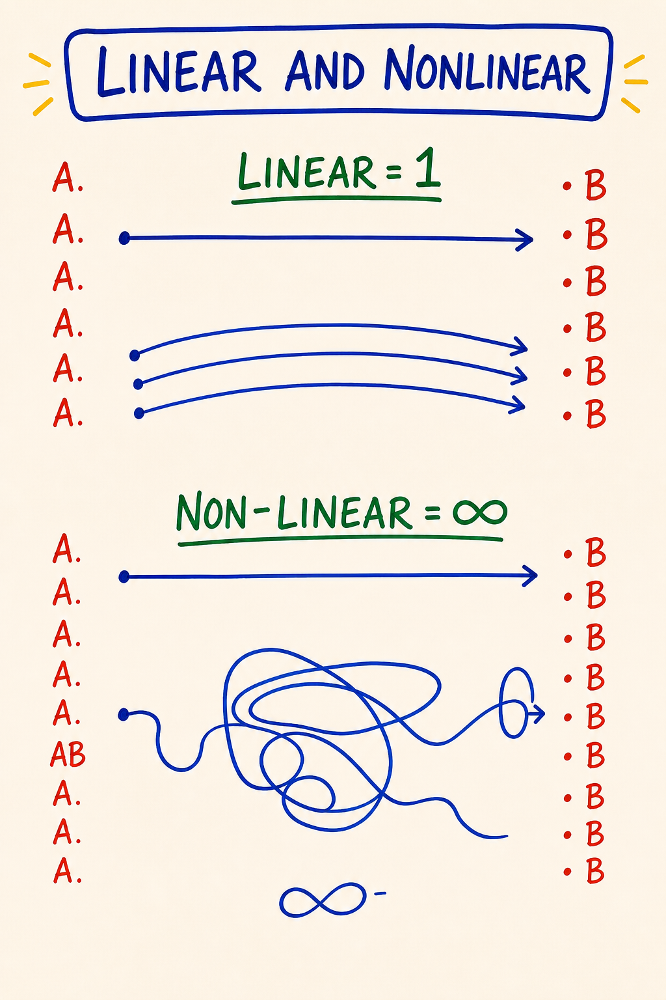

# Module 10 · Map of Possibility, Bright Principles, Three Powers, Integration

| | |
|---|---|
| **Intensity** | **LOW** (closure sensitivity: watch for inflation and deflation, named in the safety callouts). Partner check-in recommended before starting; debrief after. Partner reachability required within 24 hours for the closing-declaration exchange. |
| **Sittings** | 3 (break points marked in the text) |
| **Tools for this module** | Study the map: [M20 · Map of Possibility](../Map%20Atlas/M20%20-%20Map%20of%20Possibility.html) · [M21 · Bright & Shadow Principles](../Map%20Atlas/M21%20-%20Bright%20Principles%20and%20Shadow%20Principles.html) · [M22 · Is-Glue](../Map%20Atlas/M22%20-%20Is-Glue%20and%20Is-Glue%20Dissolver.html) · [M23 · Three Powers](../Map%20Atlas/M23%20-%20Three%20Powers%20%28Choose%2C%20Ask%20Dangerous%20Questions%2C%20Declare%29.html) · [M44 · Linear and Nonlinear](../Map%20Atlas/M44%20-%20Linear%20and%20Nonlinear.html) · [M46 · Map of Matrix](../Map%20Atlas/M46%20-%20Map%20of%20Matrix.html) · Run the practice: [Declaration Composer](../Interactive%20Tools/Day%2010/declaration-composer.html) |
| **Videos** | The written module is complete on its own. Videos are optional enrichment: see [Video Manifest](../Facilitator%20Resources/Video%20Manifest.md). This module's material is distilled from the Sparks and the Map of Possibility handouts; per-Spark citations appear where a distinction can be traced to its source. |

**Daily spine:** Phase B — morning sit: Beep! Book + Feelings Form bar reading (8-10 min). See [Daily Practice Spine](../Practice/Daily%20Practice%20Spine.md).

> **Grounding (60 seconds).** Script 1 in [Solo Centering and Grounding Scripts](../Facilitator%20Resources/Solo%20Centering%20and%20Grounding%20Scripts.md), also standing alone at [ground.html](../Interactive%20Tools/ground.html).

---

## Before you start — recall (5 minutes)

Free recall on Module 9. No notes, no peeking.

1. Take a blank page in your Beep! Book. Redraw the Map of Ego-States (M17) from memory: five locations, not three, each a place you can stand.
2. Say the core distinction out loud, in your own words. The shape to hit: ego states are locations, not personalities; Adult is the state PM is practiced from; PM names the Gremlin and the Demon so neither runs unrecognized.
3. Check against [the map](../Maps/M17.png). Mark what you missed, without verdict, and continue.

## Step 0 — center (5 minutes)

Run Script 2 (5 min centering) from [Solo Centering and Grounding Scripts](../Facilitator%20Resources/Solo%20Centering%20and%20Grounding%20Scripts.md). Then open the module.

**Sitting 1 of 3 starts here.**

---

## Purpose

To integrate the nine modules you have already lived into one piece of equipment you can carry, and to declare, out loud, witnessed, what you are taking forward.

Module 10 brings little brand-new material. It is where the maps become one map. The work is to install three remaining distinctions (the **Map of Possibility**, **bright and shadow principles**, the **Three Powers**), sharpen the language layer underneath all of them with the **Is-Glue Dissolver**, and use the whole set to do one specific thing: make a declaration, standing in your own space, and then to your partner.

What this module is not: the end. The course closes its container in Module 11, where the 90-day container, the continuation paths, and the held way to stop all live. Module 10 finishes the *teaching*. Module 11 finishes the *gameworld*. Keep the two jobs separate and both get done well.

> **A declaration is not an affirmation.** An affirmation tries to convince the self of something. A declaration creates a context the self then has to live inside, and requires action consistent with that context. Affirmations end where the sentence ends; declarations begin where the sentence ends.

---

## Core PM concepts

- **Map of Possibility.** The meta-map. Possibility is not a list of options the world hands you; possibility is a space you enter on purpose. Entered by three keys held simultaneously: held context, liquid state, dangerous question.
- **Linear and nonlinear possibility.** Linear possibility extends what already exists: more, better, faster, inside the current context. Nonlinear possibility becomes available only when the context itself changes. The Map of Possibility is the doorway to the nonlinear kind.
- **Bright principles.** The class of principles whose sourcing generates archiarchy: love, integrity, possibility, courage, presence, clarity, creation, devotion, witnessing, hospitality, gratitude. Bright is not a moral grade; it is generative of consciousness.
- **Shadow principles.** The class of principles whose sourcing generates patriarchy: domination, manipulation, control, deception, scarcity, righteousness, comparison, abandonment-as-strategy. Shadow is destructive of consciousness, and it has domains where it functions.
- **Matrix.** The energetic structure you build, through practice, that determines how much consciousness you can hold. Thoughtware upgrades install onto matrix.
- **Is-Glue.** The verb "to be" used to weld a transient perception to a permanent identity: *I AM stupid, she IS controlling, this IS impossible.* It closes the room and filters out everything that would contradict it.
- **Is-Glue Dissolver.** The swap that restores a perception's provisional scope without denying it: "is" becomes "feels," "appears to be," "right now," "from my Box." Precise, not tentative.
- **The Three Powers.** The Power of Choosing · the Power of Asking Dangerous Questions · the Power of Declaring. Not techniques. Stances available to a person standing in possibility, in sequence.
- **Declaration.** A speech act that brings a new context into being. Not a promise (content), not an opinion (reactive), not a wish (passive). A declaration creates.

---

## Learning outcomes

By the end of this module you will:

1. Be able to draw the Map of Possibility from memory and locate at least three earlier course distinctions on it (the Box, liquid state, Low Drama).
2. Be able to name three bright principles you actually source from, and three shadow principles you have caught yourself sourcing from during the course.
3. Be able to say, in one paragraph each, what your matrix is and how it is built, and what separates linear from nonlinear possibility.
4. Be able to catch one piece of your own **is-glue** and apply the dissolver so the room reopens, without softening the perception into vagueness.
5. Be able to distinguish, in language, a **declaration** from a promise, an opinion and a wish.
6. Have made one declaration aloud in your own space, and a second declaration to your pairing partner, witnessed.

---

## Module flow

| Step | Time | What you do |
|---|---|---|
| 0 | 5 min | Run Script 2 (5 min centering). Then open the module. |
| 1 | 5 min | Recall warm-up on Module 9 (above) |
| 2 | 40 min | Teaching, part one: Map of Possibility · linear and nonlinear · bright and shadow principles · matrix and the two cultures |
| 3 | 35 min | Teaching, part two: Is-Glue · the Three Powers (micro-practices inline) |
| 4 | 20 min | **The declaration practice** (solo, embodied) |
| 5 | 25 min | **Closing-declaration partner exchange** (record + send) |
| 6 | — | Receive partner's witnessing reply within 24 hours; record your reply back |
| 7 | 2 days | Run the **between-module experiment**: one clean declaration in your actual life |
| 8 | 20 min | Journal the **reflection prompts** — these pull the whole course together |
| 9 | 5 min | Close the loop; step through to Module 11 |
| 10 | 1 min | Post one line to the cohort feed |

Spread the module across two or three days. The reading is denser than it looks; the declaration practice wants a fresh system, not the end of a long evening.

---

## Concept teaching notes

### The Map of Possibility

*▶ [Study M20 in the Map Atlas →](../Map%20Atlas/M20%20-%20Map%20of%20Possibility.html)*

Study the map before reading on. Notice its shape: the long line of *what is*, and a bounded space opening off it, empty until someone steps in. That space, not the line, is the country this module is about.

Most people live almost entirely inside the **causal paradigm**, the territory of *what is*. They explain themselves by reference to their past and negotiate the present by reference to the rules they were given. Inside that territory, *what could be* shows up only as fantasy: the daydream, the someday-when, the place you go to rest from reality. Fantasy is not possibility. Fantasy is a way of not being where you are without ever leaving it.

The Map of Possibility names a different country. **Possibility is not a list of options the world hands you; possibility is a space you enter on purpose.** It is empty until someone steps into it. Once you are inside, what was previously invisible becomes available, not because reality changed, but because the Box stopped filtering it out. The Sparks put a number on the filtering: *"Ninety-nine percent of the possibilities available to you right now are invisible to you."* (SPARK 044.) The Box was filtering possibility out before you ever saw the menu. Liquid state lets the filter loosen. The new context decides what the loosened filter lets through. Or, in the Sparks' shortest form: *"The space determines what is possible."* (SPARK 016.)

Three keys put you inside the space, and they work at once, not in sequence:

- **A held context.** "I am the author here." A stance you return to when the Box says otherwise. Held context without liquid state is just conviction.
- **Liquid state.** The body soft enough, the breath low enough, the agenda quiet enough that the next move can actually be new. Liquid state without held context is just dissipation.
- **A dangerous question.** Safe questions return information that changes nothing. Dangerous questions dissolve the floor so a new floor can appear. Either of the first two keys *without* a dangerous question is just comfort. All three together is the threshold.

Once inside, you populate the space yourself: with your declarations, with more dangerous questions, with actions sourced from bright principles. **The space does not deliver anything to you.** That is the difference from "manifestation" or the Law of Attraction. PM makes no claim that holding the right thought causes the universe to provide. The space makes new *action* available; the action then operates by ordinary cause and effect. There is no shortcut around doing the thing.

Every map you learned in this course has a location on the Map of Possibility. The Box marks the boundary you came in through. Liquid state is the threshold. The four feelings are the energetic vehicles you move with. Low Drama is what happens when you mistake the gameworld of possibility for the gameworld of survival. The ego states are who is standing inside the space at any given moment. The Map of Possibility is the room they all stand in.

Most people visit this room a few times a year, accidentally, and call those visits "good days." A PM practitioner enters it deliberately.

> **Micro-practice — Crossing the threshold (4 minutes).** Do this now, before reading on. Find a doorway. A literal threshold gives the body what a chair cannot. Stand a step back. Three breaths, audible exhale longer than inhale. **Name where you are standing**: out loud, one sentence describing the territory of *what is* you are currently inside, not the room but the situation. *"I am standing in the territory of 'I cannot leave this job.'"* Notice your body: chest, breath, agenda. That is the Box you came in with. Now find the three keys: say *"For the next two minutes, I am the author here"* (soften to *"willing to behave as if I am the author"* if the body rejects it); drop your weight, soften jaw and shoulders, set the agenda down on this side of the door; then ask one dangerous question whose answer you cannot un-know. *"What am I pretending not to know about this?"* Pick the one that makes you wince a little; the wince is the marker. **Step through.** Stand still sixty seconds. Do not interpret; interpretation is the Box re-solidifying. Just notice what is in the room now that was not in the previous room. Step back, and name one small action now available that was not available before you crossed. You are not after transformation; you are building a felt reference for what crossing the threshold *is*.

**Common misunderstandings about the Map of Possibility.**

- *"Possibility means having more options to choose from."* More options is content. Possibility is the context inside which new options can appear that were previously invisible. You can be drowning in options and not in possibility, or have very few visible options and be standing in vast possibility.
- *"Possibility is the same as fantasy or imagination."* Fantasy is escape from "what is" with no enterable threshold; nothing arrives. Possibility is a real workspace where action originates. The body knows the difference: fantasy floats free of the floor; possibility puts weight on it.
- *"'Space' is just a metaphor."* PM is precise here. The space has a threshold (liquid state), keys (context, dangerous question), things you can do once inside (declare, choose, source from bright principles), and a way to fall out (the Box re-solidifies). Treating it as merely metaphorical is the Box keeping the room theoretical so you never enter.
- *"This is the Law of Attraction / manifestation."* No causal claim is made about the universe delivering. The space makes new action available; the action then runs on ordinary cause and effect.
- *"Once I enter possibility, I stay there."* Possibility is a window, not a residence. You enter, do the work that becomes available, and the Box reforms. The skill is re-entering deliberately. Trying to live there full-time is a Box move dressed up as enlightenment.

### Linear and nonlinear possibility

*▶ [Study M44 in the Map Atlas →](../Map%20Atlas/M44%20-%20Linear%20and%20Nonlinear.html)*

Give the map a full minute before the words. Two kinds of possibility, and they are not two sizes of the same thing. **Linear possibility** extends what already exists: more clients, a better apartment, a clearer version of the conversation you already have. It is reachable by ordinary steps from the current context, and most planning, goal-setting and self-improvement operates entirely inside it. **Nonlinear possibility** is not reachable by extension at all. It becomes available only when the context itself changes: a declaration, a dangerous question, a context shift that makes a different set of next actions visible. From inside the old context, nonlinear possibility looks like nothing, which is exactly why the Box never objects to it in advance. Linear gets you a better seat in the room you are in. Nonlinear changes which room exists. Neither is superior in every domain (renewing your passport is a linear job; do not declare at it), but every result you have already concluded is impossible lives, if it lives anywhere, on the nonlinear side. The vocabulary matters because the two require different equipment: linear possibility needs a plan; nonlinear possibility needs the three keys and a speech act.

**Common misunderstandings about linear and nonlinear.**

- *"Nonlinear is just thinking outside the box."* Brainstorm output is still linear: ideas generated inside the current context. Nonlinear arrives by changing the context, which no amount of idea-volume accomplishes.
- *"Nonlinear possibility is rare and mystical."* It is undramatic in practice: a sentence said from a new context, after which different actions are simply available. The threshold practice above is a nonlinear rep in four minutes.

### Bright and shadow principles

*(M21 has no dedicated map image. The two closest maps in the course are the Map of Matrix (M46, embedded below) and the Map of 3 Games (M47, taught in Module 7) — adjacent, not dedicated. The interactive card carries the full distinction.)*

*▶ [Study M21 in the Map Atlas →](../Map%20Atlas/M21%20-%20Bright%20Principles%20and%20Shadow%20Principles.html)*

Every action you take is **sourced** from some principle. You do not act from "your values" in the soft modern sense; you act from a principle that, for the duration of the action, has hold of you. There is no neutral action. The principle in the driver's seat determines what the action *is*, regardless of its content. Two parents can both say "go to bed," one sourced from presence, one from control: same words, different acts, different rooms afterward. PM distinguishes two classes of principles, and the classes are named by what their sourcing *generates*, not by moral grade.

**Bright principles are the class of principles whose sourcing generates archiarchy**: culture organised around distributed authority, conscious relating, and creating rather than dominating. They are creative, life-serving, generative of consciousness. Partial list: love, integrity, possibility, courage, presence, clarity, creation, devotion, beauty, truth-telling, witnessing, holding-space, hospitality, gratitude. When a bright principle has hold of you, the action adds aliveness to the room.

**Shadow principles are the class of principles whose sourcing generates patriarchy**: the hierarchical, fear-based, control-oriented culture most learners were raised inside. They are control-oriented, destructive of consciousness, generative of separation. Partial list: domination, manipulation, control, deception, exploitation, scarcity, righteousness, addiction, war, comparison, abandonment-as-strategy. When a shadow principle has hold of you, the action subtracts aliveness.

**The direction of causation matters, so say it precisely: principles are upstream, cultures are downstream.** Sourcing bright principles generates archiarchy. Sourcing shadow principles generates patriarchy. The culture you live inside is the accumulated output of what its people source from, never the other way around. A principle does not come *from* a culture; cultures come from sourced principles. This is also why the work is personal before it is political: nobody changes a culture except by changing what is being sourced, one action at a time.

Two things to be precise about. **Shadow is not "bad" in the moralistic sense.** Shadow principles exist, are real, and have domains where they are functionally appropriate. War has its place; domination has its place; control has its place: a surgeon operates from control. The work is not to suppress shadow or pretend it is absent. Suppression reinstalls it in disguise, where it runs the action while the speaker tells themselves the action is bright. The work is to be conscious of which principle is in the driver's seat *now*, in this action, in this room. A surgeon sourcing from control during an operation acts cleanly. A parent sourcing from control across a teenager's whole adolescence does not. Same principle. Different domain. Different verdict.

**Children are sourced from whatever the room teaches them. Adults choose.** By age ten your nervous system had absorbed the principle-set of your family, school and culture, and that set runs your action by default. Most adults run those installed principles for the rest of their lives without knowing they were installed. As an adult, you become responsible for which principle is sourcing your action: not by suppressing what was installed, but by noticing in real time and choosing. *What is sourcing this right now? The principle I would choose, or the one I was given?* The answer changes the action. And the shadow you cannot name owns you; the shadow you can name is in the room with you, where it can be chosen against, or, when the domain calls for it, chosen for, deliberately.

> **Micro-practice — The sourcing audit (4 minutes).** Do this now. Bring to mind one ordinary action from the past 24 hours: a sentence you said, a choice, a reaction, a message you sent. Re-feel it for 30 seconds: where were you, what did you do, what was happening in your body? Then the diagnostic, out loud: *what principle was sourcing me when I did that?* Do not reach for the answer that sounds best; reach for the truthful one. Presence? Control? Love? Scarcity? Integrity? Righteousness? Abandonment-as-strategy dressed up as "needing space"? If more than one principle was in the room, name the one in the *driver's seat*: the one that determined the action, not the ones commenting on it. Write it as one word in the Beep! Book. **Do not moralise.** Write "sourced from control," not "sourced from control, which is bad." Moralising is the Box reinstalling shadow in disguise. Then one more sentence: *"If I had been awake at that moment, the principle I would have wanted in the driver's seat was ___."* You are not promising to be different tomorrow. You are practising the literacy that makes choice possible at all.

**Common misunderstandings about bright and shadow principles.**

- *"Bright is good, shadow is evil; the work is to source only from bright."* The classes are named by what their sourcing generates, not by moral standing. Shadow principles have domains where they function appropriately. The work is consciousness of which is in the driver's seat. A person trying to be "only bright" is usually running shadow underneath, unnamed.
- *"If I catch myself sourcing from shadow, I should feel guilty and stop."* Noticing is the whole point. Guilt is the Box reinstalling shadow under a new label. Naming opens the choice: *do I want this principle driving this action, in this domain?* Sometimes yes (the surgeon). Sometimes no. Either way the action becomes conscious instead of automatic, and naming does not oblige you to abandon the action; a surgeon mid-operation does not drop control because it has been named.
- *"A good person is one whose values are correct."* PM does not deal in "good people." It deals in *what is sourcing the action right now.* Admirable principles on paper can still sit on top of control, scarcity or righteousness in the moment.
- *"Bright principles produce only pleasant, peaceful actions."* Truth-telling can rupture a relationship. Courage can cost you. Witnessing can mean staying in a room you would rather leave. Bright is generative of consciousness, which is not the same as pleasant. And pleasantness sourced from comparison or abandonment-as-strategy is still shadow.
- *"I should find my 'true' principles and stick to them."* Different actions in different domains call for different sourcing. The literacy is per-action, not per-life: *what is sourcing me now, and is that the principle I want driving this?*

### The matrix, and the two cultures

*▶ [Study M46 in the Map Atlas →](../Map%20Atlas/M46%20-%20Map%20of%20Matrix.html)*

Before the prose: the image. Notice what is drawn, and what is not. The course has used the word *matrix* in passing since Module 2; here is its one definition, the same one everywhere in this course. **Your matrix is the energetic structure you build, through practice, that determines how much consciousness you can hold.** Distinctions, feelings at higher intensity, responsibility at larger scale: each requires matrix to hold it. Matrix is built through conscious practice: reps, feelings work, holding attention, taking on responsibility slightly beyond current capacity. It is not built by insight, reading, or intention. Thoughtware upgrades install onto matrix; without enough matrix, an upgrade has nowhere to live. This is why the course runs on experiments and a daily sit instead of on explanations: every rep you have logged since Module 0 has been matrix construction, whether or not it felt like progress that day.

One bordering use of the word, always marked: "the cultural matrix" names the default cosmology a person is raised inside, which for most learners is the patriarchal one. When this course says *matrix* without a qualifier, it always means the structure you build.

That brings the two cultures into focus, and this teaching ships as prose by design: there is no course map for it, and none is needed. **Patriarchy** here is a structural description, not an accusation aimed at men or at anyone's family: a culture that runs on hierarchy, fear, control, and numbness, generated and regenerated by people sourcing shadow principles, mostly without knowing it. **Archiarchy** is the name PM uses for the culture generated by sourcing bright principles: distributed authority, conscious relating, creating rather than dominating. Neither is a place you move to. The shift from one to the other has no parliament and no revolution; it is made of individual humans noticing what is sourcing their next action and choosing. Your matrix determines how much of that noticing you can hold; your sourcing determines which culture your next action feeds. That pair of sentences is the whole geopolitics of this course.

**Common misunderstandings about matrix.**

- *"Matrix is a metaphor for knowledge — I build it by learning more."* Matrix is built by practice, not information. A learner who reads every Spark and runs no experiments has upgraded their library, not their matrix.
- *"I either have matrix or I don't."* Matrix grows by reps slightly beyond current capacity, the same way strength does. The 30 days of bar readings behind you are measurable construction.
- *"The matrix is patriarchy."* That is the qualified, secondary sense (the *cultural* matrix). Unqualified, in this course, matrix means the structure you build.

---

**SITTING BREAK** — stop here if you need to. When you return: one breath, re-read your last Beep! Book line, continue with Sitting 2 of 3.

---

### Is-Glue and the Is-Glue Dissolver

*▶ [Study M22 in the Map Atlas →](../Map%20Atlas/M22%20-%20Is-Glue%20and%20Is-Glue%20Dissolver.html)*

Look at the map until you could redraw it with your eyes closed. Then continue. The "to be" weld on one side, the dissolver swap on the other. The weld closes a room; the swap reopens it without throwing the perception away.

The Box defends itself in many ways. One of the cheapest, most invisible, and most effective is **the verb "to be."** When you say "I AM stupid," "She IS controlling," "This IS impossible," "He IS a victim," the verb welds a transient perception to a permanent identity. A perception that was provisional and partial gets fused to a noun, and the noun is presented as how things *are*. PM names this welding **is-glue**. The Sparks name the stakes: *"You create reality with Is-Glue."* (SPARK 008.) Once it is applied, you cannot perceive anything else about the situation; the is-glue has filtered out everything that would contradict it. The Box has used a two-letter verb to close the room.

Is-glue is not limited to nouns or to negatives. *I am stupid* (state-to-identity), *she is controlling* (perception-to-essence), *he is a narcissist* (story-to-label), *this is impossible* (perception-to-reality), *I am a genius, she is the love of my life, this is destiny* (the inflating and prophetic versions). Positive is-glue closes the room exactly the way negative is-glue does. It just feels better while doing it.

The **is-glue dissolver** is a simple swap: replace "is" with "feels," "appears to be," "right now," "in this moment," "from my Box," "as I am perceiving it."

- *"I AM stupid"* → *"I am noticing a thought that I am stupid right now, from my Box."*
- *"She IS controlling"* → *"I am perceiving her as controlling right now."*
- *"This IS impossible"* → *"From here, in my current thoughtware, I cannot yet see how this would be possible."*

Hear what happens. The perception is preserved: the behaviour you saw, the confusion you felt, the impasse you hit, all still there to be discussed. What dissolves is the metaphysical claim that the perception describes how things *permanently are*. **Dissolving is-glue does not mean the perception was wrong.** It means the perception is recognised as provisional: real, partial, lived from a particular vantage in a particular moment.

One precision the map insists on: **the dissolver is not being tentative, non-committal, or "softening."** A wishy-washy *"well, maybe she's sort of controlling, I'm not really sure"* is a different Box move (appeasement, hedging), not the dissolver. The dissolver is precise: the behaviour you saw is named accurately, the vantage is named, the moment is named. Only the unwarranted claim about permanent essence is withdrawn. And dissolving is not deleting: once you have looked from many vantages across many moments and the perception still holds, you can re-speak it as a grounded finding: *"across the last six months, in three domains, when she does X the pattern is consistent with what people call controlling."* That is the difference between an opinion and a finding. The verb "to be" has legitimate uses too (*the door is open, the meeting is at noon*); the work is to catch the welding-of-identity-to-state in real time and undo it, not to ban a verb.

This is the language layer that has been running underneath every Box catch since Module 2, and it is what lets a closing declaration hold: a declaration spoken over un-dissolved is-glue is just the Box asserting its permanence in a louder voice.

> **Micro-practice — Catching is-glue (3 minutes).** Do this now. Bring to mind one sentence you have said about yourself this week with "I am ___": *I am exhausted, I am a fraud, I am bad with money, I am the responsible one.* Say it out loud; notice your body: tighten, sink, close? The body knows where the is-glue is. Now rewrite it with one dissolver swap: *"I am noticing a thought that ___ right now,"* or *"Right now, from my Box, ___."* Read the new version out loud; notice the body again. Often it is a very small shift, a half-breath of softening, a slight loosening across the shoulders. Look for the small shift, not transformation. Then do the same for one sentence about another person (*she is controlling, he is impossible*), swapping to *"I am perceiving them as ___ right now"* or *"in our last interaction, the behaviour I observed was ___."* Finish with one investigation question: *what could be true that I cannot see while the is-glue is in place?* Write whatever shows up in the Beep! Book. Even "nothing, the perception still holds" is fine; you have moved from metaphysics to a finding.

**Common misunderstandings about is-glue.**

- *"Dissolving is-glue means hedging or being non-committal."* The dissolver is precise, not vague. The behaviour, the vantage, the moment are all named accurately; only the metaphysical claim about permanent essence is withdrawn. Hedging is a different Box move that merely sounds similar.
- *"If I dissolve 'I am stupid,' I'm telling myself a comforting lie."* The dissolver restores provisional scope; it does not deny the perception. *"I am noticing a thought that I am stupid right now"* describes the actual phenomenon (a thought, noticed, in a moment) more accurately than the welded version, not less.
- *"Is-glue is only about negative self-talk."* It applies to any "to be" + noun that welds identity to state: *I am a genius, she is the love of my life, he is evil, this is destiny.* Inflating and prophetic is-glue close the room just like the negative kind.
- *"Once I dissolve the is-glue I should never re-speak the claim."* The dissolver enables investigation, not silence. After looking from many vantages, a perception that holds can be re-spoken as a grounded finding.
- *"Is-glue is just bad grammar; speak more carefully."* Is-glue is the linguistic symptom of a Box move. Speaking more carefully without catching the underlying move just produces more elegant is-glue.

### The Three Powers

*▶ [Study M23 in the Map Atlas →](../Map%20Atlas/M23%20-%20Three%20Powers%20%28Choose%2C%20Ask%20Dangerous%20Questions%2C%20Declare%29.html)*

Three stances drawn in sequence, not in parallel: Choosing, Asking Dangerous Questions, Declaring. The Map of Possibility named where you are standing; bright and shadow named what is sourcing you; the Three Powers are the moves you can make from there.

The powers are not techniques you master. They are stances available to a person standing in possibility, and they are sequenced. Choosing is the foundation; without it the other two do not exist. Asking dangerous questions populates the space with what was previously invisible. Declaring brings a new context into being and walks the speaker into it. The Sparks tie all three back to the Module 3 equipment: *"You can responsibly choose, declare, and ask best when you are centered."* (SPARK 013.)

**The Power of Choosing.** Most adults experience themselves as chosen-by: by reactions, habits, conditioning, biology, biography. *I had to. They made me. It was reflex.* The Power of Choosing is the radically responsible act of declaring "I am the one who chose this" even when the choice was made on autopilot. You did not choose your first reaction. You can choose to own that you reacted, and choose your second move deliberately. The choice is to own the choice. Without this power, the other two do not exist; you cannot ask a dangerous question or make a declaration from inside the conviction that life happens *to* you. The declaration would have no author. (And this is not a claim about blame or about controlling your circumstances. PM does not deal in blame. The power is over the *second* move, not the first.)

**The Power of Asking Dangerous Questions.** A safe question's answer changes nothing: *How are you? Fine.* Information is exchanged; nothing moves. A dangerous question's answer leads somewhere the asker cannot un-know. *What would I have to be willing to feel to leave this job? What am I pretending not to know? Who would I be if I didn't have this story about myself? What is the cost of not changing this?* Asked of yourself, with liquid state and a held context, it is the engine of possibility. Asked of another person, with consent and a holding container, it is one of the most respectful things one human can offer another. Asked carelessly (no liquid state, no consent, no container) it is violence. The responsibility is in the conditions, not in the question, and not in avoidance.

**The Power of Declaring.** A declaration is a speech act that brings a new context into being. *I am the author of this conversation. This relationship is now over. I am a person who tells the truth. We are starting now.* A declaration is not a promise (content: "I will do X by Friday"), not an opinion (reactive: "I think X is true"), and not a wish (passive: "I hope X happens"). It is the verb that walks a new room into being. And declarations are not necessarily loud. The dramatic *"I AM TRANSFORMED"* shouted to a crowd is more often inflation than declaration, while *"I am willing to be wrong about this,"* said quietly to one person across a table, can be far more powerful. The marker is not the decibel; it is whether the speech act creates a new room the speaker then walks into. A declaration also requires living, not just speaking: the new context becomes real only as you act, choose, source and speak from inside it until it is more solid than the old one.

Declarations only hold when sourced from bright principles. A declaration sourced from shadow (the gremlin declaring, the Box performing power, fear masquerading as conviction) produces dissonance and collapse, usually within hours. The room feels off; other people sense the tilt before the declarer does. This is why the Three Powers come last in the arc: without radical responsibility (Module 1), without the visible Box (Module 2), without ego-state literacy (Module 9), "I declare" is grandiosity wearing PM vocabulary. With the prior modules installed, "I declare" creates. Most "personal growth" reaches for declaration without first owning the choice (*"I declare I am a millionaire," "I declare I am healed"*), and the Box absorbs it by morning.

**Common misunderstandings about the Three Powers.**

- *"A declaration is a confident, dramatic statement said with conviction."* Volume, drama and confidence are not the marker. *"I am willing to not know what to do about this yet,"* spoken quietly, can outlast anything performed loudly. The marker is whether the speech act creates a new room the speaker walks into.
- *"Affirmations are declarations."* *"I am wealthy. I am loved. I am successful."* Affirmations are usually wishes wearing the grammar of declarations. Sourced from a self that does not yet experience itself as choosing, they are the gremlin declaring or the Box performing: dissonance, not new reality.
- *"The Power of Choosing means I can choose my reactions, feelings and circumstances."* You did not choose your first reaction. The power is owning that you reacted so your *next* move is yours. There is always a second move, and the second move is yours.
- *"Asking dangerous questions is reckless."* Asked of yourself with liquid state and held context, it is the engine of possibility; asked of another with consent and a container, it is deeply respectful. The carelessness is in asking without consent, liquid state, or container, not in the question.
- *"The three powers can be used in any order, or one at a time."* They are sequential. Own the choice before you ask the dangerous question; ask the dangerous question before you declare from a clean place. Skipping the foundation produces declarations the speaker cannot hold for 24 hours.
- *"A declaration, once made, holds automatically."* A declaration creates a new context; inside it, ordinary cause and effect operate. The work is to live inside the declared context until it is more solid than the old one. Declarations require living, not just speaking.

---

**SITTING BREAK** — stop here if you need to. When you return: one breath, re-read your last Beep! Book line, continue with Sitting 3 of 3.

---

## Embodied practice (solo) — The declaration

This is the analog of the closing declaration in a live ETB, where each participant stands in the circle and names, out loud, what they are taking forward. Async, you do it for yourself first, then to your partner. The [Declaration Composer](../Interactive%20Tools/Day%2010/declaration-composer.html) can help you draft and check the three sentences before you stand up; the standing up is not optional.

It takes ~20 minutes. Find a place where you will not be interrupted. Read the script through once, then do it.

> **Script.**
>
> Stand up. Both feet on the floor. Knees soft. Shoulders down. Hands loose.
>
> Three breaths. Exhale longer than inhale. Audible.
>
> **Locate yourself.** Drop your weight into your feet. Notice the ground. Notice the room. You are not collecting yourself for performance. You are arriving in your own house.
>
> **Notice the principle.** Ask quietly: *what principle is sourcing me right now?* Do not judge it. Just name it. Do not declare from inside a shadow principle. If you cannot find a bright principle to source from, breathe, drop, and wait. The declaration can wait three minutes; it cannot wait until the source is right.
>
> **First declaration — what you are.** Out loud, one sentence. Not what you do, not what you want. *What you are.* "I am a person who tells the truth." "I am the author of my life." "I am someone who can stay in the room when it gets hard." Say it. Hear it in your body. Notice whether it is true.
>
> If it does not feel true, that is information. Soften the claim until it does. *"I am someone learning to tell the truth"* is closer than *"I am a person who tells the truth"* if the latter is reaching past you. (This is the is-glue dissolver doing closing-day work: a declaration the size of your actual life holds; one welded past your lived experience collapses on contact with life.)
>
> **Second declaration — what you commit to.** One sentence. Name the work you are taking forward. The one piece. "I am running the daily box catch for the next 90 days." "I am asking one dangerous question per week." Specific. Small enough to actually do. (You will choose your full 90-day practice pair in Module 11; this sentence is the seed, not the contract.)
>
> **Third declaration — what gameworld you are now entering.** One sentence. The course was one gameworld; you are leaving it. What is the next? "I am entering the gameworld of my marriage on different terms." "I am entering the gameworld of being an adult to my own children." The next gameworld is not necessarily grand. It is the actual one.
>
> Sit down. Write the three declarations on paper. Date it. Put it where you will see it.

If you cannot honestly make any of the three right now, that is also information. Write what would be true today, even if small. Smallness is calibration, not failure.

> **A declaration can be a public act — check your room first.** If you live or work inside a situation where being heard declaring change could be unsafe (the intake Screen 4 situation: a controlling partner, a monitored household), run the practice where you are genuinely alone, keep the paper somewhere private or use the tool's local-only draft, and pick the low-stakes variant of the declaration experiment from the variant column in the [Experiment Bank](../Facilitator%20Resources/Experiment%20Bank.md). The declaration is no less real for being quiet.

> **Variation B: the three-power sequence (~12 min).** If you want to drill all three powers in the body before you declare, run this instead of or before the declaration script. Find a stretch of floor with three distinct standing spots about a step apart; mark each with a coin or post-it. Bring to mind one situation where you experience yourself as chosen-by: a repeated argument, a stuck pattern at work, a commitment you keep half-breaking. **Spot one, Choosing:** step on, name your most recent *move* in one sentence (the move you made, not the situation), then say *"I am the one who chose this."* Let the Box object, then say it again, as fact, not guilt; stay until it stops being a sentence and becomes a stance. **Spot two, Asking Dangerous Questions:** step on, and from that stance ask one dangerous question out loud (*what am I pretending not to know? what would I have to be willing to feel to choose differently? what is the cost of continuing?*), then stand silent sixty seconds; if the body recoils, you asked a real one. **Spot three, Declaring:** before you declare, check the source: *what principle is sourcing me?* If it is fear, control, or righteousness: wait, drop, breathe, and find a bright principle you can honestly source from; if you cannot find one, do not declare. Once the source is bright, declare one sentence sized to your actual life, and soften it until the body holds it. Step off, sit, and write three lines in the Beep! Book: the choice I owned · the dangerous question I asked · the declaration I made. The point is not to fix the situation today; it is to have walked the three powers in sequence, in your body, so the stance is available when your actual life asks for it.

---

## Partner exchange (async) — the closing declaration

This one is **declaration witnessed**, not reflection witnessed. You are speaking the work forward; your partner reflects back what they heard you commit to. The pairing does not close here: Module 11 holds one more exchange (your My Map Book swap and the container check), so this is the summit, not the goodbye.

**Prompt to record (5–8 minutes):**

Speak directly. Four things:

1. **What you are taking forward.** The practice seed from your second declaration, plus anything else you already know belongs in your 90-day container (you will build the container itself in Module 11). Specific. Not aspirational.
2. **The declaration.** Say one of the three declarations from the solo practice, *as a declaration*, out loud into the recording. Not "I think I want to be…": the actual sentence. Your partner is your witness.
3. **Your sourcing.** One bright principle you found you can source from, one shadow principle you caught yourself sourcing from during the course. No moralizing.
4. **One thing you want your partner to know** before the continuation work: gratitude, an apology, a question, a thing left unsaid.

Speak from your body. Do not edit.

**When you receive their message, listen all the way through once before doing anything else.** Then record your reply (5–8 minutes):

1. Repeat their declaration back, verbatim if you can. You are mirroring it into the field so they can hear themselves having spoken it.
2. What you noticed in yourself while listening: a feeling, a body sensation, a thing that moved.
3. The piece of them you are carrying forward. Specific.
4. A close for this exchange: *"Thank you. See you in Module 11."* Clean, so nothing leaks into ambiguity.

No advice. No fixing. Witnessing only.

> **If your partner is unreachable for the close.** The declaration deserves a real witness. If your partner has dropped out or gone silent, **message your CM** and ask for a closing witness: the CM will either pair you with another finishing learner or hold the exchange themselves. Do not skip the witnessed declaration because the original pairing fell away.

---

## Between-module experiment — one clean declaration

One rep before Module 11, in your actual life. Write it on a fresh Beep! Book page in the Module 4 format:

> **Experiment — the lived declaration**
> *What I will do:* in one real conversation that would otherwise drift on default, make one clean declaration: sourced from a bright principle, sized to my actual life. ("I am ending meetings on time from now on." "I am telling you the true version, starting today.")
> *By when:* a specific window inside the next 48 hours, written as date and time.
> *What I will notice:* whether I can hold the declared context through the following 24 hours, or whether the Box reabsorbs it by morning · what my body did at the moment of speaking · what the other person did with the new room.

**Callback rep (Module 9 instrument).** In the ten seconds before you declare, ask: *which ego state is about to speak?* Declare only from Adult. If you find Critical Parent or Gremlin at the microphone, wait, re-center, and let the Adult say it.

The Screen-4 note above applies here with full force: if a declaration would be heard by someone who punishes change, use the variant column in the [Experiment Bank](../Facilitator%20Resources/Experiment%20Bank.md) and run the rep in a safe room. Capture within ten minutes, 2–3 sentences, in the Beep! Book. A declaration that collapsed by morning is a Beep! with a Shift! line, and one of the best data points this course can give you.

---

## Reflection prompts

These pull the whole course together, not just Module 10. Journal at your own pace. Longhand if you can.

1. **The context shift.** In Module 1 you named the context you were operating from in the area of your life you most wanted to be different. Has it shifted? If yes: what is the new context? If no: what is one act that could start changing it?
2. **The Box, in one sentence.** Write a single sentence describing your Box as you now see it. Not a list. One sentence. The discipline of one sentence is part of the practice.
3. **The principle audit.** Name three bright principles you can honestly say you sourced from in the past 30 days. Name three shadow principles you caught yourself sourcing from. Do not moralize either list. Just name.
4. **The is-glue that runs you.** Write one "I am ___" or "they are ___" sentence you say often. Dissolve it. What becomes visible once the welding is gone, about you, the other person, or the situation, that the is-glue was keeping out of the room?
5. **The Low Drama you are now aware of.** Name one Low Drama you can now see yourself playing that you could not see 30 days ago. What does it cost? What would it cost to stop?
6. **The declaration that scared you.** Of the three declarations from the embodied practice, which was hardest to say out loud? Why? What is on the other side of saying it cleanly?
7. **What you do not yet know.** Name one thing you came to the course thinking you would find an answer to, and did not. The unanswered question is often the doorway to whatever comes next.
8. **The trend line (the third scheduled row re-read).** Open your [Feelings Form](../Practice/Feelings%20Form.md) and read every row since Module 5, in order. Did the Numbness Bar move? Which feeling opened, which stayed shut, what raises the bars? Thirty rows are evidence no insight can substitute for. Write what the trend says, one line.

---

## Safety callouts for this module

Module 10 is Low intensity with a specific shape: most learners report it as grounding and quietly emotional rather than destabilizing, and the risk sits in the closing itself. Two patterns to watch for at integration:

- **Inflation.** A part of the Box, or the gremlin, can hijack the closing declaration into grandiosity. *"I am transformed. I am a Possibility Manager now. I have transcended my conditioning."* If your body recognizes the voice (too big, too clean, too triumphant), pause. A declaration sized to your actual life feels grounded and slightly humble; one sourced from inflation feels rehearsed. Inflation is the Box claiming victory over itself. (It is also is-glue in its loudest costume: "I AM transformed" welds a permanent identity onto a single good day. Dissolve it and re-speak what is actually true.) Soften until it matches what is true in your body.
- **Deflation.** The opposite. *"Nothing actually changed. I am the same person. The course was a nice idea."* Also the Box, same Box, different costume, minimizing the work. Do not argue with the voice. Acknowledge it. Then make a small, specific declaration anyway, sized to the smallest piece of new ground you can honestly claim. Tiny is fine. Tiny is real. Real declarations compound; pretend ones do not.

The universal grounding script applies (Script 1, [ground.html](../Interactive%20Tools/ground.html)). If you notice you are floating, dissociating or shutting down: stop, ground, decide.

This course is not therapy and is not a substitute for therapy. If material from the cohort is still in process, the closing-declaration exchange is not the place to resolve it; the referral pathway is, and Module 11's continuation paths name where ongoing held work lives.

---

## Hand-off to Module 11

The teaching arc of this course ends on this page. What does not end here: the daily sit, the partnership, and the question of what holds your practice once the course stops asking for it. All of that is Module 11's single job: the 90-day container, the My Map Book exchange, the Possibility Team and the other continuation paths, and a clean, held way to stop if stopping is your honest next move. Go there within a few days, while the declaration is still warm. [Module 11 — Continuation, 90-Day Container and Possibility Team](Day%2011%20-%20Continuation%2C%2090-Day%20Container%20and%20Possibility%20Team.md).

---

## Cohort feed post (suggested)

One line each, no more:

- The declaration I made today: …
- The bright principle I found I can source from: …
- (Optional) one question for the group: …

---

## Glossary additions

- **Map of Possibility**: the meta-map; possibility is a space you enter, not a list of options; entered by held context + liquid state + dangerous question, held simultaneously
- **Linear possibility**: what becomes available by extending the current context; reachable by ordinary steps; the domain of plans
- **Nonlinear possibility**: what becomes available only when the context itself changes; reached through declaration and dangerous questions, not extension
- **Bright principle**: a principle of the class whose sourcing generates archiarchy (love, integrity, possibility, courage, presence, clarity, creation, devotion, witnessing, hospitality, gratitude); generative of consciousness; not a moral grade
- **Shadow principle**: a principle of the class whose sourcing generates patriarchy (domination, manipulation, control, deception, scarcity, righteousness, comparison, abandonment-as-strategy); destructive of consciousness; real, with domains where it functions
- **Sourcing**: the act of acting from a principle; there is no neutral action; asked per-action, not per-life: *what is sourcing this action right now?*
- **Matrix**: the energetic structure you build, through practice, that determines how much consciousness you can hold; thoughtware installs onto it; "the cultural matrix" is the marked, secondary sense
- **Is-glue**: the verb "to be" used to weld a transient perception to a permanent identity (*I AM stupid, she IS controlling, this IS impossible*); closes the room and pre-filters contradicting evidence
- **Is-glue dissolver**: the swap that restores a perception's provisional scope ("is" → "feels," "appears to be," "right now," "from my Box"); precise, not tentative; does not mean the perception was wrong
- **The Three Powers**: the Power of Choosing, the Power of Asking Dangerous Questions, the Power of Declaring; sequential, not parallel
- **Declaration**: a speech act that brings a new context into being; distinct from promise, opinion and wish; only holds when sourced from a bright principle
- **Dangerous question**: a question whose answer leads somewhere the asker cannot un-know
- **Archiarchy**: the culture generated by sourcing bright principles; distributed authority, conscious relating, creating rather than dominating
- **Patriarchy**: the culture generated by sourcing shadow principles; hierarchical, fear-based, control-oriented, built on numbness; the default cultural matrix most learners were raised inside
- **Integration**: the phase where the course's distinctions stop being information and start being equipment in use

---

## Close the loop (5 minutes)

1. **Self-check, three-word scale** (not yet · starting · landed in my body; the scale from the [Learning Self-Assessment](../Facilitator%20Resources/Learning%20Self-Assessment.md)): *I can declare something and stand on it (rather than wish or intend it), and I can tell when I'm sourcing from a bright principle versus from fear.* Say your rating out loud. While you have the instrument open: this is also the moment to re-rate all eleven Part 1 statements, fresh, without looking at your enrollment answers. The delta is yours to read.
2. **My Map Book entry.** Add one page to [My Map Book](../Practice/My%20Map%20Book.md): one distinction from this module in your own words, plus one lived example. Then check the book is current for all ten modules; Module 11 asks you to exchange it with your partner as your completion artifact.
3. **Re-entry line.** If the gap between declaration and continuation stretches longer than planned, come back through [Coming Back](../Practice/Coming%20Back.md). The declaration does not expire.

Module 11 is short, Low intensity, and it is where the next 90 days get a structure. Take it within the week.

---

🄯 **World Copyleft 2026** · *Expand the Box (Digital)* · licensed **[CC BY-SA 4.0](https://creativecommons.org/licenses/by-sa/4.0/)**, consistent with the spirit of World Copyleft · re-presents Possibility Management thoughtware originated by Clinton Callahan & the Possibility Management community · this course is an independent re-presentation, **not an official Possibility Management training** · please share, share-alike · Powered by Possibility Management ([possibilitymanagement.org](https://possibilitymanagement.org)) · full terms: `LICENSE.md` in the course root
