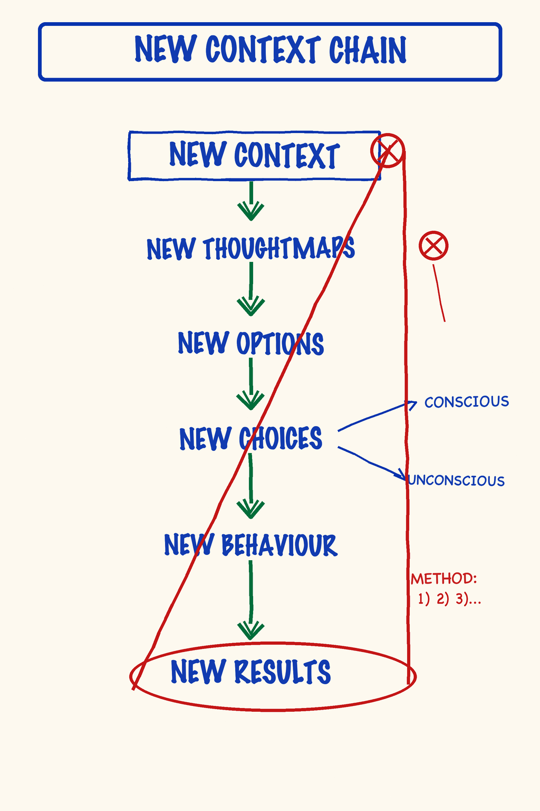

# M01 — New Context (the chain)

*The causal sequence by which a chosen context, not an attempted behavior, produces a new result — and the reason most personal change fails when it starts on the wrong end of the chain.*

**What it is.** A seven-link causal sequence: **new context → new thoughtware → new thoughtmaps → new options → new choices → new behavior → new results.** The arrow runs one direction only. The leftmost link is the most leveraged and the most invisible — which is why nearly all attempts at change start on the right, where the symptoms live, and produce no durable shift. The map is both descriptive (where your current results came from) and prescriptive (where to put your attention to get different ones).

**At a glance.** Context → the invisible source-frame, upstream of everything *(not your surroundings)* · Behavior & results → farthest downstream, least leveraged · Causal direction → left-to-right only; you don't get a new context by collecting new results · Not steps to do but layers to see — stand in the new context, the rest cascades · Behavior change without context change reverts *(the old context eats it)*.

## How to explain it verbally

When I teach the chain, I draw an arrow that runs one way only: context, then thoughtware, thoughtmaps, options, choices, behavior, results. The result you hate started way over on the left, in a context you cannot normally see, the way a fish cannot see water. Most people try to change the result directly, on the right, by gritting their teeth and acting different. The old context just eats that, and the behavior reverts. You do not collect new results to get a new context. You stand in a new context, and the rest reorganizes by itself.

**If you only remember one thing:** work the left end of the chain, the context, because everything downstream is just the context showing its work.

---

> **This is a map card.** The full teaching and practice now live in two places:
>
> - **Full teaching →** [Day 1 — Orientation, New Context, Radical Responsibility](../Days/Day%2001%20-%20Orientation%2C%20New%20Context%2C%20Radical%20Responsibility.md)
> - **Interactive tool →** [Map Atlas · M01 New Context (the chain)](../Map%20Atlas/M01%20-%20New%20Context%20%28the%20chain%29.html)

---

🄯 **World Copyleft 2026** · *Expand the Box (Digital)* · licensed **[CC BY-SA 4.0](https://creativecommons.org/licenses/by-sa/4.0/)**, consistent with the spirit of World Copyleft · re-presents Possibility Management thoughtware originated by Clinton Callahan & the Possibility Management community · this course is an independent re-presentation, **not an official Possibility Management training** · please share, share-alike · Powered by Possibility Management ([possibilitymanagement.org](https://possibilitymanagement.org)) · full terms: `LICENSE.md` in the course root
