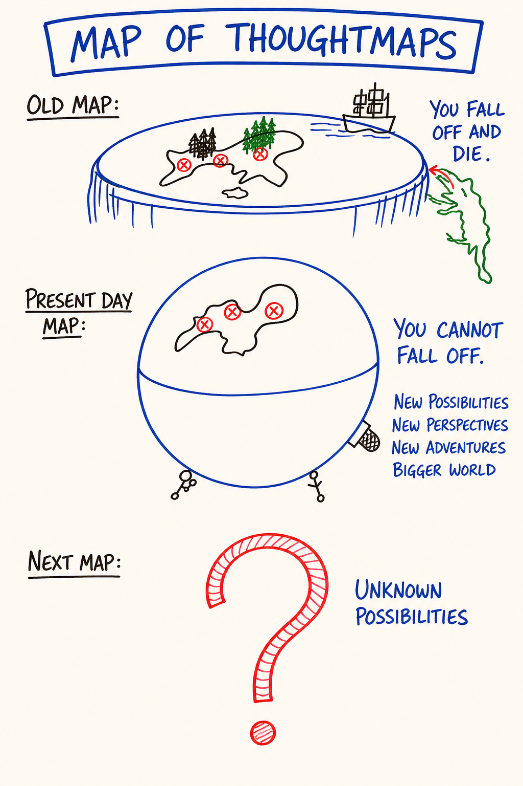

# M03 — Map of Thoughtmaps

*A thoughtmap is a specific cognitive map used to navigate a piece of territory — and PM gives the learner roughly twenty of them, each one a tool to use, none of them the truth to believe.*

**What it is.** The *meta-map* — the map about the maps. A thoughtmap is a specific cognitive map you use to navigate a piece of territory: the Chain, the Box, the Five Bodies, the Old and New Maps of Feelings, the Low Drama Triangle, Ego States. PM provides roughly twenty; this course installs the core set. The meta-map locates each as a tool and establishes the rule that holds the toolbox together: **the map is not the territory.** No PM thoughtmap is true — each is a useful cut that makes invisible structure workable. Treat one as doctrine and it converts to Box and stops working.

**At a glance.** Thoughtmap vs reality → a cut through reality, not reality itself · Thoughtmap vs ideology → a tool you pick up and put down vs a position you defend · Tool vs identity → *using* the map vs *being* a Possibility Manager · Multiple maps per territory → anger seen through feelings, bodies, drama, or ego states; none is *the* answer · Try it on like a t-shirt → run it a week, keep what gives traction · Integration is skilled use, not belief.

## How to explain it verbally

The map of thoughtmaps is the map about the maps. A thoughtmap is one specific cognitive map you use to get around some territory: the Box, the Five Bodies, ego states. This course hands you about twenty. The rule that holds the toolbox together is that the map is not the territory. None of them is true. Each is a useful cut that makes some invisible structure workable for a while. The moment you defend a map as the truth, you have turned it into Box, and it stops working. Try one on like a t-shirt, run it a week, keep what gives traction.

**If you only remember one thing:** a thoughtmap is a tool you pick up and put down, never a doctrine you defend.

---

> **This is a map card.** The full teaching and practice now live in two places:
>
> - **Full teaching →** [Day 2 — Thoughtware, Thoughtmaps, Box Technology](../Days/Day%2002%20-%20Thoughtware%2C%20Thoughtmaps%2C%20Box%20Technology.md)
> - **Interactive tool →** [Map Atlas · M03 Map of Thoughtmaps](../Map%20Atlas/M03%20-%20Map%20of%20Thoughtmaps.html)

---

🄯 **World Copyleft 2026** · *Expand the Box (Digital)* · licensed **[CC BY-SA 4.0](https://creativecommons.org/licenses/by-sa/4.0/)**, consistent with the spirit of World Copyleft · re-presents Possibility Management thoughtware originated by Clinton Callahan & the Possibility Management community · this course is an independent re-presentation, **not an official Possibility Management training** · please share, share-alike · Powered by Possibility Management ([possibilitymanagement.org](https://possibilitymanagement.org)) · full terms: `LICENSE.md` in the course root
